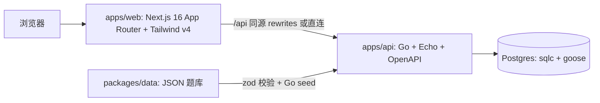

# 仓库维护指南

TouhouFlandre（东方芙一把）是东方 Project 主题角色推理游戏。玩家根据结构化标签反馈猜测隐藏角色。项目以 Go API 为权威规则来源，Next.js 前端负责展示、交互和本地统计。

## 架构与数据流



- `contracts/openapi/openapi.yaml` 是 HTTP 契约唯一来源。Go 侧 oapi-codegen 生成 strict handler + DTO，前端 openapi-typescript 生成类型 + openapi-fetch 调用。
- Go 是比较、每日题、随机题、会话和多人状态的权威来源。`packages/shared` 只保留前端类型、展示工具、搜索归一化和分享文本。
- 题库流：`packages/data` JSON → `task catalog:check` → `task db:seed` → Postgres 行表 + `CatalogSnapshot` 版本化快照 + `CatalogState.currentVersion`。
- 会话和多人场次绑定题库快照，题库更新不影响已开始的题局。

## 关键目录

| 目录 | 用途 |
|---|---|
| `apps/api/cmd/` | `server`、`seed` 和容器健康检查入口 |
| `apps/api/internal/` | handler、game、multi、hub、seed、config 与生成物 |
| `apps/api/migrations/` | goose 版本化 SQL |
| `apps/api/sql/queries/` | sqlc 查询源 |
| `apps/web/src/app/` | App Router 路由 |
| `apps/web/src/components/` | 页面组件与游戏组件 |
| `apps/web/src/hooks/`、`lib/`、`domain/`、`stats/` | 数据 hook、API 客户端、展示逻辑和本地统计 |
| `packages/data/src/` | 题库 JSON、zod schema 和校验 |
| `packages/shared/src/` | 前端共享类型、常量、分享文本和搜索工具 |
| `contracts/openapi/` | OpenAPI 规范 |
| `contracts/ws/` | WebSocket 协议 |
| `docs/` | 长期维护文档 |

## 常用命令

```bash
pnpm install
task dev
task db:up
task db:migrate
task db:seed
task gen
task check:generated
pnpm test
pnpm typecheck
pnpm build
pnpm lint:openapi
pnpm --filter @touhouflandre/web test:e2e
cd apps/api && go test ./...
```

Go 命令通过 Taskfile 注入 `.env`：在 `apps/api` 目录内使用 `bash -c 'set -a && . ../../.env && set +a && …'`。新增 task 时沿用此模式。

## Go 约定

- handler 实现 oapi-codegen 生成的 strict server interface。
- 业务错误使用 `handler.ApiError{Status, Code, Message}`，错误码集中在 `internal/handler/errors.go`。
- 权威规则放在 `internal/game` 和 `internal/multi`，优先保持纯函数和表驱动测试。
- JSONB 列以 `[]byte` 存取，handler 层反序列化为领域类型。
- catalog 版本号依赖 JSON 序列化字段顺序；改动 `internal/game/types.go` 的字段顺序会影响 seed 版本与旧快照兼容。
- 并发写入使用乐观锁和稳定错误码；不要让后到请求覆盖已成功写入的猜测。
- 多人状态以 Postgres 为权威，hub 只管理活动连接和事件扇出。

## 前端约定

- 交互页面和组件使用 `'use client'`；纯展示页面和布局组件保持 server component。
- `apps/web/src/lib/api.ts` 是前端唯一 API 出口。
- hooks 使用 `AbortController`，搜索防抖保持轻量。
- 本地恢复 key 不随意改名，避免破坏玩家已有会话。
- Tailwind v4 入口和设计 token 在 `apps/web/src/app/globals.css`。
- 游戏状态类如 `feedback-*`、`suggestion`、`game-surface` 保留语义。
- 动态路由必须校验非法参数并返回 `notFound()` 或稳定重定向。

## 生成物纪律

不要手工编辑：

- `apps/api/internal/generated/`
- `apps/web/src/generated/`
- `apps/api/.openapi.bundled.yaml`

改 OpenAPI、sqlc 查询或 Web API 类型后运行 `task gen`，并确保生成物与源文件一致。

## 贡献与 PR

- PR 必须先在 Issue 中对齐需求、验收标准或数据来源。
- 未事先在 Issue 中对齐，或明显偏离 `docs/site-development-plan.md` 的 PR 将被直接关闭。
- 一个 PR 聚焦一个功能或问题。
- 避免提交本地日志、数据库文件、缓存、依赖目录、测试输出或来源不明媒体资源。
- 用户可见行为变化时同步更新 README、`docs/` 或站内公告。

## 重要文档

| 文件 | 用途 |
|---|---|
| `docs/gameplay.md` | 公开玩法和反馈规则 |
| `docs/features.md` | 页面、功能和 API 概览 |
| `docs/data-guidelines.md` | 题库、来源和素材规则 |
| `docs/development.md` | 本地开发、命令和故障排查 |
| `docs/architecture.md` | 架构、契约、数据流和不变量 |
| `docs/deployment.md` | 生产部署与运维 |
| `docs/site-development-plan.md` | 开发边界和 PR 对齐标准 |
| `docs/multiplayer.md` | 多人房间规则和协议 |

## 测试

- Go 单元：`internal/game`、`internal/multi` 优先表驱动。
- Go 集成：`internal/server` 使用真实 Postgres 与 `httptest`。
- Web 单元：Vitest + jsdom + Testing Library。
- E2E：Playwright desktop + mobile project，需要 `task dev` 运行中。
- CI 覆盖 OpenAPI lint、引用检查、WS protocol 校验、类型检查、Vitest、Go vet/build/test 和生成物漂移检查。
