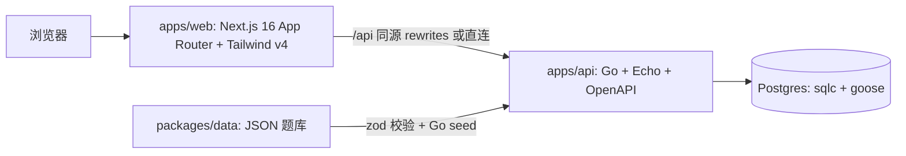

# Repository Guidelines

TouhouFlandre（东方芙一把）— 东方 Project 主题角色推理游戏。玩家根据结构化标签反馈（初登场作品/年份/种族/阵营/地点/头发颜色）猜隐藏角色。非官方同人项目，单机玩法优先；身份/多人/后台为后续产品化阶段（见 `docs/07_productization_plan.md`）。

## Architecture & Data Flow



- **契约优先**：`contracts/openapi/openapi.yaml` 是 HTTP 契约唯一来源。Go 侧 oapi-codegen 生成 strict handler + DTO，前端 openapi-typescript 生成类型 + openapi-fetch 调用。三处生成物（Go `internal/generated`、前端 `src/generated`）提交入库，CI 用 `git diff --exit-code` 防漂移。
- **Go 是权威游戏规则**（比较/每日题/随机题/会话），`packages/shared` 仅剩前端类型与展示工具；`normalizeSearchText` 例外（data 校验用）。
- **题库流**：`packages/data` JSON → `task catalog:check`（zod 校验）→ `task db:seed`（Go 单事务：upsert 行表 + 写版本化快照 `CatalogSnapshot` + 更新 `CatalogState.currentVersion`）。搜索走 `search_text` 预计算列（seed 时归一化，查询不现场计算）。
- **会话绑定题库快照**：`GameSession` 记录 `catalogVersion`，恢复时按版本读快照，题库更新不影响已开始会话（07 §2 不变量）。

## Key Directories

| 目录 | 用途 |
|---|---|
| `apps/api/cmd/` | `server`（Echo 入口 + 优雅关闭）、`seed`（题库写入） |
| `apps/api/internal/` | `handler`（OpenAPI strict 实现/错误映射）、`game`（权威规则，纯函数）、`generated/`（oapi-codegen + sqlc 生成物，禁改）、`seed`、`config` |
| `apps/api/migrations/` | goose 版本化 SQL（当前单一 `0001_init.sql`） |
| `apps/api/sql/queries/` | sqlc 查询源（`sqlc generate` 产出 `internal/generated/repo`） |
| `apps/web/src/app/` | App Router 路由（`single/[mode]` 是唯一动态路由，非法 mode → `notFound()`） |
| `apps/web/src/components/` | 页面组件（SiteNav/HomePage/SingleGamePage/SingleLobby/PlaceholderPage 等） |
| `apps/web/src/hooks/` `lib/` `domain/` | 数据 hook、API 客户端（openapi-fetch）、纯展示逻辑 |
| `packages/data/src/` | 题库 JSON（`characters.demo.json`/`works.demo.json`）+ zod schema + 版本校验 |
| `packages/shared/src/` | 前端共享类型/常量/分享文本（`modes`/`fields`/`types`/`share`/`search`） |
| `contracts/openapi/` | OpenAPI 规范（`paths/` + `schemas/` 拆分，唯一入口 `openapi.yaml`） |
| `docs/` | 计划/技术栈/产品规划；`docs/develop_plan/` 各阶段执行记录 |

## Development Commands

```bash
pnpm install              # 安装（workspace + allowBuilds: esbuild）
task dev                  # = db:up 后并行启动 Go(4000) + Next(5173)
task db:up / db:down      # docker compose 起停 Postgres（宿主 5433）
task db:migrate           # go tool goose -dir migrations up（经 go.mod tool，无需全局 goose）
task db:seed              # catalog:check（data zod 校验）+ Go seed
task gen                  # gen:openapi → gen:repo(sqlc) → gen:web(openapi-typescript)
task check:generated      # 重生成 + git diff --exit-code -- apps/api/internal/generated
pnpm dev                  # = task dev
pnpm test                 # pnpm -r --if-present test（shared/data/web Vitest；不含 Go/E2E）
pnpm typecheck            # tsc --noEmit（全部包）
pnpm build                # pnpm -r build（含 next build）
pnpm lint:openapi         # redocly lint
pnpm --filter @touhoufriberg/web test:e2e   # Playwright（需 task dev 运行中）
cd apps/api && go test ./...   # 需 DATABASE_URL_PG（或根 .env）；go vet ./... 同理
```

- **.env 注入模式**：Go 不读 `.env`，Taskfile 用 `bash -c 'set -a && . ../../.env && set +a && …'`（apps/api 目录内相对路径）。新 task 照抄此模式。
- `.env` 关键变量：`API_PORT`(4000)、`DATABASE_URL_PG`(127.0.0.1:5433)、`WEB_ORIGINS`、`POSTGRES_PASSWORD`、`GOOSE_*`、`NEXT_PUBLIC_API_BASE_URL`（前端直连 API 用；留空则走 Next rewrites 同源）。

## Code Conventions & Common Patterns

**Go（apps/api）**
- handler 实现 oapi-codegen 生成的 strict server interface；业务错误用 `handler.ApiError{Status, Code, Message}`，错误码枚举见 `internal/handler/errors.go`（`INVALID_REQUEST`/`SESSION_NOT_FOUND`/`SESSION_CLOSED`/`DUPLICATE_GUESS`/`CONCURRENT_UPDATE`/`CATALOG_NOT_READY`/`INTERNAL` 等）。`internalError(err)` 包装兜底。
- 依赖注入：`handler.Server{pool, q, now func() time.Time, rng *rand.Rand}`；`NewServer` 注入 `time.Now` 与随机源——测试可固定时钟/随机。
- 权威规则放 `internal/game`（纯函数，无 DB/HTTP 依赖）；JSONB 列以 `[]byte` 存取，handler 层 `json.Unmarshal` 转 `game.Character`。
- **⚠️ 版本号约束**：catalog 版本号 = FNV-1a(JSON 序列化)，`game/types.go` 注释明确 **Character 字段顺序必须与 `packages/data` 组装键序一致**——改结构会影响 seed 版本与旧快照兼容。
- 并发写入用乐观锁：猜测提交带 `version` 列，冲突 `CONCURRENT_UPDATE` + 2 次重试（见 `handler/service.go` 与 `TestConcurrentGuesses`）。
- 唯一冲突处理：pgconn `23505` 检查（`isUniqueViolation`），每日题并发创建时重读已存在记录。

**前端（apps/web）**
- 交互页面/组件一律 `'use client'`；纯展示页（`links`/`SingleLobby`/`PlaceholderPage`/`SiteFooter`）保持 server 组件。新增交互组件默认先考虑 client。
- 数据获取：`lib/api.ts` 的 `api.*` 客户端（`requestApi` 统一抛错 `new Error(error.error ?? "请求失败。")`）；hooks 用 `AbortController`（卸载取消）+ 防抖（搜索 `delay: 120`）。
- 会话状态：localStorage key `touhoufriberg:daily-session` / `random-session`（`gameModes.ts` 定义）；`loadSession` 恢复失败（404/日期过期）即删 key 重建，`parseStoredSession` 兼容旧纯字符串 id。**不要改 storageKey 与 dev 端口 5173**（origin 不变才能延续会话）。
- 样式：Tailwind v4 **无 preflight**（`globals.css` 只引 `theme.css` + `utilities.css`，保持基线行高）；设计 token 在 `@theme`（`--color-ink/paper/vermilion/jade/amber-*`）；游戏页状态类（`feedback-*`/`suggestion`/`game-surface`/`nav-link::after`）保留语义类。断点用 `max-[680px]:`/`max-[900px]:`（非默认 Tailwind 断点）。
- 路由：App Router 文件路由；`/single/[mode]` 用 `isSinglePlayerGameMode` 校验 + `notFound()`；导航高亮 `usePathname`（游戏项前缀匹配 `/single*`/`/multi*`）。

## Important Files

| 文件 | 为什么重要 |
|---|---|
| `contracts/openapi/openapi.yaml` | 契约唯一入口；改端点先改这里再 `task gen` |
| `apps/api/internal/server/server.go` | Echo 组装（middleware 链、livez/readyz、errorHandler） |
| `apps/api/internal/handler/errors.go` + `service.go` | 错误码表与业务逻辑（会话/每日题/快照） |
| `apps/api/internal/game/types.go` | 权威类型 + 字段顺序警告 |
| `apps/web/src/lib/api.ts` | 前端唯一 API 出口（openapi-fetch） |
| `apps/web/src/components/SingleGamePage.tsx` | 游戏核心状态机（会话/猜测/分享） |
| `apps/web/src/app/globals.css` | Tailwind theme + 保留的游戏页语义类 |
| `packages/data/src/schema.ts` + `validate.ts` | 题库 zod 校验（seed 前置） |
| `Taskfile.yml` | 跨语言命令唯一入口 |
| `docs/07_productization_plan.md` | 业务不变量（答案权威、快照绑定、每日题固定等），改后端行为前必读 |

## Runtime/Tooling Preferences

- **运行时**：Go 1.26+、Node 20.19+/22.12+（pnpm 11）、Docker（Postgres 18.4-alpine，宿主 5433）。
- **包管理**：pnpm 11 workspace；**不用 npm/yarn**。构建脚本白名单 `allowBuilds: esbuild`（pnpm 10+ 要求，缺了 `pnpm run` 会被依赖状态检查拦截）。
- **Go 工具**：goose 经 go.mod `tool` 指令（`go tool goose`，无全局安装）；sqlc 未进 go.mod，本地需自行安装（CI 用 `sqlc-dev/setup-sqlc` 1.31.1）。
- **生成物纪律**：`internal/generated/`、`src/generated/`、`apps/api/.openapi.bundled.yaml`（gitignored）禁止手改；改契约后必须 `task gen` 并保持提交零 diff。
- **提交习惯**：conventional commits（`feat(api):`/`refactor(web):`/`docs(plan):`）；计划任务执行记录写进 `docs/develop_plan/phaseNN.md §10`。避免 `git add` 宽路径（`apps/web` 可能带入生成物）；`test-results/`、`.next/`、`dist/` 已 gitignore。

## Testing & QA

- **Go 单元**：`internal/game`（`*_test.go`，包 `game_test`）——黄金用例：固定时钟/固定输入/表驱动；辅助 `baseCharacter()` + `withPatch()` 构造 fixture。
- **Go 集成**：`internal/server/server_test.go`（461 行）连**真实 Postgres**：TestMain 用 admin 连接 DROP/CREATE `touhouflandre_test` 库 → goose 迁移 → seed → `httptest.NewServer`。覆盖 6 端点、错误码、每日题稳定、完整猜测生命周期（won/endedAt/409）、并发乐观锁。运行需要 `DATABASE_URL_PG` env 或根 `.env`。
- **Vitest（web）**：jsdom 环境；**jsdom 30 的 localStorage 需 `src/test/setup.ts` 注入**（否则 getter 返回 undefined）。mock 模式：`vi.mock("../lib/api")` + `vi.mocked(...).mockResolvedValue`、`vi.mock("next/navigation")`（useRouter→`{push: vi.fn()}`）、mock `useCharacterSearch` 返回固定结果；类型强转 `as unknown as PublicGameSession`。
- **Playwright**：`apps/web/playwright.config.ts` — desktop + Pixel 7 双 project，`webServer` 复用已运行的 `pnpm dev`；场景：导航高亮/404/搜索/每日题全流程/模式切换/非法模式/会话恢复与重建。**仅本地运行**（CI 不跑 E2E，需 `task dev` 起 Go+Next）。
- **CI**（`.github/workflows/ci.yml`）：`check` job = install + OpenAPI lint/refs + `gen:api` diff + typecheck + `pnpm test`；`go` job = Postgres service + `go vet/build/test` + `task gen` diff。
- **坑**：`packages/shared` 无测试（`--passWithNoTests`）；改题库数据后跑 `task db:seed` 再看搜索；进行中会话不返回答案（`convert.go` 的 `toPublicSession` 只在非 playing 时带 `answer`）。
