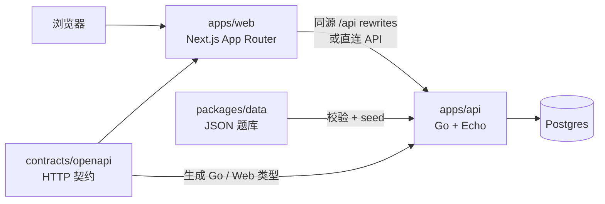
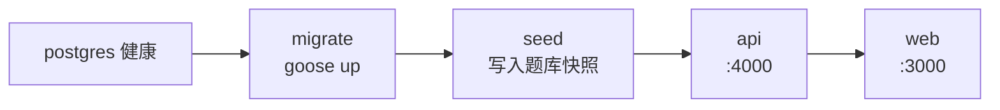

# TouhouFlandre（东方芙一把）

TouhouFlandre（东方芙一把）是一个东方 Project 主题角色推理游戏。玩家根据结构化标签反馈（初登场作品、年份、种族、阵营、地点、头发颜色等）逐步缩小范围，猜出隐藏角色。

本项目是非官方同人项目，功能覆盖每日题、随机题、角色搜索、本地统计和多人房间。

## 项目结构



| 目录 | 说明 |
|---|---|
| `apps/web` | Next.js 16、React、TypeScript、Tailwind CSS v4 前端 |
| `apps/api` | Go + Echo API 服务，承载权威游戏规则、HTTP API、WebSocket 和数据库访问 |
| `packages/data` | 角色、作品和头像元数据 JSON；seed 前通过 zod 校验 |
| `packages/shared` | 前端共享类型、模式配置、展示工具、题库校验辅助和分享文本 |
| `contracts/openapi` | HTTP API 契约唯一来源，生成 Go 与 Web 类型 |
| `contracts/ws` | 多人房间 WebSocket 协议约定 |
| `docs` | 游戏规则、功能说明、架构、部署、数据规范和维护计划 |

## 技术栈

| 层级 | 技术 | 用途 |
|---|---|---|
| 前端 | Next.js 16 App Router、React 19、TypeScript、Tailwind CSS v4 | 页面路由、交互组件、样式系统 |
| 前端数据访问 | openapi-fetch、openapi-typescript、Dexie | 类型化 API 调用、IndexedDB 本地统计 |
| 后端 | Go 1.26、Echo v5、pgx、coder/websocket | HTTP API、权威游戏规则、多人实时通道 |
| 数据库 | Postgres 18、goose、sqlc | 结构化题库、会话、每日题、多人房间和事件 |
| 契约与生成 | OpenAPI、oapi-codegen、Redocly、sqlc | 契约优先、服务端/前端生成物防漂移 |
| 测试 | Vitest、React Testing Library、Playwright、Go test | 单元、组件、端到端和真实 Postgres 集成测试 |
| 部署 | Docker、Docker Compose、Next standalone、distroless Go 镜像 | 本地开发数据库与生产全栈部署 |
| 任务编排 | Task、pnpm workspace | 跨语言命令入口和 monorepo 管理 |

## 正式部署

生产环境通过 Docker Compose 运行完整服务栈，包含 `postgres`、`migrate`、`seed`、`api`、`web` 五个服务。生产栈使用独立项目名和数据卷，与本地开发环境的 `compose-dev.yaml` 隔离。

### 1. 准备环境

生产机器需要安装 Docker 与 Docker Compose。Task 不是必需项，但推荐安装，方便复用仓库命令。

从仓库根目录创建环境文件：

```bash
cp .env.example .env
```

部署前需要配置这些变量：

| 变量 | 生产建议 |
|---|---|
| `POSTGRES_PASSWORD` | 改为强密码，不能使用示例开发密码 |
| `WEB_ORIGINS` | 设置为浏览器实际访问源，例如 `https://game.example.com`；本地生产调试可用 `http://localhost:3000` |
| `NEXT_PUBLIC_API_BASE_URL` | 通常留空，让前端通过同源 `/api` 访问 API |
| `LOG_LEVEL`、`MULTI_*` | 按需要调整多人房间 TTL、回合时长、WebSocket 队列等参数；不填则使用后端默认值 |

如果用 cloudflared 或反向代理暴露服务，默认让公网入口指向宿主机 `http://localhost:3000`。API 的宿主机 `4000` 端口主要用于直连调试或单独代理。

### 2. 构建并启动

推荐命令：

```bash
task prod:up
```

等价 Docker Compose 命令：

```bash
docker compose up -d --build --wait
```

启动顺序为：



Web 容器使用 Next standalone 产物，构建时通过 `API_PROXY_TARGET=http://api:4000` 固化 `/api` rewrite 目标；API 容器内置 `server`、`seed`、`goose` 和 `healthcheck` 二进制。

### 3. 检查状态

```bash
docker compose ps
task prod:logs
```

常用检查地址：

| 地址 | 用途 |
|---|---|
| `http://localhost:3000` | 生产 Web 入口 |
| `http://localhost:3000/api/health` | 经 Web 同源代理访问 API 健康检查 |
| `http://localhost:4000/livez` | API 容器进程探活 |
| `http://localhost:4000/readyz` | API 数据库 readiness |

### 4. 更新与回滚

常规更新流程：

```bash
git pull
task prod:up
```

`migrate` 和 `seed` 是一次性服务：每次启动会先执行数据库迁移，再写入题库并生成版本化快照。进行中会话绑定创建时的题库版本，题库更新不会改变已开始的会话答案或反馈。

停止生产栈：

```bash
task prod:down
```

注意：Docker 命名卷不是备份。公开部署前应为 Postgres 配置独立备份和恢复演练；数据库迁移前也应先备份。

## 本地开发

前置依赖：

| 工具 | 版本 |
|---|---|
| Node.js | 24 或更高 |
| pnpm | 11 |
| Go | 1.26 或更高 |
| Docker + Compose | 用于本地 Postgres |
| Task | 跨语言任务入口 |

从仓库根目录启动：

```bash
cp .env.example .env
pnpm install
task db:up
task db:migrate
task db:seed
pnpm dev
```

本地 Web 地址为 `http://localhost:5173`，API 地址为 `http://localhost:4000`。`task dev` 会先启动开发 Postgres，再并行启动 Go API 和 Next 开发服务。

本地开发默认通过 Next rewrites 走同源 `/api`。如果要让浏览器直连 API，可在 `.env` 设置：

```bash
NEXT_PUBLIC_API_BASE_URL=http://localhost:4000
```

开发数据库由 `compose-dev.yaml` 管理，Postgres 宿主端口为 `5433`，数据保存在 Docker 命名卷 `pgdata`。

## 常用命令

| 命令 | 说明 |
|---|---|
| `pnpm dev` / `task dev` | 启动本地 Postgres、API 和 Web |
| `task db:up` / `task db:down` | 启停本地开发 Postgres |
| `task db:migrate` | 执行 goose 数据库迁移 |
| `task db:seed` | 校验题库并写入数据库 |
| `task prod:up` | 构建并启动生产 Compose 栈 |
| `task prod:down` | 停止生产 Compose 栈 |
| `task prod:logs` | 查看生产 Compose 日志 |
| `pnpm build` | 构建全部 workspace 包 |
| `pnpm test` | 运行 shared/data/web 的 Vitest 测试 |
| `pnpm typecheck` | TypeScript 类型检查 |
| `pnpm lint:openapi` | Redocly OpenAPI lint |
| `task gen` | 重新生成 OpenAPI、sqlc 和 Web API 类型 |
| `task check:generated` | 生成后检查 Go 生成物是否漂移 |
| `cd apps/api && go test ./...` | Go 单元与集成测试；需要可访问 Postgres |
| `pnpm --filter @touhouflandre/web test:e2e` | Playwright E2E；需要 `task dev` 正在运行 |

## 功能范围

主要页面：

| 路由 | 功能 |
|---|---|
| `/` | 首页 |
| `/search` | 角色搜索 |
| `/single` | 单人模式大厅 |
| `/single/daily` | 每日题 |
| `/single/random` | 随机题 |
| `/multi`、`/multi/room/[code]` | 多人房间创建、加入和对战 |
| `/stats` | 浏览器本地统计 |
| `/announcement` | 公告 |
| `/links` | 友情链接和第三方素材署名 |

核心玩法包括每日题、随机题、结构化反馈、角色搜索、头像展示、结果分享、会话恢复、本地统计和多人房间。

## 数据与契约维护

- `contracts/openapi/openapi.yaml` 是 HTTP API 契约唯一入口。调整接口后运行 `task gen`，并将 Go 与 Web 生成物一并纳入版本管理。
- `apps/api/internal/generated`、`apps/web/src/generated` 是生成物，不要手工编辑。
- 权威游戏规则和运行时角色搜索位于 Go 的 `apps/api/internal/game`。前端只负责搜索交互、展示逻辑和类型消费。
- 题库从 `packages/data/src/*.json` 写入 Postgres。维护角色记录后运行 `task db:seed`。
- 题库 seed 会写版本化快照。会话记录绑定 `catalogVersion`，因此题库更新不会影响已开始的游戏。

## 文档

| 文档 | 内容 |
|---|---|
| [游戏规则](./docs/gameplay.md) | 玩法、反馈字段、胜负和公平性原则 |
| [功能与页面](./docs/features.md) | 页面职责、功能范围、状态存储和 API 概览 |
| [数据规范](./docs/data-guidelines.md) | 题库字段、来源、素材和贡献检查 |
| [开发指南](./docs/development.md) | 本地启动、命令、约定和故障排查 |
| [架构说明](./docs/architecture.md) | 技术栈、契约、数据流和不变量 |
| [部署指南](./docs/deployment.md) | Docker Compose 生产部署与运维注意事项 |
| [站点开发计划](./docs/site-development-plan.md) | 开发边界、PR 对齐标准和维护重点 |
| [多人房间开发文档](./docs/multiplayer.md) | 多人规则、状态机、REST 与 WebSocket 协议 |

## 测试与质量

推荐在合并前至少运行：

```bash
pnpm typecheck
pnpm test
pnpm lint:openapi
cd apps/api && go test ./...
```

涉及 API 契约、数据库 schema 或生成物时，额外运行：

```bash
task gen
task check:generated
```

涉及核心交互、多人房间或响应式布局时，建议在 `task dev` 运行中执行 Playwright：

```bash
pnpm --filter @touhouflandre/web test:e2e
```

## 贡献方式

欢迎通过 Issue 和 Pull Request 参与题库、规则、界面、文档和工程质量改进。提交 PR 前，请先在 Issue 中对齐需求、验收标准或数据来源；未事先在 Issue 中对齐，或明显偏离[站点开发计划](./docs/site-development-plan.md)的 PR 将被直接关闭。

详细贡献流程见 [CONTRIBUTING.md](./CONTRIBUTING.md)。

## 内容与授权说明

TouhouFlandre 是非官方同人项目，与上海爱丽丝幻乐团或任何官方发行方无关。东方 Project 的名称、角色和设定归各自权利方所有。

角色像素头像为第三方素材，按其各自条款使用，不属于本仓库 MIT 许可证覆盖范围。署名和授权详情见 [THIRD_PARTY_ASSETS.md](./THIRD_PARTY_ASSETS.md)。

本仓库原创源代码采用 [MIT License](./LICENSE)。第三方素材、东方 Project 名称、角色和设定不包含在该许可证内。
