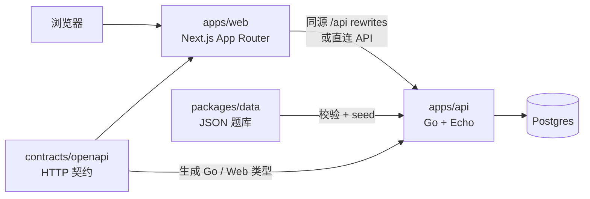

<p align="center">
  
</p>

<h1 align="center">TouhouFlandre（东方芙一把）</h1>

<p align="center">
  根据作品、年份、种族、阵营、地点和发色反馈，逐步推理出隐藏的东方 Project 角色。
</p>

<p align="center">
  <a href="https://github.com/jachinzhang1/TouhouFlandre/actions/workflows/ci.yml"></a>
  <a href="./LICENSE"></a>
  
  
  
</p>

<p align="center">
  <a href="https://touhouflandre.com"><strong>在线游玩</strong></a>
  ·
  <a href="#快速开始">本地运行</a>
  ·
  <a href="#文档导航">项目文档</a>
</p>

TouhouFlandre（东方芙一把）是一个无需账号即可游玩的东方 Project 主题角色推理游戏，支持每日题、随机题、角色搜索、本地统计以及实时多人房间。服务器负责答案选择、反馈判定和多人状态，避免在游戏结束前向客户端泄露答案。

本项目是非官方同人项目，与上海爱丽丝幻乐团或任何官方发行方无关。

## 目录

- [核心功能](#核心功能)
- [玩法简介](#玩法简介)
- [快速开始](#快速开始)
- [技术架构](#技术架构)
- [项目结构](#项目结构)
- [常用命令](#常用命令)
- [生产部署](#生产部署)
- [数据与契约](#数据与契约)
- [测试与质量](#测试与质量)
- [文档导航](#文档导航)
- [贡献方式](#贡献方式)
- [鸣谢与授权](#鸣谢与授权)

## 核心功能

| 功能           | 说明                                                                                |
| -------------- | ----------------------------------------------------------------------------------- |
| 每日题         | 同一天使用固定题目，最多 8 次猜测，并支持恢复未完成会话。                           |
| 随机题         | 随时创建独立题局，在当前答案池中随机选择角色。                                      |
| 结构化反馈     | 根据初登场作品、年份、种族、阵营、地点和头发颜色给出完全、部分、方向或不匹配反馈。  |
| 角色搜索       | 支持简繁中文、日文、英文、罗马字、别名和初登场作品等检索方式。                      |
| 多人房间       | 无需账号即可创建或加入房间，支持 2–8 人竞速、双人接力、观战、房间聊天和 BO1/3/5/7。 |
| 结果分享       | 复制不包含答案名称的纯文本结果摘要。                                                |
| 本地统计       | 在浏览器本地记录单人及多人数据，支持筛选、清除和 JSON 导入导出。                    |
| 会话与题库快照 | 游戏会话绑定创建时的题库版本，更新题库不会改变已经开始的题局。                      |

主要页面包括首页、单人模式、多人房间、角色搜索、统计和公告。更完整的页面与能力说明见[功能文档](./docs/features.md)。

## 玩法简介

每次猜测后，游戏会对六项公开字段进行比较：

| 字段                       | 反馈方式                                             |
| -------------------------- | ---------------------------------------------------- |
| 初登场作品                 | 作品相同为完全匹配；媒介类型相同为部分匹配。         |
| 初登场年份                 | 年份相同为完全匹配；否则通过箭头提示答案更早或更晚。 |
| 种族、阵营、地点、头发颜色 | 集合完全相同、存在交集或完全不匹配。                 |

反馈中的 `O` 表示完全匹配，`~` 表示部分匹配，`X` 表示不匹配，`↑` / `↓` 表示答案的初登场年份方向。完整胜负规则、多人规则与公平性原则见[游戏规则](./docs/gameplay.md)。

## 快速开始

### 在线游玩

访问 **[touhouflandre.com](https://touhouflandre.com)** 即可开始游戏，无需注册账号。

### 本地运行

准备以下环境：

| 工具             | 版本或用途        |
| ---------------- | ----------------- |
| Node.js          | 24 或更高         |
| pnpm             | 11                |
| Go               | 1.26 或更高       |
| Docker + Compose | 运行本地 Postgres |
| Task             | 跨语言任务入口    |

首次启动：

```bash
git clone https://github.com/jachinzhang1/TouhouFlandre.git
cd TouhouFlandre
cp .env.example .env
pnpm install
task db:up
task db:migrate
task db:seed
pnpm dev
```

默认服务地址：

| 服务         | 地址                               |
| ------------ | ---------------------------------- |
| Web          | `http://localhost:5173`            |
| API          | `http://localhost:4000`            |
| API 健康检查 | `http://localhost:4000/api/health` |
| API 存活检查 | `http://localhost:4000/livez`      |
| API 就绪检查 | `http://localhost:4000/readyz`     |

Web 默认通过同源 `/api` rewrite 访问 API。如需让浏览器直连 API，可在 `.env` 中设置：

```bash
NEXT_PUBLIC_API_BASE_URL=http://localhost:4000
```

更多环境变量、开发约定和故障排查见[开发指南](./docs/development.md)。

## 技术架构



| 层级       | 技术                                                         | 用途                                    |
| ---------- | ------------------------------------------------------------ | --------------------------------------- |
| 前端       | Next.js 16 App Router、React 19、TypeScript、Tailwind CSS v4 | 页面路由、交互组件和样式系统            |
| 前端数据   | openapi-fetch、openapi-typescript、Dexie                     | 类型化 API 调用和 IndexedDB 本地统计    |
| 后端       | Go 1.26、Echo v5、pgx、coder/websocket                       | HTTP API、权威游戏规则和多人实时通道    |
| 数据库     | Postgres、goose、sqlc                                        | 题库、会话、每日题、多人房间和事件      |
| 契约与生成 | OpenAPI、oapi-codegen、Redocly、sqlc                         | 维护契约并生成 Go、Web 和数据库访问代码 |
| 测试       | Vitest、React Testing Library、Playwright、Go test           | 单元、组件、端到端和 Postgres 集成测试  |
| 部署       | Docker、Docker Compose、Next standalone、distroless Go 镜像  | 生产全栈部署                            |

详细的数据流、权威边界和系统不变量见[架构说明](./docs/architecture.md)。

## 项目结构

| 目录                    | 说明                                                  |
| ----------------------- | ----------------------------------------------------- |
| `apps/web`              | Next.js 前端、页面组件、本地统计和浏览器端 API 客户端 |
| `apps/api`              | Go API、权威游戏规则、WebSocket、数据库迁移与查询     |
| `packages/data`         | 角色、作品、头像元数据和 Zod 运行时校验               |
| `packages/shared`       | 前端共享类型、模式配置、展示工具和分享文本            |
| `contracts/openapi`     | HTTP API 契约唯一来源                                 |
| `contracts/ws`          | 多人房间 WebSocket 协议约定                           |
| `content/announcements` | 站点公告 Markdown 内容                                |
| `docs`                  | 玩法、功能、架构、开发、部署和数据规范                |

## 常用命令

| 命令                                        | 说明                                         |
| ------------------------------------------- | -------------------------------------------- |
| `pnpm dev` / `task dev`                     | 启动本地 Postgres、API 和 Web                |
| `task db:up` / `task db:down`               | 启停本地开发 Postgres                        |
| `task db:migrate`                           | 执行 goose 数据库迁移                        |
| `task db:seed`                              | 校验题库并写入数据库                         |
| `pnpm build`                                | 构建全部 workspace 包                        |
| `pnpm test`                                 | 运行 shared、data 和 web 的 Vitest 测试      |
| `pnpm typecheck`                            | 执行 TypeScript 类型检查                     |
| `pnpm lint:openapi`                         | 检查 OpenAPI 契约                            |
| `task gen`                                  | 重新生成 OpenAPI、sqlc 和 Web API 类型       |
| `task check:generated`                      | 检查生成物是否与契约和查询保持同步           |
| `cd apps/api && go test ./...`              | 运行 Go 单元与 Postgres 集成测试             |
| `pnpm --filter @touhouflandre/web test:e2e` | 运行 Playwright 端到端测试，需先启动开发服务 |

## 生产部署

生产环境通过 Docker Compose 运行 `postgres`、`migrate`、`seed`、`api` 和 `web`。部署前请修改 `.env` 中的数据库密码、浏览器来源和多人服务密钥等生产配置。

```bash
cp .env.example .env
task prod:up
```

默认 Web 入口为 `http://localhost:3000`，API 调试入口为 `http://localhost:4000`。公网反向代理通常只需指向 Web 入口，并支持多人房间使用的 WebSocket Upgrade。

更新和停止服务：

```bash
git pull
task prod:up
task prod:down
```

Docker 命名卷不是备份。公开部署前应配置 Postgres 备份与恢复演练。完整环境变量、启动顺序、健康检查和运维说明见[部署指南](./docs/deployment.md)。

## 数据与契约

- `contracts/openapi/openapi.yaml` 是 HTTP API 契约唯一入口。修改接口后运行 `task gen`，并提交对应 Go 与 Web 生成物。
- `apps/api/internal/generated` 和 `apps/web/src/generated` 是生成代码，不应手工编辑。
- 权威答案选择、反馈比较和运行时角色搜索位于 `apps/api/internal/game`。
- 角色与作品数据位于 `packages/data/src`，写入前通过 Zod 和跨记录规则校验。
- 题库 seed 会生成版本化快照，已经开始的游戏继续使用创建时的版本。

题库字段、资料来源、Excel 编辑流程和素材要求见[数据规范](./docs/data-guidelines.md)。

## 测试与质量

提交常规改动前，至少运行：

```bash
pnpm typecheck
pnpm test
pnpm lint:openapi
cd apps/api && go test ./...
```

修改 API 契约、数据库查询或生成物时，额外运行：

```bash
task gen
task check:generated
```

修改核心交互、多人房间或响应式布局时，在开发服务运行期间执行：

```bash
pnpm --filter @touhouflandre/web test:e2e
```

CI 会检查 OpenAPI、WebSocket 协议、类型、测试、Go 构建以及生成物漂移。

## 文档导航

| 文档                                                   | 内容                                           |
| ------------------------------------------------------ | ---------------------------------------------- |
| [游戏规则](./docs/gameplay.md)                         | 反馈字段、胜负、多人规则和公平性原则           |
| [功能与页面](./docs/features.md)                       | 页面职责、功能范围、状态存储和 API 概览        |
| [数据规范](./docs/data-guidelines.md)                  | 题库字段、资料来源、素材和贡献检查             |
| [开发指南](./docs/development.md)                      | 本地启动、环境变量、开发约定和故障排查         |
| [架构说明](./docs/architecture.md)                     | 技术边界、契约、数据流和系统不变量             |
| [部署指南](./docs/deployment.md)                       | Docker Compose 生产部署与运维注意事项          |
| [站点开发计划](./docs/site-development-plan.md)        | 开发边界、PR 对齐标准和维护重点                |
| [多人房间文档](./docs/multiplayer.md)                  | 多人规则、状态机、REST 与 WebSocket 协议       |
| [多人扩展文档](./docs/multiplayer-expansion/README.md) | 多人席位、竞速、聊天等扩展功能的设计和验收记录 |

## 贡献方式

欢迎参与题库、规则、界面、文档和工程质量改进。提交 Pull Request 前，请先通过 Issue 对齐需求、验收标准或数据来源，并阅读 [CONTRIBUTING.md](./CONTRIBUTING.md)。题库修正还需遵守[数据规范](./docs/data-guidelines.md)，引入素材时需同步更新 [THIRD_PARTY_ASSETS.md](./THIRD_PARTY_ASSETS.md)。

请勿手工修改生成物、提交凭据或引入来源不明及授权不清的素材。

## 鸣谢与授权

### 第三方素材

- 角色像素头像来自苗库里的“东方全角色像素肖像素材包”，按作者允许的个人及非商业用途使用。
- 首页视觉、平台图标和其他素材的来源与许可记录在 [THIRD_PARTY_ASSETS.md](./THIRD_PARTY_ASSETS.md)。
- 第三方素材不属于本仓库 MIT License 的授权范围，复用或再分发前请分别核对其许可条件。

感谢所有提供资料、测试、反馈、代码和文档的贡献者。

### 东方 Project 声明

TouhouFlandre 是非官方同人项目，与上海爱丽丝幻乐团或任何官方发行方无关。东方 Project 的名称、角色和设定归各自权利方所有。

### 许可证

本仓库原创源代码采用 [MIT License](./LICENSE)。第三方素材、商标、东方 Project 名称、角色和设定不包含在该许可证内。
