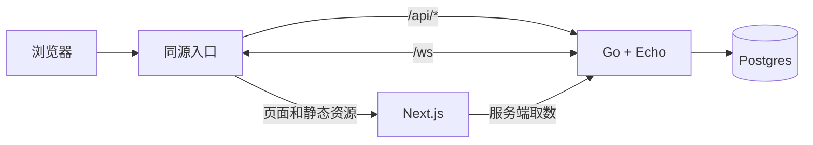

# 技术栈迁移书

> 状态：规划中  
> 基线日期：2026-08-05  
> 目标读者：项目贡献者  
> 范围：技术框架、开发工具、仓库结构及其迁移顺序

本文只回答三个问题：

1. 当前使用什么技术；
2. 迁移到什么技术，以及为什么；
3. 如何在保持项目可运行的前提下完成技术替换。

账号、权限、Token、多人房间协议、数据保留、监控告警、后台和运营规则不属于技术栈选型，统一记录在 [`07_productization_plan.md`](./07_productization_plan.md)。面向全体成员的简要介绍见 [`06_tech_stack_migration_summary.md`](./06_tech_stack_migration_summary.md)。

---

## 1. 当前技术栈

| 层 | 当前方案 |
|---|---|
| 前端 | React 19 + Vite 7 + TypeScript + 手写 History API 路由 |
| 样式 | 单一原生 CSS 文件 + lucide-react |
| 后端 | TypeScript + Express 5 + Zod |
| HTTP 调用 | 手写 `fetch` 和共享 TypeScript 类型 |
| 数据库 | SQLite + Prisma 6 |
| 共享代码 | `packages/shared`，混合传输类型、游戏规则和展示工具 |
| 题库 | `packages/data` JSON + Zod 校验，seed 写入数据库快照，服务启动时加载进内存 |
| 测试 | Vitest 用于 API、共享逻辑和题库；Web 尚无正式测试配置 |
| 仓库 | pnpm workspace monorepo |

当前 API 有 6 个 REST 端点。Prisma schema 现有 6 个模型，全部迁入 Postgres：`Character`、`Work`、`CatalogSnapshot`、`CatalogState`（题库目录）与 `DailyPuzzle`、`GameSession`（运行时数据）。题库的存储与版本设计见产品化规划第 4 节。

---

## 2. 目标技术栈

| 对象 | 目标方案 | 主要收益 |
|---|---|---|
| 前端框架 | Next.js App Router | 文件路由、页面级拆分、Server/Client Component 边界 |
| 样式 | Tailwind CSS v4 | 设计 token、局部样式修改、减少全局冲突、Vibe Coding 友好   |
| 后端语言与框架 | Go + Echo | 单二进制部署、明确的并发和生命周期管理 |
| HTTP 契约 | OpenAPI 3.0.3 | 前后端从同一规范生成类型，减少接口漂移 |
| 前端 API 客户端 | openapi-typescript + openapi-fetch | 生成类型和轻量类型安全调用 |
| Go HTTP 生成 | oapi-codegen + kin-openapi middleware | 生成 handler 接口、DTO 和请求校验 |
| 数据库 | Postgres | 更强的并发、约束、查询和扩展能力（仅存运行时与用户数据） |
| 数据访问 | sqlc | 从 SQL 生成类型安全的 Go 代码 |
| 数据库迁移 | goose | 版本化、可审查的 SQL migration |
| 实时传输 | coder/websocket | 轻量、支持 context 的 Go WebSocket 实现 |
| 前端单元/组件测试 | Vitest + React Testing Library | 延续现有 Vitest，覆盖纯逻辑、hooks 和 Client Components |
| 前端 E2E | Playwright | 在真实浏览器中测试 Next.js 路由和完整用户流程 |
| 跨语言任务 | Taskfile | 统一调用 pnpm、Go、数据库和生成任务 |
| 本地基础设施 | Docker Compose | 以固定方式启动 Postgres 等基础依赖 |
| 仓库 | pnpm workspace + `apps/api` 单 Go module | 保留前端工作区，同时避免单模块下引入 `go.work` |

本次不引入微服务、Kubernetes、额外消息服务、在线接口文档、mock service 或额外前端共享包。未来出现明确需求后再单独选型。

---

## 3. 目标技术拓扑



- Next.js 负责页面、路由、渲染和前端交互。
- Go + Echo 负责 HTTP API 和 WebSocket 服务。
- Postgres 是持久化数据库；题库数据的存储与版本设计见产品化规划第 4 节。
- 同源入口负责把页面、API 和 WebSocket 请求转发到对应服务。
- Next.js Route Handler 不承载 Go 已经负责的业务逻辑，避免形成两个后端。

这里仅定义技术组件和调用方向。身份传递、房间状态和事件时序见产品化规划。

---

## 4. 前端：Vite → Next.js App Router

### 4.1 迁移收益

| 当前问题 | Next.js 对应能力 |
|---|---|
| `parseRoute` 和 `routePath` 手工维护路径 | App Router 文件系统路由 |
| 页面都在单一客户端组件树中 | 路由级拆分、Server/Client Components |
| 404、loading、error 状态手工组织 | 框架约定文件 |
| 内容页只能客户端渲染 | 可按页面选择静态化、服务端渲染或缓存 |
| 元数据手工维护 | Metadata API |

Next.js 不会自动带来 SEO 或性能提升。只有减少客户端 JavaScript、选择合适的渲染方式并配置正确缓存时，收益才会兑现。

### 4.2 路由映射

| 当前 Route | App Router 路径 |
|---|---|
| `home` | `app/page.tsx` |
| `search` | `app/search/page.tsx` |
| `singleLobby` | `app/single/page.tsx` |
| `singleGame(mode)` | `app/single/[mode]/page.tsx` |
| `multiLobby` / `multiRoom` | `app/multi/page.tsx` / `app/multi/room/page.tsx` |
| `stats` / `leaderboard` / `announcement` / `links` / `admin` | 对应目录 |
| `notFound` | `app/not-found.tsx` |

游戏页保持 Client Component。首页、公告等页面从 Server Component 开始，只把需要状态和浏览器 API 的子树标记为 Client Component。

### 4.3 迁移方式

- 新前端临时放在 `apps/web-next` 或独立 worktree/部署槽，不在原目录中边删边改。
- 先迁移公共 layout 和静态页面，再迁移搜索和游戏页面。
- 每迁移一个页面即补齐对应测试并与旧页面对比。
- 全部路由完成后再将新应用替换为 `apps/web`。

---

## 5. 样式：原生 CSS → Tailwind CSS

采用 Tailwind CSS v4，以 `@theme` 和 CSS 变量维护颜色、字号、间距、圆角和阴影，使用 `prettier-plugin-tailwindcss` 排序类名。

迁移原则：

- 按页面迁移，不一次性机械改写全部 CSS。
- 保留必要的 reset、字体、复杂动画和第三方覆盖 CSS。
- 业务组件优先使用既有 token，不随意新增颜色和尺寸。
- 不预先引入 shadcn/ui；后台真正开始实现时再判断是否需要。

---

## 6. 后端：TypeScript/Express → Go/Echo

### 6.1 采用理由

- Go 可构建为单二进制，部署依赖更少。
- goroutine、context 和标准库生命周期适合同时承载 HTTP 与 WebSocket。
- 静态类型、`go test` 和 `go vet` 能提前发现一部分实现错误。
- 与 sqlc、oapi-codegen 组合后，接口和数据访问都有生成期检查。

Go 并不会自动消除 nil、并发或错误处理问题；迁移收益必须依靠测试和实际指标验证。现有 Express 代码已经使用 TypeScript 和 Zod，不能把它描述成“完全没有类型安全”。

### 6.2 Echo 集成方式

- handler 实现 oapi-codegen 生成的 strict server interface。
- 通过 kin-openapi 对应的 Echo middleware 做运行时请求校验。
- 手写业务代码放在 `internal`，生成代码与手写代码分离。
- HTTP server、数据库连接和后台 goroutine 都接受 context 并支持优雅关闭。

### 6.3 迁移方式

- 将当前 6 个端点完整映射到 OpenAPI operation，一次性实现全部端点。
- 将权威游戏规则迁入 Go，用现有 TypeScript 用例翻译为 Go 测试，建立等价验证。
- 验证通过后直接切换 API 入口，删除 Express。项目规模小，不需要双后端并行、逐端点切流或回滚窗口；git 历史即回滚手段。

---

## 7. HTTP 契约：共享类型 → OpenAPI

### 7.1 职责

采用 OpenAPI 3.0.3 作为 HTTP 请求和响应的唯一规范来源：

- Go 使用 oapi-codegen 生成 DTO 和 strict server interface。
- Web 使用 openapi-typescript 生成 `paths` 类型，并由 openapi-fetch 调用。
- OpenAPI 不负责数据库结构、前端视图模型或 WebSocket 协议。

### 7.2 目录

```text
contracts/openapi/
├── openapi.yaml
├── paths/
│   ├── health.yaml
│   ├── characters.yaml
│   ├── catalog.yaml
│   ├── puzzles.yaml
│   └── sessions.yaml
└── schemas/
    ├── common.yaml
    ├── character.yaml
    ├── work.yaml
    ├── session.yaml
    └── guess.yaml
```

`openapi.yaml` 是唯一入口。所有生成器只读取该文件，其他文件通过本地 `$ref` 引用。

### 7.3 最小规范要求

- 每个 operation 有稳定且唯一的 `operationId`。
- 明确 required、nullable、枚举、长度、格式和状态码。
- 时间使用 RFC 3339，业务日期另行定义格式。
- 错误响应使用统一结构并包含稳定错误码。
- CI 检查 OpenAPI 格式、规则、本地 `$ref` 和未引用文件。
- 生成代码提交入库，重新生成后工作区必须无 diff。

不预先引入在线接口文档或 mock service；团队出现明确需求时再选择工具。

---

## 8. 数据：SQLite/Prisma → Postgres/sqlc/goose

### 8.1 工具职责

- Postgres：关系数据库，保存题库快照与运行时数据（每日题、会话、未来的用户与房间）。
- goose：执行版本化 SQL migration。
- sqlc：读取 migration 描述的 schema 和查询 SQL，生成 Go 数据访问代码。

**迁移边界：全部 6 个模型迁入 Postgres**：`Character`、`Work`、`CatalogSnapshot`、`CatalogState`（题库目录）与 `DailyPuzzle`、`GameSession`（运行时数据）。题库的存储设计、版本管理与优化预案见产品化规划第 4 节，不在本技术栈文档展开。

### 8.2 JSON 字段

SQLite 中的 JSON 文本迁移为 Postgres JSONB 或规范化表，需要按查询和约束需求逐项决定。角色目录与运行时数据都适用：

- 只展示、低频查询的复合字段可以使用 JSONB。
- 需要唯一约束、关联、排序或统计的数据应使用关系表。
- JSONB 只保证合法 JSON，结构仍需 CHECK 或应用层校验。

具体业务表拆分记录在产品化规划和后续 schema ADR 中。

### 8.3 Zod 的保留范围

Zod 与目标技术栈并不冲突，但职责会收窄：

- `packages/data` 继续用 Zod 校验题库源 JSON，校验通过才允许 seed 写入数据库。
- Next.js 表单和前端本地输入可以使用 Zod。
- Go API 请求使用 OpenAPI middleware 校验，不维护第二套 Zod API schema。
- `task catalog:check` 执行题库 Zod 校验（校验失败即 CI 失败）；`task db:seed` 将校验通过的题库写入数据库快照。

### 8.4 搜索

沿用现有方式：`search_text` 列（seed 时预计算的规范化文本）+ SQL 子串匹配，直接映射为 sqlc 查询。现有逻辑的归一化（NFKC、符号剥离）与字段拼接保留在 seed 写入阶段，不在查询时现场计算。

内存索引等搜索优化属后期预案，见产品化规划第 4 节。

---

## 9. 实时传输：coder/websocket

当前仓库尚未实现 Socket.IO，因此这里是新增实时传输选型，不是替换已有库。

采用 coder/websocket 的原因：

- API 小且贴近标准 WebSocket。
- 原生支持 context 取消。
- 提供 JSON、ping/pong、并发写和关闭握手所需基础能力。
- 对低频、小房间的回合制游戏足够轻量。

该库只提供传输。房间状态、重连、事件顺序、鉴权和持久化属于系统设计，见产品化规划。只有容量数据表明确实需要跨实例广播时，才重新评估 Redis、NATS 或 Centrifugo。

---

## 10. 前端测试技术栈

### 10.1 Vitest + React Testing Library

用于：

- `apps/web/src/domain` 中的纯函数；
- hooks 和状态 reducer；
- 同步 Server Components；
- Client Components 的渲染与交互。

选择 Vitest 是因为仓库已经使用它，迁移成本最低。React Testing Library 用用户可见行为测试组件，不依赖内部实现。

### 10.2 Playwright

用于：

- App Router 导航、404 和页面加载；
- async Server Components；
- 完整游戏流程；
- 键盘、移动端、无障碍和视觉回归。

不同时引入 Jest 或 Cypress，避免重复测试运行器。

---

## 11. Monorepo 目标结构

```text
touhouflandre/
├── apps/
│   ├── web/
│   │   ├── app/
│   │   └── src/
│   │       ├── domain/              # 前端专用展示和格式化逻辑
│   │       └── generated/           # OpenAPI 生成类型
│   └── api/
│       ├── cmd/server/
│       ├── cmd/seed/                # seed：题库写入快照 + 更新当前版本
│       ├── internal/
│       │   ├── game/
│       │   ├── generated/
│       │   │   ├── openapi/
│       │   │   └── repo/
│       │   └── handler/
│       ├── migrations/
│       ├── sql/queries/
│       ├── sqlc.yaml
│       └── go.mod
├── contracts/openapi/
├── scripts/
├── docs/
├── Taskfile.yml
├── compose.yaml
├── pnpm-workspace.yaml
└── package.json
```

- Go 只有一个 module，不引入 `go.work`。
- 前端专用代码直接放 `apps/web`，不创建 `web-domain` 等额外 workspace 包。
- 生成目录禁止手工修改。
- `packages/shared` 按调用者逐步拆解，不在迁移开始时直接删除。
- 题库 JSON 留在 `packages/data`（源数据），seed 写入数据库；存储与版本设计见产品化规划第 4 节。

---

## 12. 任务编排与本地环境

pnpm 负责 JavaScript 包内任务；Taskfile 只提供跨语言入口。

```yaml
version: "3"

tasks:
  dev:
    deps: [db:up]
    cmds:
      - task --parallel dev:api dev:web

  dev:api:
    dir: apps/api
    cmds: ["go run ./cmd/server"]

  dev:web:
    cmds: ["pnpm --filter @touhouflandre/web dev"]

  db:up:
    cmds: ["docker compose up -d --wait postgres"]

  db:migrate:
    dir: apps/api
    cmds: ["goose -dir migrations up"]

  catalog:check:
    cmds: ["pnpm --filter @touhouflandre/data validate"]

  db:seed:
    deps: [catalog:check, db:migrate]
    dir: apps/api
    cmds: ["go run ./cmd/seed"]

  gen:
    cmds:
      - task: gen:openapi
      - task: gen:repo
      - task: gen:web
```

本地开发只容器化 Postgres，Next.js 和 Go 在宿主机运行以保留快速热更新。

```yaml
services:
  postgres:
    image: postgres:18.4-alpine
    environment:
      POSTGRES_DB: touhouflandre
      POSTGRES_USER: touhouflandre
      POSTGRES_PASSWORD: ${POSTGRES_PASSWORD}
    ports:
      - "5432:5432"
    volumes:
      - pgdata:/var/lib/postgresql
    healthcheck:
      test: ["CMD-SHELL", "pg_isready -U touhouflandre -d touhouflandre"]
      interval: 5s
      timeout: 3s
      retries: 10

volumes:
  pgdata:
```

生产运行规范放在产品化规划中，本节不展开。

---

## 13. 技术迁移顺序

### Phase 0 — 固定基线与工具版本

- 记录当前 6 个端点、6 个模型和测试结果。
- 固定题库版本、Go、Node、pnpm、Postgres、生成器和 Taskfile 版本。

### Phase 1 — 引入 OpenAPI

- 按现有端点编写 OpenAPI 3.0.3。
- Express 和当前 Vite 前端先接入生成类型。
- 加入规范校验和生成结果 diff。

### Phase 2 — 引入 Postgres、Go 与题库迁移

- 创建 Go module、goose migration（全部 6 个模型）、sqlc 查询、Go seed（题库写入快照 + 更新当前版本）。
- 搜索沿用 `search_text` SQL 查询映射为 sqlc；内存索引属后期优化，不在本阶段（见产品化规划 4.4）。
- 使用真实 Postgres 完成集成测试；一次性实现全部 6 个端点，用黄金用例验证与现有行为一致。

### Phase 3 — 切换后端

- 将 API 入口切换到 Go，删除 Express、Prisma 和 SQLite 依赖。
- 旧实现保留在 git 历史中，确认稳定后不再维护双后端。

### Phase 4 — 迁移前端

- 在并行目录迁移 Next.js 路由和页面。
- 按页面迁移 Tailwind CSS。
- 建立 Vitest、React Testing Library 和 Playwright 测试。
- 稳定后替换 Vite 应用。

### Phase 5 — 清理仓库

- 删除无调用者的共享类型和重复游戏规则。
- 更新 README、开发命令和 CI。
- 确认生成代码、migration 和工具版本可复现。

身份、后台、多人玩法和生产运维能力在技术迁移完成后，按产品化规划独立实施；它们不是技术栈替换阶段。

---

## 14. 技术迁移风险

| 风险 | 缓解 |
|---|---|
| 现有 6 个模型被遗漏 | 以当前 Prisma schema 生成迁移清单 |
| Go 与现有行为不一致 | 固定输入、时钟和随机源的黄金用例测试 |
| OpenAPI 与生成代码漂移 | CI 重新生成并检查工作区 diff |
| sqlc 静态分析覆盖不了复杂 SQL | 使用真实 Postgres 集成测试 |
| Next.js 与 Go 职责重叠 | Route Handler 只承担明确的前端适配职责 |
| Go 学习曲线影响进度 | 小端点先行，保留测试和代码评审 |
| Tailwind 迁移造成视觉回归 | 页面级迁移和 Playwright 截图对比 |
| 内存搜索与现有逻辑行为不一致 | 固定中/日/罗马字样本黄金用例回归（逻辑平移，无 SQL 退化问题） |
| 过早引入额外基础设施 | 新组件必须由实际容量或功能需求触发 |

---

## 参考资料

- [Next.js App Router](https://nextjs.org/docs/app)
- [Next.js：Vitest](https://nextjs.org/docs/app/guides/testing/vitest)
- [Next.js：Playwright](https://nextjs.org/docs/app/guides/testing/playwright)
- [oapi-codegen](https://github.com/oapi-codegen/oapi-codegen)
- [sqlc：代码生成](https://docs.sqlc.dev/en/latest/howto/generate.html)
- [coder/websocket](https://github.com/coder/websocket)
- [Postgres 官方容器镜像](https://hub.docker.com/_/postgres)
