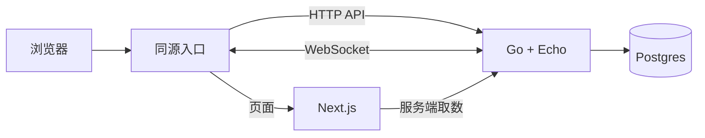

# 技术栈迁移概览

> 面向项目全体成员的精简说明  
> 完整技术选型见 [`05_tech_stack_migration.md`](./05_tech_stack_migration.md)
> 账号、多人、运维等产品化设计见 [`07_productization_plan.md`](./07_productization_plan.md)

## 迁移目的

当前技术栈已经支持可玩的本地 Demo，但手写路由、SQLite、手工共享接口类型和单一 CSS 文件会增加后续维护成本。本次迁移只更换项目的技术基础，不在同一份计划中新增账号、后台或多人玩法。

## 迁移对象、目标和好处

| 对象 | 当前方案 | 目标方案 | 带来的好处 |
|---|---|---|---|
| 前端框架 | React + Vite + 手写路由 | Next.js App Router | 减少路由维护，支持页面级拆分和按需服务端渲染 |
| 样式 | 单一原生 CSS 文件 | Tailwind CSS v4 | 统一设计 token，让样式修改更局部 |
| 后端 | TypeScript + Express | Go + Echo | 简化部署和生命周期管理，为 HTTP 与实时连接提供统一服务 |
| HTTP 契约 | 手写共享类型 | OpenAPI 3.0.3 | 前端、后端从同一规范生成类型，减少接口漂移 |
| 前端 API | 手写 `fetch` | openapi-typescript + openapi-fetch | 自动生成类型并保留轻量调用方式 |
| 数据库 | SQLite | Postgres | 提供更强的并发、约束和查询能力（仅运行时数据） |
| 题库目录 | 每次查询都读数据库 | 数据库快照权威（版本化） | 版本管理与历史复现由 DB 承担；内存索引为后期优化 |
| 数据访问 | Prisma | sqlc | 从可审查 SQL 生成类型安全的 Go 代码 |
| 数据库迁移 | Prisma Migrate | goose | 使用独立、版本化的 SQL migration |
| 实时传输 | 尚未实现 | coder/websocket | 为未来实时功能提供轻量 Go WebSocket 传输层 |
| 前端单元/组件测试 | 尚未配置 | Vitest + React Testing Library | 延续仓库现有 Vitest，覆盖逻辑和组件交互 |
| 前端 E2E | 尚未配置 | Playwright | 在真实浏览器验证 Next.js 路由和完整流程 |
| 跨语言任务 | pnpm 脚本 | pnpm + Taskfile | 统一前端、Go、数据库和生成任务入口 |
| 本地基础设施 | 手工环境为主 | Docker Compose | 用固定方式启动 Postgres 等依赖 |

## 迁移后的技术结构

- Next.js 负责页面、路由和前端交互。
- Go + Echo 负责 HTTP API 和 WebSocket 服务。
- Postgres 负责持久化。
- OpenAPI 连接前后端类型生成。
- Taskfile 统一跨语言开发命令。

## 主要迁移顺序

1. 固定当前端点、数据模型、测试结果和工具版本。
2. 为现有 HTTP 接口建立 OpenAPI 规范和生成代码。
3. 引入 Postgres、Go、goose 和 sqlc，实现题库快照与内存加载器，替换 Express。
4. 后端稳定后迁移 Next.js 路由和 Tailwind CSS。
5. 配置 Vitest、React Testing Library 和 Playwright。
6. 删除 Express、Prisma、SQLite、Vite 和无调用者的共享代码。

每一步都保持项目可运行，旧实现经过验证和回滚窗口后才删除。

## 对成员的影响

- 前端使用 Next.js、Tailwind CSS、生成的 API 类型和两层测试工具。
- 后端使用 Go、Echo、sqlc、goose 和 Postgres。
- HTTP 接口变更先修改 OpenAPI，再重新生成代码。
- 数据库结构变更通过 goose migration 提交。
- 生成代码禁止手工编辑。
- 题库继续由 Zod 校验后写入数据库快照，查询走 SQL；内存索引属于后期优化。

## 不属于本次技术栈迁移的内容

以下内容另行规划，不作为技术栈切换的交付物：

- 账号、JWT、权限和后台；
- 多人房间规则和事件协议；
- 统计、排行榜和个人数据生命周期；
- 生产监控、告警、备份和事故流程；
- 素材许可及其他运营规则。

详见 [`07_productization_plan.md`](./07_productization_plan.md)。
