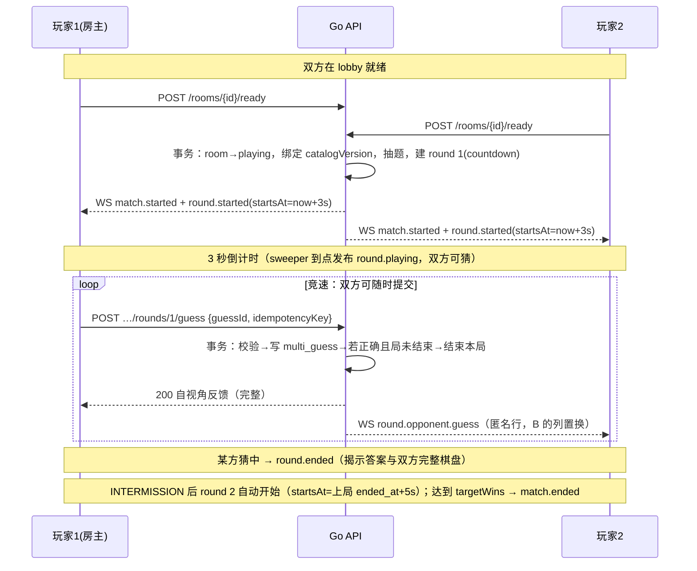
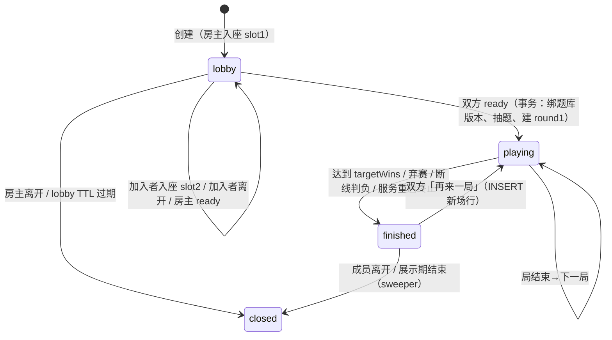
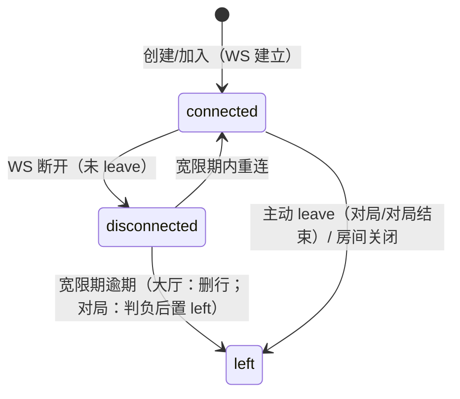
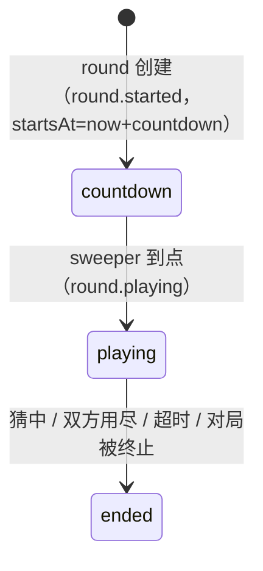

# 多人联机模式设计

> 状态：设计稿（待评审）
> 基线日期：2026-08-06
> 目标读者：产品、前后端、测试和运维贡献者
> 范围：第一阶段房间制实时对战——创建房间/输入房间号加入、BO1/3/5/7 赛制、游客游玩

本文是 [`07_productization_plan.md`](./07_productization_plan.md) §7（多人房间系统）与 §4.2（后续产品数据）的具体化设计，并遵循 [`05_tech_stack_migration.md`](./05_tech_stack_migration.md) 的技术选型（Go + Echo + Postgres + sqlc + goose + coder/websocket、Next.js App Router）。实现阶段执行记录写入 `docs/develop_plan/multiplayer_mode/`。

---

## 1. 目标与边界

### 1.1 本阶段范围（In Scope）

- **房间制**：创建房间获得 6 位房间号；凭房间号加入；**不做随机匹配**。
- **游客可玩**：无需注册登录即可创建/加入/游玩；游客**不参与排行榜、不提供云端对局保存**。
- **实时对战（非回合制）**：双方同时竞猜同一个隐藏角色，**先提交正确猜测者赢得该局**。
- **赛制**：BO1 / BO3 / BO5 / BO7，即先胜 `(N+1)/2` 局（BO1→1 局、BO3→2 局、BO5→3 局、BO7→4 局）。
- **再来一局（rematch）**：对局结束后同一房间一键开新对局，双方无需重新创建/加入房间。
- **进度可见性**：对局中可实时看到对方已猜次数，以及对方每次猜测逐「标签」（字段）的符合状况；**看不到对方猜的角色，也看不到标签（字段）是什么**——前端只呈现颜色。
- 断线重连（宽限期内）、宽限期后判负、服务重启给出明确终止结果。

### 1.2 本阶段边界（Out of Scope）

- 随机匹配、观战、多人大厅列表、邀请链接（分享房间号文本即可）。
- 排行榜、对局回放、云端对局保存、个人统计（游客身份本就是房间级的，见 §5）。
- 账号体系（`users`/`auth_sessions` 属产品化 Stage 2，本阶段不引入；游客令牌与未来 JWT 通过令牌类型前缀共存，见 §5.1）。
- 投降（对局中主动认输）、单步计时（棋钟）、表情/聊天——不在 v1，列为后续扩展。
- 多实例横向扩展、跨实例广播——延后，由压测数据触发（07 §7.4）；届时选型范围：Redis/NATS/Centrifugo 或零新基建的 Postgres `LISTEN/NOTIFY`（§9.4）。

---

## 2. 术语

| 术语 | 含义 |
|---|---|
| 房间（room） | 一次联机会话，容量固定 2 人，有 6 位房间号 |
| 成员（member） | 房间内的玩家，slot 1/2；游客身份房间级有效 |
| 对局（match） | 从双方就绪到分出胜负的一整场，含多局 |
| 局（round） | 对局中的一个独立题目竞速；一局一个隐藏角色 |
| 赛制（format） | bo1/bo3/bo5/bo7，决定目标胜场 `targetWins=(N+1)/2` |
| 猜测（guess） | 一局内一次角色提交；每局每人上限 8 次（沿用单人 `GameContentDefinition.MaxGuesses`） |
| 匿名矩阵（opponent board） | 对手视角：只含状态颜色的网格（无角色名、无字段标签/值） |
| 列置换（column permutation） | 每个观察者每局独立打乱的字段列序，用于让「看不到标签」成立 |
| 游客令牌（guest token） | 服务端签发的匿名身份凭据，仅绑定单个房间 |
| 事件序列（sequence） | 房间内单调递增的持久事件序号，客户端恢复游标 |

---

## 3. 业务不变量（新增）

在 07 §2 既有不变量（服务器权威、进行中不返回答案、题库快照绑定、猜测顺序稳定、并发不覆盖、匿名可玩）之上，多人模式新增：

1. **单局是实时竞速**：无回合交替、无「轮到谁」概念；`round.status = playing` 期间双方可随时提交猜测，服务端按事务串行化裁决。
2. **首个提交正确猜测者胜该局**：并发正确猜测由行锁串行化，后到者收到 `ROUND_ENDED`，其猜测**不写入**（与单人「已结束的会话不再接受新的猜测」一致）。
3. **单局结束后才揭示答案**；局中对局双方只拿到：自己的完整反馈、对手的匿名矩阵。
4. **匿名矩阵数据最小化**：局中发给对手的行**不含**角色名、头像、字段标签、字段值——后端根本不生成这些字段；列序按观察者独立置换，且该置换只存在于服务端投影。
5. **游客身份房间级**：令牌只对该房间有效；跨房间不产生任何可累计的统计或存档（无排行榜、无云端对局记录）。
6. **断线宽限**：连接断开进入 60 秒宽限期；宽限期内重连恢复，逾期未归——对局中判负、大厅中移除成员（房主离开则房间关闭）。
7. **服务重启给出明确结果**：进行中对局终止（`match.ended result=draw, reason=server_restart`），不静默丢失。
8. **对局结束即锁定**：`match.ended` 后不接受 ready、猜测、加入，仅接受「再来一局」；房间保留一段展示期后关闭。
9. **再来一局是新对局**：`finished` 后双方各自确认「再来一局」即开新对局——房间号与成员不变，服务端 `INSERT` 新场行（`multi_match`），比分/抽题池自然重置、题库版本重新绑定（07 §2 快照不变量按「每场对局」界定）。

---

## 4. 玩法设计

### 4.1 创建与加入

- 房主在 `/multi` 选择赛制（BO1/3/5/7）与昵称，创建房间 → 得到 6 位房间号（如 `ABC123`）。
- 房主把房间号发给朋友；朋友在 `/multi` 输入房间号与昵称加入。
- 加入校验：房间存在且处于 `lobby`、未满 2 人；否则 `ROOM_NOT_FOUND` / `ROOM_FULL` / `ROOM_CLOSED`。
- 房间号字符集 `ABCDEFGHJKLMNPQRSTUVWXYZ23456789`（32 字符，去除易混 0/O/1/I），6 位 → 约 10.7 亿组合；生成冲突重试。
- 房间号输入归一化：去空格/连字符、转大写。

### 4.2 赛制与胜场

| format | 总局数语义 | targetWins | 说明 |
|---|---|---|---|
| bo1 | 1 局定胜负 | 1 | 平局重开（安全上限见下） |
| bo3 | 先胜 2 局 | 2 | |
| bo5 | 先胜 3 局 | 3 | |
| bo7 | 先胜 4 局 | 4 | |

- 赛制在创建时固定（v1 不可改），加入者加入前可见（经公开 `GET /api/rooms/{roomCode}` 预检，见 §7.1）。
- **平局**（双方 8 猜未中或整局超时）不计入任何一方胜场，经 `INTERMISSION` 自动重开下一局（时间线见 §4.3）。
- **安全上限**：总局数达到 `3 × N`（bo1→3、bo3→9、bo5→15、bo7→21）仍无胜者 → 整场判平（`match.ended result=draw reason=round_cap`）。开局事务检查 `round_count < 3 × N` 才开新局，第 `3 × N` 局结束仍无胜者即判平（见 §9.2）。正常对局几乎不可能触达（113 个可答角色、每人 8 猜），仅为协议终止兜底。

### 4.3 单局流程与实时竞速



关键语义：

- **局间时间线**：round 1 的 `startsAt = 双方就绪时刻 + ROUND_COUNTDOWN`（3s）；后续局的 `startsAt = 上一局 ended_at + INTERMISSION`（5s）——**间歇兼作倒计时，不叠加 `ROUND_COUNTDOWN`**（后者仅用于首局）。`round.started` 于局创建时发布（countdown 态），sweeper 到 `startsAt` 发布 `round.playing`。
- **无回合交替**：猜测输入只受 `round.status` 门控，任何时刻双方都能提交。
- **同一角色双方可各自猜**（去重是「同一成员同局内同角色」）；与对手重复无限制。
- 一局中自己已猜过的角色不能重复提交（复用 `DUPLICATE_GUESS` 语义）。
- 每局每人 8 猜：用尽后该成员不能再提交（`GUESS_LIMIT_REACHED`），但对手仍可继续；双方都用尽且无人猜中 → 平局。
- 局中自己的棋盘与单人模式一致：角色名、头像、每字段 标签/状态/符号/值；由 `game.CompareCharacter` 权威计算后**仅存状态序列**，展示字段（标签、显示值、头像）由题库快照在投影时恢复（与单人旧猜测恢复同源，见 07 §2）。

### 4.4 单局结束判定（优先级从高到低）

1. **猜中**：某成员提交正确角色 → 该成员胜；局立即结束。
2. **双方用尽**：双方各 8 猜且无人猜中 → 平局。
3. **整局超时**：`deadline`（默认 15 分钟，从 `startsAt` 起算）到点 → 平局（sweeper 判定，见 §6.3；猜测事务在 `deadline` 后拒绝新猜测并同步结算平局，见 §9.2 步骤 4b）。

局结束即发布 `round.ended`：包含结果（win/loss/draw）、胜者 slot、答案角色（名称/头像）、双方完整棋盘、当前比分；比分达到 `targetWins` 时紧随发布 `match.ended`。

**局末展示交互（弹窗）**：局结束弹窗展示本局胜负与答案，并附「查看对局」按钮；点击后关闭弹窗，展示双方完整棋盘。若对局未结束，弹窗同时显示下一局倒计时（下一局 `startsAt` = 本局 `ended_at` + `INTERMISSION`，默认 5s）；倒计时由服务端 `startsAt` 驱动，**点击「查看对局」不会暂停倒计时**——到点即开下一局，客户端自动切到新局棋盘，上一局完整棋盘保留在历史局摘要中可回看。

### 4.5 可见性与隐私

#### 自视角（完整）
与单人模式相同的反馈表格：角色名、头像、每字段标签、状态、符号、展示值。

#### 对手视角（匿名矩阵）
- 行 = 对手本局已提交的猜测（按时间序）；列 = 6 个字段位置；单元格 = 状态颜色。
- 无列头、无角色名/头像、无展示值。**后端在局中只下发状态序列**，标签/值/名称不进入任何 payload。
- **列置换**：由于字段顺序在单人分享文本中是公开信息，固定列序会让「看不到标签」形同虚设。因此服务端按 `(roundId, observerMemberId)` 生成确定性种子，对 6 列做 Fisher–Yates 置换；下发给 A 的 B 棋盘与下发给 B 的 A 棋盘使用**各自独立**的列序，且每局重新打乱。置换只存在于服务端投影（实时推送、快照、事件重放三处共用同一投影函数），客户端永远拿不到真实列序。
- 已知取舍：颜色图案本身仍可被推断，且比「单个反例」更系统——观察者拥有自己的**带标签完整棋盘**、知道每次猜测的值，而同一 `(round, observer)` 列序固定，多次猜测后即可把颜色模式与自身猜测值对照反推各列身份（例如「整行全绿只有一列箭头」可反推出年份列位置；数值列 ↑/↓ 与自己的年份值逐一比对即可定位）。这是「可见进度」玩法的一部分，属可接受范围；真正隐藏的是角色身份与字段值（标签/展示值不进 payload）。
- 状态→颜色映射（全局唯一，公开在帮助/图例中，不泄露字段身份）：

| 状态 | 符号 | 颜色 |
|---|---|---|
| exact | O | jade（绿） |
| partial | ~ | amber（黄） |
| miss | X | ink/gray（灰） |
| higher | ↑ | sky（浅蓝） |
| lower | ↓ | indigo（深蓝） |
| unknown | ? | 中性描边（虚） |

- 无障碍：颜色不唯一表达（§10.4）：矩阵外提供图例；单元格 `aria-label` 为状态名。

#### 局末揭示
`round.ended` 后双方可见答案与**双方**完整棋盘（此时答案已公开，历史猜测不再敏感）。

### 4.6 断线、重连、离开与服务重启

| 场景 | 处理 |
|---|---|
| WS 断开（网络抖动） | 成员置 `disconnected`，启动 60s 宽限；对手照常继续本局 |
| 宽限期内重连 | `hello{token, lastSequence}` 重新鉴权；补发缺口事件 + 快照；恢复 `connected` |
| 宽限期逾期 | 对局中：当前局判对方胜 + `match.ended reason=disconnect`；大厅中：移除成员（房主离开→房间关闭） |
| 主动离开（大厅） | 房主→房间关闭；加入者→**删除成员行**释放 slot（大厅无局数据，删行不级联），房间继续可加入，房主的 ready 保留 |
| 主动离开（对局中） | 等同立即弃赛：判对方胜 + `match.ended reason=forfeit`，成员行置 `left` 保留（供结果展示/审计） |
| 主动离开（对局结束后/等待再来一局） | 房间关闭（无继续对局的可能） |
| 断线宽限逾期（对局结束后/等待再来一局） | 视同主动离开：房间关闭（`room.closed reason=member_left`） |
| 服务重启（发布/崩溃） | 启动时对进行中的对局（**含 `countdown` 态局**）执行「明确终止」：`round.ended`(平局) + `match.ended reason=server_restart, result=draw`；成员重连/拉快照即见结果。大厅房间保留，成员置 `disconnected` 重启宽限计时 |
| 双方同时离线 | 各自宽限计时；先逾期者触发上述规则——判对方胜**不要求对方在线**（确定性优先），结果在成员重连/拉快照时可见 |

宽限期、间歇、超时等常量见 §11。

### 4.7 时间常量（默认值，全部可配置）

| 常量 | 默认 | 用途 |
|---|---|---|
| `ROUND_COUNTDOWN` | 3s | 首局就绪后的倒计时（仅 round 1） |
| `INTERMISSION` | 5s | 局间自动间歇（下一局 `startsAt` = 上局 `ended_at` + `INTERMISSION`，兼作下一局倒计时，不叠加 `ROUND_COUNTDOWN`） |
| `ROUND_SECONDS` | 900s | 单局整局时限（超时平局） |
| `DISCONNECT_GRACE` | 60s | 断线宽限期 |
| `LOBBY_TTL` | 30min | 大厅无人加入的房间过期 |
| `FINISHED_RETENTION` | 30min | 对局结束后结果展示期 |
| `MULTI_EVENT_RETENTION` | 24h | closed 到删除的保留时长（§9.1 删除策略） |
| `MAX_ROUNDS_FACTOR` | 3 | 总局数安全上限 = `3 × N` |

---

## 5. 身份与游客

### 5.1 游客令牌

- 创建/加入房间时服务端签发 `guestToken`：`crypto/rand` 32 字节 → base64url（无填充）。**令牌即凭据**，库中只存 `sha256(token)` 哈希。
- 令牌房间级有效：不能用于其他房间，无跨房间身份、无过期时间（生命周期受房间 TTL 约束）。
- 传输约定：REST 用 `Authorization: Bearer guest:{token}`；WS 在 `hello` 首帧携带（**不放 URL 查询参数**，避免进日志，符合 07 §5.3）。
- 扩展性：令牌带 `guest:` 前缀，未来账号（Stage 2）以 `Bearer jwt:{accessToken}` 共存，协议无需改动；令牌类型不匹配 → `GUEST_UNAUTHORIZED`。
- 前端持久化：`localStorage["touhoufriberg:multi-room"] = {roomId, roomCode, guestToken}`，用于刷新/重连恢复；一个浏览器同时只活跃一个房间（v1）。

### 5.2 昵称与展示

- 创建/加入时可选昵称：trim + 去控制字符 + ≤16 字符；空则服务端给 `匿名玩家`。
- 昵称纯展示，不构成身份；房间内互见。

### 5.3 排行榜与云存档边界

- v1 无排行榜（本就属规划中）；游客身份不产生任何跨房间统计表，无对局历史查询接口，无回放。这是产品边界而非缺口：`multi_*` 表只承载房间生命周期与**场次记录**（房间关闭后经事件保留期由 sweeper 单条 `DELETE FROM multi_room` CASCADE 清理，见 §9.1），跨房间不累计任何统计。
- 未来账号合并（07 §5.2「匿名会话通过显式流程合并」）与本设计无冲突：合并对象是未来的账号级数据，游客对局记录本来就不保留。

---

## 6. 状态机

### 6.1 房间状态



- 状态 `lobby`（等待加入）→ `playing` → `finished` → `closed`；`finished` 在双方确认再来一局时可回到 `playing`。`closed` 为终态：房间行保留 `MULTI_EVENT_RETENTION`（`expires_at = now() + MULTI_EVENT_RETENTION`）后由 sweeper `DELETE`，CASCADE 清整棵树（见 §9.1 删除策略）。
- **再来一局**：`finished` 后任意成员 `POST /rematch` 置自身 `rematch_ready`（幂等）；双方都就绪（且都 `connected`）时在同一事务中（锁房间行）：`INSERT` 新 `multi_match`（`match_index = MAX+1`、重绑 `catalog_version`，比分/`round_count` 自然为 0）→ 重置双方 `rematch_ready=false` → 建 round 1（countdown），发布 `match.started` + `round.started`。等待期受 `FINISHED_RETENTION` 约束。
- `catalog_version` 在每场对局开始时绑定（首场：`lobby→playing`；再来一局：`finished→playing`），唯一来源 = `multi_match.catalog_version`（07 §2「会话绑定创建时的题库快照」按每场对局界定）。
- 每局答案：从绑定版本的快照中取 `enabled_as_answer` 池，排除本场已用答案，`rng` 随机选取（池 113，上限 21 局，排除逻辑不会空池；防御性兜底：池空则允许复用）。

### 6.2 成员状态



- 大厅中的离开/逾期是**删除成员行**（释放 slot 供重新加入）；对局中的离开/逾期是置 `left` 保留行；对局结束后（`finished`）的离开/逾期 → **房间关闭**（整树删除，见 §4.6）。三者都撤销令牌（行没了/`left` 拒绝鉴权/房间关闭）。

### 6.3 单局状态



- 唯一后台调度器（sweeper goroutine，1s tick，重启安全）：把 `countdown`→`playing`、`playing` 超时→`ended(平局)`、处理宽限期、大厅 TTL、展示期、事件保留。
- 单局判定与局间推进逻辑为纯函数（输入：round + guesses 聚合），便于 Go 单测（固定时钟）；**超时结算与猜测事务共用同一纯函数**（谁先发现超时谁结算，见 §9.2 步骤 4b）。

---

## 7. API 设计（REST 命令）

### 7.1 端点总览

| 方法 | 路径 | 鉴权 | 用途 |
|---|---|---|---|
| `POST` | `/api/rooms` | 无 | 创建房间（body: `format`, `displayName?`）→ 201 `{roomId, roomCode, guestToken, member}` |
| `GET` | `/api/rooms/{roomCode}` | 无 | 公开只读预检（加入前可见赛制，§4.2）：房间存在性 + 赛制 + 状态 + 人数 → 200 `{roomCode, format, status, memberCount}`；不存在/已关闭 → 404 `ROOM_NOT_FOUND`。不含成员名/token；与 join 共用按 IP 速率限制（§8.5） |
| `POST` | `/api/rooms/{roomCode}/join` | 无 | 加入（body: `displayName?`）→ `{roomId, guestToken, member}`；随后连接 WS（§8.1）接收房间状态 |
| `GET` | `/api/rooms/{roomId}/snapshot?after=<seq>` | 成员令牌 | 房间快照 + 游标后事件重放（重连/补齐用） |
| `POST` | `/api/rooms/{roomId}/ready` | 成员令牌 | 就绪（幂等）；双方就绪 → 对局开始 |
| `POST` | `/api/rooms/{roomId}/rematch` | 成员令牌 | 确认再来一局（幂等，仅 `finished` 态）；双方确认 → 新对局开始 |
| `POST` | `/api/rooms/{roomId}/rounds/{roundIndex}/guess` | 成员令牌 | 提交猜测（body: `guessId`, `idempotencyKey`） |
| `POST` | `/api/rooms/{roomId}/leave` | 成员令牌 | 离开（大厅释放 slot / 对局判负） |
| `DELETE` | `/api/rooms/{roomId}` | 房主令牌 | 房主（slot 1 成员）关闭大厅房间 |
| `GET` | `/api/rooms/{roomId}/ws` | 升级时 Origin+协议校验，`hello` 首帧带令牌 | WebSocket 事件通道 |

- 所有房间级命令带令牌鉴权（`guest:{token}`）；创建/加入无鉴权（签发令牌）。
- 猜测带 `idempotencyKey`（客户端 UUID）：`UNIQUE(round_id, member_id, idempotency_key)`，重试返回首次结果（07 §7.2「REST 命令使用幂等键」）。
- 快照是**逐观察者投影**：`self`（完整棋盘）、`opponent`（匿名矩阵 + 对方列置换）、`events[after..]`（同样投影）。同一端点同时承担「状态快照」与「事件补齐」两个职责。
- **组装方式（单查询）**：快照由一条 `jsonb_agg` 聚合查询取回（§9.3 `GetRoomSnapshotState`）——room/match/round/members + 双方 `multi_guess` 行一次返回；名称/头像/标签/显示值在 Go 投影层按场 `catalog_version` 快照水合（含列置换），SQL 不承担展示组装。

### 7.2 新增错误码

沿用 `handler/errors.go` 稳定错误码模式，新增：

| 错误码 | HTTP | 场景 |
|---|---|---|
| `ROOM_NOT_FOUND` | 404 | 房间号不存在/已关闭/已过期 |
| `ROOM_FULL` | 409 | 房间已满 2 人 |
| `ROOM_CLOSED` | 409 | 加入/命令作用于非预期状态的房间 |
| `GUEST_UNAUTHORIZED` | 401 | 令牌缺失/无效/不属于该房间 |
| `INVALID_FORMAT` | 400 | 非法赛制 |
| `MATCH_ALREADY_STARTED` | 409 | 对局开始后重复 ready |
| `REMATCH_NOT_AVAILABLE` | 409 | rematch 作用于非 `finished` 态/成员已离开 |
| `ROUND_NOT_ACTIVE` | 409 | 局不处于可猜状态（countdown/已结束/已超时）；超时场景由猜测事务内结算保证不判胜（见 §9.2 步骤 4b） |
| `ROUND_ENDED` | 409 | 正确猜测提交时局已结束（局以对方胜或平局结束均可；响应携带局结果，猜测不写入，见 §9.2 步骤 4c） |
| `GUESS_LIMIT_REACHED` | 409 | 本局 8 猜用尽 |
| `DUPLICATE_GUESS`（复用） | 409 | 同局同人同角色重复 |

### 7.3 快照形状（逐观察者）

```jsonc
{
  "roomId": "a1b2c3d4e5f6a7b8c9d0e1f2a", "roomCode": "ABC123", "format": "bo3", "status": "playing",
  "members": [
    { "slot": 1, "displayName": "房主", "status": "connected", "ready": true },
    { "slot": 2, "displayName": "匿名玩家", "status": "connected", "ready": false }
  ],
  "match": { "matchIndex": 0, "targetWins": 2, "scoreSlot1": 1, "scoreSlot2": 0, "roundIndex": 2, "maxRounds": 9, "rematchReady": [false, false] },
  "round": {
    "status": "playing", "startsAt": "…", "deadline": "…", "maxGuesses": 8,
    "self": { "guesses": [ /* 完整 GuessResult，同单人 */ ] },
    "opponent": { "rows": [ { "index": 1, "statuses": ["miss", "exact", …] } ] }
    // statuses 已按观察者列置换；局中无名称/标签/值
  },
  "events": [ /* after 游标之后的事件（投影后） */ ]
}
```

---

## 8. WebSocket 协议

### 8.1 连接与鉴权

- 升级地址：`/api/rooms/{roomId}/ws`；同源经 Next rewrites（`ws: true`，见 §10.1）；直连模式由 `NEXT_PUBLIC_API_BASE_URL` 推导（http→ws）。
- 升级时校验：Origin ∈ `WEB_ORIGINS`；`Sec-WebSocket-Protocol: touhouflandre-multi.v1`（协议版本协商，不符 → 拒绝升级）。
- 建连后**第一条**消息必须是 `hello`：`{type:"hello", token, lastSequence}`；鉴权前不接收/发送任何房间事件（07 §7.4）。
- 令牌校验通过 → 回 `hello-ok {roomId, nextSequence}`，随后从 `lastSequence+1` 重放事件再进入实时流。
- 同成员新连接替换旧连接（旧连接以 `replaced` 关闭），保证每成员单活跃连接。

### 8.2 事件信封与序列

沿用 07 §7.3 信封：

```json
{
  "type": "round.opponent.guess",
  "eventId": "…",
  "roomId": "…",
  "sequence": 42,
  "occurredAt": "2026-08-06T12:00:00Z",
  "payload": {}
}
```

- `sequence` 由 `room_event.sequence` 持久化，房间内单调递增（`UNIQUE(room_id, sequence)`）。
- 客户端按 sequence 去重、排序；发现缺口 → `GET /snapshot?after=lastAppliedSeq` 补齐。
- **事件先入库后广播**：REST 命令事务提交后，hub 才向连接扇出（07 §7.2）。

### 8.3 事件表（服务端 → 客户端）

| 事件 | 权限/观察者 | payload 要点 | 时机 |
|---|---|---|---|
| `room.updated` | 全体成员 | 成员列表（含加入/离开）、就绪态、赛制 | 大厅任何成员变化/就绪 |
| `match.started` | 全体成员 | format、targetWins、catalogVersion、matchIndex | 双方就绪 / 双方确认再来一局 |
| `match.rematch` | 全体成员 | memberSlot（已确认再来一局的成员） | 成员点击「再来一局」 |
| `round.started` | 全体成员 | matchIndex、roundIndex、startsAt、deadline、maxGuesses | 每局创建（含倒计时） |
| `round.playing` | 全体成员 | matchIndex、roundIndex | 倒计时结束可开猜 |
| `round.opponent.guess` | **仅对手**（逐观察者投影） | matchIndex、roundIndex、rowIndex、statuses（已置换） | 对方每次猜测被接受 |
| `round.ended` | 全体成员 | matchIndex、roundIndex、result、winnerSlot、answer（角色）、双方完整棋盘、比分 | 局结束 |
| `match.ended` | 全体成员 | matchIndex、result（win/loss/draw）、winnerSlot、比分、reason（normal/forfeit/disconnect/server_restart/round_cap） | 对局结束 |
| `room.closed` | 全体成员 | reason（host_left/member_left/ttl/retention） | 房间关闭 |

- `round.opponent.guess` 是唯一逐观察者事件：DB 中存规范形态（真实列序的状态数组），扇出时按观察者置换；快照/重放复用同一投影函数。
- 客户端消息仅两类：`hello`（首帧）、`ack {lastSequence}`（服务端据此检测慢消费者并推进水位）。

### 8.4 重连与同步

1. WS 断开 → 指数退避重连（1s→2s→4s→8s→16s→30s 封顶 + 随机抖动），携带本地 `lastAppliedSeq`。
2. 重连成功：`hello{token, lastSequence}` → 服务端重放缺口事件。
3. 客户端校验连续性；任何缺口/异常 → `GET /snapshot?after=…` 全量对齐。
4. 断线期间 `disconnected`，宽限期 60s；超时按 §4.6 处理。

### 8.5 限制与慢消费者

- 消息大小：读限 4KB（客户端消息极小）；发送队列 64 条；写超时 10s；读超时 60s（心跳 ping/pong）。
- 慢消费者：发送队列写满 → 关闭该连接（1013），按断线处理（宽限期内可重连补同步），不阻塞房间广播（07 §7.4）。
- 每成员单连接（替换旧连接）；加入接口按 IP 速率限制：默认每分钟 10 次尝试（进程内计数，单实例）。

---

## 9. 数据模型（schema ADR 草案）

### 9.1 表结构（`migrations/0002_multiplayer.sql`）

```sql
CREATE TABLE multi_room (
    id              text PRIMARY KEY,                -- 25 位小写字母数字（同 newSessionID 模式）
    code            text NOT NULL UNIQUE,            -- 6 位房间号
    format          text NOT NULL,                   -- bo1|bo3|bo5|bo7（创建时固定）
    status          text NOT NULL,                   -- lobby|playing|finished|closed（生命周期，见 §6.1）
    event_seq       bigint NOT NULL DEFAULT 0,       -- 事件序号分配器（事务内 UPDATE 取号，见 §9.2）
    created_at      timestamptz NOT NULL DEFAULT now(),
    expires_at      timestamptz NOT NULL             -- lobby TTL / finished 展示期 / closed 事件保留期
);
CREATE INDEX multi_room_status_idx ON multi_room (status);
CREATE INDEX multi_room_status_expires_idx ON multi_room (status, expires_at);  -- sweeper：lobby/finished/closed 过期

CREATE TABLE multi_match (
    id              text PRIMARY KEY,
    room_id         text NOT NULL REFERENCES multi_room (id) ON DELETE CASCADE,
    match_index     integer NOT NULL,                -- 0=首场，1=第一次再来一局……
    catalog_version text NOT NULL REFERENCES catalog_snapshot (version) ON DELETE RESTRICT,  -- 场级题库绑定（07 §2 快照不变量）
    target_wins     integer NOT NULL,                -- 冗余自 room.format，场级自包含
    score_slot1     integer NOT NULL DEFAULT 0,
    score_slot2     integer NOT NULL DEFAULT 0,
    round_count     integer NOT NULL DEFAULT 0,      -- 本场已开总局数（安全上限判定）
    status          text NOT NULL,                   -- playing|finished
    started_at      timestamptz NOT NULL,
    ended_at        timestamptz,
    UNIQUE (room_id, match_index)
);
CREATE INDEX multi_match_room_idx ON multi_match (room_id, match_index);

CREATE TABLE multi_member (
    id            text PRIMARY KEY,                  -- 成员 id（房间内即游客身份；slot 1 = 房主，§7.1 DELETE 权限判定）
    room_id       text NOT NULL REFERENCES multi_room (id) ON DELETE CASCADE,
    slot          integer NOT NULL CHECK (slot IN (1, 2)),
    display_name  text NOT NULL,
    token_hash    text NOT NULL,                     -- sha256(guestToken)，不存明文
    status        text NOT NULL DEFAULT 'connected', -- connected|disconnected|left
    ready         boolean NOT NULL DEFAULT false,    -- 大厅就绪（仅 lobby 态使用；加入者离开删行，新房主保留）
    rematch_ready boolean NOT NULL DEFAULT false,    -- 再来一局确认（对局结束态使用，开新对局时重置）
    grace_until   timestamptz,                       -- disconnected 时的宽限截止（sweeper 判定超期；connected 为 NULL）
    joined_at     timestamptz NOT NULL DEFAULT now(),
    UNIQUE (room_id, slot),
    UNIQUE (room_id, token_hash)
);
CREATE INDEX multi_member_token_hash_idx ON multi_member (token_hash);  -- 鉴权查询（WHERE token_hash=$1，不带 room_id）

CREATE TABLE multi_round (
    id              text PRIMARY KEY,
    match_id        text NOT NULL REFERENCES multi_match (id) ON DELETE CASCADE,
    round_index     integer NOT NULL,                 -- 局内序号（1 起）
    answer_id       text NOT NULL,
    status          text NOT NULL,                    -- countdown|playing|ended
    winner_slot     integer CHECK (winner_slot IN (1, 2)),  -- NULL=平局/未决
    starts_at       timestamptz NOT NULL,
    deadline        timestamptz NOT NULL,
    ended_at        timestamptz,
    CONSTRAINT multi_round_ended_consistency CHECK ((status = 'ended') = (ended_at IS NOT NULL)),
    UNIQUE (match_id, round_index)
);
CREATE INDEX multi_round_match_idx ON multi_round (match_id, status);
CREATE INDEX multi_round_status_deadline_idx ON multi_round (status, deadline);  -- sweeper：局超时

CREATE TABLE multi_guess (
    id               text PRIMARY KEY,
    round_id         text NOT NULL REFERENCES multi_round (id) ON DELETE CASCADE,
    member_id        text NOT NULL REFERENCES multi_member (id) ON DELETE CASCADE,
    sequence         integer NOT NULL,               -- 局内该成员猜测序号（1 起）
    guess_id         text NOT NULL,                  -- 角色 id（角色数据按所属场 multi_match.catalog_version 快照恢复）
    statuses         jsonb NOT NULL CHECK (jsonb_typeof(statuses) = 'array' AND jsonb_array_length(statuses) = 6),  -- [6] FeedbackStatus，真实字段序（匿名投影的权威源）
    is_correct       boolean NOT NULL,
    idempotency_key  text NOT NULL,
    created_at       timestamptz NOT NULL DEFAULT now(),
    UNIQUE (round_id, member_id, guess_id),
    UNIQUE (round_id, member_id, sequence),
    UNIQUE (round_id, member_id, idempotency_key)
);
CREATE INDEX multi_guess_round_idx ON multi_guess (round_id, sequence);

CREATE TABLE room_event (
    id          bigserial PRIMARY KEY,
    room_id     text NOT NULL REFERENCES multi_room (id) ON DELETE CASCADE,
    sequence    bigint NOT NULL,
    type        text NOT NULL,
    payload     jsonb NOT NULL,                      -- 规范形态（round.guess 存真实列序，不含名称/标签）
    occurred_at timestamptz NOT NULL DEFAULT now(),
    UNIQUE (room_id, sequence)
);
CREATE INDEX room_event_room_seq_idx ON room_event (room_id, sequence);
```

要点与取舍：

- **场次自包含（multi_match）**：比分、题库版本、round_count 归场行；rematch = `INSERT` 新场行，无重置变更，每场对局数据独立可查（比分可从 `round.winner_slot` 推导）。未来加场次级字段直接加在 match 表，不存在「重置清单漏项 → 新场带旧数据」风险。`catalog_version` 唯一来源是场行，round 经 `match_id` 获取（07 §2「会话绑定创建时的题库快照」按每场对局界定）。
- **展示数据最小化**：`multi_guess.statuses` 只存状态序列；标签/显示值/头像/名称一律由所属场的 `catalog_version` 快照 + `CHARACTER_GUESS_FIELDS` 在投影时恢复（与单人「旧猜测可从快照恢复」同一机制）。
- **双写（状态表 + 事件日志）**：`multi_*` 是权威查询状态，`room_event` 是恢复游标与审计（07 §7.1 明确要求 `room_events`）。冗余换取重放简单；未来如需可从事件日志重建 `multi_*`（本阶段不做事件溯源）。
- 删除策略（统一走房间行）：`closed` 时 `expires_at = now() + MULTI_EVENT_RETENTION`，sweeper 到期执行**单条** `DELETE FROM multi_room`，由 ON DELETE CASCADE 在同一事务内清理整棵树（match → round → guess → member，以及 `room_event`）——`room_event` 无需单独清理，`MULTI_EVENT_RETENTION` 即 closed 到删除之间的保留时长。游客对局数据本就不保留，与「无云存档」一致。

### 9.2 并发与一致性（猜测事务）

```sql
BEGIN;
  -- 1. 锁局：SELECT * FROM multi_round WHERE id = $1 FOR UPDATE;（同局所有猜测/结算在此串行）
  -- 2. 读场：SELECT catalog_version, target_wins, score_slot1, score_slot2
  --    FROM multi_match WHERE id = round.match_id   -- 版本唯一来源 = 场行
  -- 3. 角色校验与反馈计算：guess_id 与 round.answer_id 均须存在于场版本快照、
  --    guess 为 EnabledAsGuess（缺任一 → INVALID_GUESS，与单人 server.go 同语义）；
  --    game.CompareCharacter(guess, answer, CHARACTER_GUESS_FIELDS)
  --    → statuses 数组（真实列序）；is_correct = guess.id == answer.id
  -- 4. 局态分流（本事务发现局已不可猜时**不写入**，仅返回结果）：
  --    a. status='playing' 且 starts_at <= now() < deadline → 正常路径，继续 5-10
  --    b. now() >= deadline：整局超时——调用与 sweeper 共用的超时结算纯函数，
  --       本局判平（UPDATE multi_round SET status='ended', winner_slot=NULL, ended_at=now()），
  --       本次猜测不写入，响应 ROUND_NOT_ACTIVE；场级推进（下一局/match 判定）由
  --       sweeper 在 ≤1s 内完成（谁先发现超时谁结算，状态一致）
  --    c. status='ended'：is_correct → ROUND_ENDED（响应携带局结果，猜测不写入）；
  --       否则 → ROUND_NOT_ACTIVE
  --    d. status='countdown' 或 now() < starts_at → ROUND_NOT_ACTIVE
  -- 5. 幂等：INSERT multi_guess ON CONFLICT (round_id, member_id, idempotency_key) DO NOTHING
  --    （0 行 → 按幂等键重读首次结果返回，不重复处理；与 seed UpsertSnapshot 同模式）
  --    UNIQUE(round_id, member_id, guess_id) 冲突 → DUPLICATE_GUESS（同局同人同角色）
  -- 6. 若 is_correct：UPDATE multi_round SET status='ended', winner_slot=…, ended_at=now()
  --    WHERE id=$1 AND status='playing'   -- 行锁已保证单写者，条件更新兜底
  -- 7. 若双方 guess 数均 == 8：UPDATE … status='ended', winner_slot=NULL（平局）
  -- 8. 比分/对局结束判定：UPDATE multi_match SET score_slot{win}=score_slot{win}+1
  --    （平局不加分）；达到 target_wins → match.status='finished', ended_at=now()
  --    + room.status='finished', expires_at=now()+FINISHED_RETENTION
  -- 9. 取事件号：UPDATE multi_room SET event_seq = event_seq + 1 WHERE id=$room RETURNING event_seq
  -- 10. INSERT room_event（round.guess / round.ended / match.ended，规范形态，sequence=上一步值）
COMMIT;  -- 提交后 hub 才向连接扇出（07 §7.2）
```

**锁序纪律（无死锁）**：所有事务统一按 **局 → 场 → 房间** 顺序取行锁，只取自己需要的锁，**任何路径不得先锁房间再取局/场锁**：

- 猜测事务：锁局行（`FOR UPDATE`）→ 更新场行（比分/场结束）→ 取房间事件号（上述步骤 1→2→8→9）。✓ 局→场→房间
- 对局中 leave（弃赛/forfeit）：**先锁局行**（判对方胜、结束当前局）→ 锁场行（`match.status='finished'`、`ended_at=now()`）→ 取房间事件号（`room.status='finished'`、`expires_at=now()+FINISHED_RETENTION`）。与猜测事务同序，**绝不先锁房间**。
- sweeper 超时结算 / 局间推进：先锁局行（`FOR UPDATE`）→ 需要时锁场行（开新局前校验 `round_count < 3×N`、`status='playing'`；达上限则判 `match.ended reason=round_cap`）→ 取房间事件号。同序。
- 大厅命令（join / leave(大厅) / ready / rematch / close）：只锁房间行，事务内完成「校验状态 + 变更 + 取号」；它们只 `INSERT` 新 match/round 行（无既有行锁竞争）或触碰 member 行，天然串行化大厅/对局转移，避免双开局竞态（双方同时 ready/rematch 时恰一个事务生效，后到者 `MATCH_ALREADY_STARTED`）。
- 三条会触碰局/场行的路径锁序一致（局→场→房间），不存在反向获取环；`round_count` 的 +1 与上限检查在**开局事务**（StartMatch/新局）内做，不在猜测事务。

- 正确猜测竞速：第 1 步 `FOR UPDATE` 串行化同局猜测；后到者发现局已 ended → 按步骤 4c 分流（正确 → `ROUND_ENDED` 携带局结果；错误 → `ROUND_NOT_ACTIVE`），均不写入。
- 与单人 `UpdateSessionGuess` 乐观锁模式并存：单人路径不动；多人路径用行锁（2 人规模最简且正确）。

### 9.3 sqlc 查询（新增清单）

`sql/queries/multi.sql`（示意）：`CreateRoom`、`GetRoomByCode`、`GetRoom`、`GetRoomSnapshotState`（jsonb_agg 单查询组装快照，见 §7.3）、`UpdateRoomStatus`、`CloseRoom`、`CreateMember`、`GetMemberByTokenHash`、`UpdateMemberStatus`、`SetMemberReady`、`SetMemberRematchReady`、`ListMembersForRematch`、`CreateMatch`（首场与再来一局共用；事务内算 `match_index = MAX+1`）、`GetMatchForUpdate`、`GetActiveMatchForUpdate`（重启终止取进行中 match，按 `status='playing'` 过滤）、`EndMatch`、`CreateRound`（含 `round_count+1` 与 `3×N` 上限检查）、`GetRoundForUpdate`、`GetActiveRoundForUpdate`（对局中 leave/sweeper 结算取当前局，按 `status='playing'|'countdown'` 过滤）、`ListRoundsForMatch`、`ListUsedAnswersForMatch`、`InsertGuess`、`CountGuessesForRoundMember`、`EndRound`、`UpdateMatchScore`、`ListGuessesForRound`、`InsertRoomEvent`、`ListEventsAfterSeq`、`ListExpiredLobbyRooms`、`ListExpiredRounds`、`ListTimedOutMembers`、`ListFinishedMatches`、`ListExpiredClosedRooms`（closed 保留期到期删除）。

### 9.4 Postgres 特性运用（决策记录）

| 特性 | 决策 | 说明 |
|---|---|---|
| 行锁 `FOR UPDATE` + 条件更新 | 采用 | 竞速裁决串行化、单写者兜底（§9.2） |
| `UPDATE ... RETURNING` | 采用 | `event_seq` 取号（§9.2） |
| CHECK 约束 | 采用 | slot、statuses 长度、ended 一致性（§9.1） |
| `INSERT ... ON CONFLICT ... DO NOTHING` | 采用 | 幂等键处理，冲突时重读返回首次结果；与 seed `UpsertSnapshot` 同模式（§9.2） |
| `jsonb_agg` 快照聚合 | 采用 | 快照单查询组装（§7.3、`GetRoomSnapshotState`）；猜测棋盘水合在 Go 投影层（需角色快照数据与列置换，SQL 不承担展示组装） |
| `LISTEN/NOTIFY` 跨实例广播 | 延后 | 触发：多实例需求（07 §7.4）。`pg_notify` 事务内发送、提交即投递，匹配「先入库后广播」不变量；多实例时任一实例收到 `roomId:sequence` 指针后读 `room_event` 增量扇出。payload 上限 8000B 足够；代价是一次事件重读，省一个基础设施 |
| `FOR UPDATE SKIP LOCKED` | 延后 | 触发：多实例 sweeper。抢占过期局/宽限任务，恰好一个实例处理，不重复结算 |
| 事件日志分区 | 延后 | 触发：事件量级上来。保留期清理从 `DELETE` 变 `DROP PARTITION` |
| `SERIALIZABLE`/SSI | 不采用 | 行锁 + READ COMMITTED 更简单可预期，无 40001 重试噪音 |
| `UNLOGGED` 表 | 不采用 | `room_event` 是恢复游标，不能接受崩溃丢数据 |
| RLS | 不采用 | 无租户模型，鉴权在应用层逐请求做 |
| 物化视图/窗口函数/生成列 | 不采用 | 无统计需求；`is_correct` 依赖跨表比较，生成列不适用 |
| `pg_trgm` | 不采用 | 搜索已走 `search_text` 预计算列 |

---

## 10. 前端设计

### 10.1 路由与 WebSocket 传输

| 路由 | 页面 | 说明 |
|---|---|---|
| `/multi` | 多人大厅（替换占位页） | 创建房间（赛制选择 + 昵称）、加入房间（房间号 + 昵称） |
| `/multi/room/[code]` | 房间页（替换占位页） | lobby → 对局 → 结果的完整状态机；`[code]` 校验非法值 → `notFound()` |

- 传输：同源 `/api/…/ws` 经 Next rewrites 代理——`next.config.ts` 的 `/api/:path*` rewrite 增加 `ws: true`（Next 13.2+ 支持，`next dev` 与 `next start` 均可用；**standalone 部署有历史问题**，生产若用 standalone 需走反向代理或直连）。直连模式：`NEXT_PUBLIC_API_BASE_URL` 非空时由该地址推导 ws(s) URL。
- 持久化：`localStorage["touhoufriberg:multi-room"]`（与单人 storageKey 并列，不冲突）；刷新后凭 roomId+token 重连；无匹配成员资格访问 `/multi/room/[code]` → 重定向 `/multi` 提示加入。
- 分享：房主复制房间号文本即可（v1 不做邀请链接）。

### 10.2 组件与复用

```
components/
  MultiLobby.tsx        创建/加入表单（赛制单选、昵称、房间号输入）
  RoomPage.tsx          编排：useRoom 连接 + 视图切换
  RoomLobby.tsx         房间号大字展示+复制、成员列表与就绪态、准备/离开按钮
  MatchBoard.tsx        比分条（赛制/胜场/局号/剩余时间）+ 双棋盘布局
  SelfBoard.tsx         自视角：搜索框 + 反馈表（复用 SingleGamePage 模式）
  OpponentBoard.tsx     匿名矩阵：无列头网格 + 状态图例（帮助可开）
  CountdownOverlay.tsx  倒计时/间歇遮罩
  RoundResultOverlay.tsx 局结果弹窗：胜负 + 答案揭示 + 「查看对局」按钮（关闭弹窗，展示双方完整棋盘）+ 下一局倒计时（若有下一局；倒计时不因查看对局而暂停）
  MatchResultOverlay.tsx 整场结果（胜者、比分、原因、「再来一局」按钮与等待对方确认态、返回大厅）
hooks/
  useRoom.ts            WS 生命周期 + reducer + 重连/补齐
  useRoomClock.ts       剩余时间（deadline）渲染
```

复用与约束：

- 搜索框/建议列表/`useCharacterSearch`/`CharacterAvatar`/`feedback-*` 语义类全部沿用；猜测仍**必须**从搜索结果选择（01 文档约束）。
- `SelfBoard` 每局重置，局内展示本局猜测；历史局以「第 N 局 胜/负/平」摘要条呈现。
- 客户端**不自行计算反馈**：所有反馈来自 API/事件。
- 状态以事件 + 快照为唯一权威（详见 10.3）；localStorage 只做恢复入口。

### 10.3 客户端状态机

- `useRoom`：连接 → `hello` → 事件流。reducer 按 sequence 应用事件；`round.opponent.guess` 直接追加对手行；`round.ended` 替换本局为完整结果；`match.ended`/`room.closed` 切终态。
- 再来一局：`match.ended` 后 `MatchResultOverlay` 显示「再来一局」；点击 → `POST /rematch`（本地置已确认，等对方）；收到对方 `match.rematch` → 显示「对方想要再来一局」；双方确认后收到 `match.started`（新 matchIndex）→ 自动回到对局视图（比分已清零）。
- 连续性：本地 `lastAppliedSeq`；收到非连续序号 → 拉 `snapshot?after=…`；重连同样携带 `lastSequence`。
- 状态机：`connecting → lobby → playing(round) → finished`；连接层 `connected / reconnecting / grace-expired`；`finished` 下可回 `playing`（再来一局）。
- 竞速 UI 语义：猜测输入只被 `round.status==='playing'` 门控，**没有回合指示**（明确非回合制）。
- 局末弹窗内的倒计时只是服务端 `startsAt` 的渲染：点击「查看对局」仅本地关闭弹窗，不改变服务端时序——到点 `round.playing` 强制开新局，客户端自动切换棋盘（历史局经摘要回看）。

### 10.4 样式与无障碍

- 匿名矩阵用现有设计 token（jade/amber/ink + sky/indigo 新增状态色）；单元格为无边框色块，无文字（但 `aria-label` 携带状态名）。
- 图例常驻（折叠为帮助按钮）：颜色 ↔ 状态（O/~ /X/↑/↓/?）——不泄露字段身份，满足「状态不只依赖颜色表达」。
- 键盘：全部操作可键盘完成；`prefers-reduced-motion` 停用非必要动画（倒计时数字优先于动画条）。
- 窄屏：双棋盘上下堆叠（单人在上、对手在下），表格横向可滚动；矩阵 6 列始终完整可见。

---

## 11. 配置与可观测性

### 11.1 配置（新增，进 `internal/config`）

`MULTI_LOBBY_TTL`、`MULTI_DISCONNECT_GRACE`、`MULTI_ROUND_SECONDS`、`MULTI_ROUND_COUNTDOWN`、`MULTI_INTERMISSION`、`MULTI_MAX_ROUNDS_FACTOR`、`MULTI_FINISHED_RETENTION`、`MULTI_EVENT_RETENTION`（默认 24h；closed 到删除的保留时长，见 §9.1/§4.7）、`MULTI_WS_READ_LIMIT`、`MULTI_WS_SEND_QUEUE`。

### 11.2 可观测性

- 日志：结构化字段 `roomId`、`memberId`、`roundIndex`、`sequence`、`eventType`；**token 永不入日志**（07 §5.3）。
- 指标（prometheus 语义，Stage 5 落地）：`rooms{status}`、`members{status}`、`active_rounds`、`ws_connections`、`events_total{type}`、`guess_latency{p50,p95}`、`reconnects_total`、`forfeits_total{reason}`。
- 优雅排空：SIGTERM → 终止进行中对局（含 `countdown` 态局，§4.6 重启路径）→ 关 WS（1012）→ 停 sweeper → `e.Shutdown`（沿用 `cmd/server/main.go` 现有 10s 窗口）。

---

## 12. 测试计划

| 层 | 覆盖 |
|---|---|
| Go 单元（`internal/game`、`internal/multi`） | targetWins 数学、答案池排除、列置换确定性（固定种子黄金用例）、状态机纯函数（固定时钟） |
| Go 集成（真实 Postgres + `httptest` + coder/websocket 客户端） | 全生命周期（创建→加入→就绪→对局→结束）；**竞速**：两 goroutine 同时提交正确猜测 → 恰一个胜者；平局（双方用尽/超时）；`ROUND_ENDED`；重复角色；幂等键重试；断线宽限→判负；快照补齐与事件连续；重启终止路径（含 `countdown` 态局）；事件先入库后广播；**再来一局**：双方 rematch → 新对局（`INSERT` 新场行：比分/抽题池为 0、`match_index` 递增、题库版本重绑）；rematch 等待期离开 → 房间关闭；公开 `GET /api/rooms/{roomCode}`（存在性/赛制/状态/人数，与 join 共用 IP 限流）；**deadline 竞态**：超时后的猜测被拒（`ROUND_NOT_ACTIVE`）且本局按平局结算（不判胜）；**ended 局分流**：局结束后的正确猜测 → `ROUND_ENDED`（携带局结果）、错误猜测 → `ROUND_NOT_ACTIVE`；**对局中 leave 与并发猜测** → 结果一致、无重复结算（统一锁序 局→场→房间） |
| Vitest（web） | `useRoom` reducer（乱序/重复/缺口）、`OpponentBoard`（只渲染颜色、永不含名称/标签/值）、表单校验、`RoomPage` 状态切换 |
| Playwright（双 context，本地运行） | 双玩家流程：创建→加入→就绪→互猜→局结果；断线→重连；宽限判负；刷新恢复 |
| 回归 | 单人六端点与黄金用例不回归；`task gen` 后生成物零 diff |

CI 沿用现有 gate（OpenAPI lint/refs、gen diff、typecheck、`pnpm test`、Go job 带 Postgres service）；E2E 仅本地。

---

## 13. 实施顺序（里程碑）

> 执行记录按仓库惯例写入 `docs/develop_plan/multiplayer_mode/phaseNN.md` §10。

- **M1 契约与数据**：OpenAPI 新增端点 + schema；`0002_multiplayer.sql` + sqlc 查询；`contracts/ws/protocol.yaml`（07 §7.3 要求，含有效/无效示例，CI 校验）；WS 事件 Go/TS 类型（TS 放 `packages/shared`，手写维护，与 protocol.yaml 一致性由 CI 校验）。
- **M2 房间与大厅（无实时）**：创建/加入/就绪/离开/关闭 + 房间状态机 + 快照端点 + sweeper 骨架（大厅 TTL / closed 清理，对局职责 Phase 3 扩展同一 goroutine）+ 全部集成测试。
- **M3 对局引擎**：抽题、猜测事务（行锁 + 幂等）、局结束判定、sweeper（倒计时/超时/宽限/TTL/展示期）、比分与 `match.ended`、**再来一局转移（`finished→playing`，INSERT 新场行）**。
- **M4 实时通道**：hub（升级校验、hello 鉴权、逐观察者投影扇出、序列重放、慢消费者、单连接替换）、优雅排空。
- **M5 前端**：`/multi` 与 `/multi/room/[code]`、`useRoom`、匿名矩阵与图例、倒计时/结果遮罩、再来一局交互、Playwright 双人流程（含 rematch）。
- **M6 收尾**：配置项、指标/日志字段、文档（02 功能表、README 命令）、测试补全。

---

## 14. 决策记录

| 决策 | 结论 | 理由 |
|---|---|---|
| 赛制语义 | BO_N = 先胜 `(N+1)/2` 局；平局重开 | 奇数局必有胜负的常识语义；平局不吞局数 |
| 平局处理 | 重开；`3×N` 局安全上限判平 | 保证终止；正常对局不可能触达 |
| 局时限 | 整局 15min 超时平局（无单步计时） | 防无限僵持；不引入棋钟复杂度 |
| 局间时间线 | round 1 `startsAt` = 就绪 + `ROUND_COUNTDOWN`；后续局 `startsAt` = 上局 `ended_at` + `INTERMISSION`（间歇兼作倒计时，不叠加） | 单一倒计时语义；避免「5s 间歇 + 3s 倒计时」8s 空窗；客户端与服务端 `startsAt` 单一来源 |
| 公开房间预检 | `GET /api/rooms/{roomCode}` 无鉴权只读（存在性/赛制/状态/人数），与 join 共用 IP 限流 | 兑现「加入者加入前可见赛制」；探测风险由限流兜底 |
| 列置换 | 按 `(round, observer)` 确定性置换，仅服务端投影 | 让「看不到标签」真正成立（列序本是公开信息） |
| 竞速裁决 | 行锁 + 条件更新；局结束后正确猜测不写入 | 与单人「结束后不接受猜测」一致，不变量最简 |
| 游客令牌 | 房间级、sha256 存库、`guest:` 前缀 | 满足「游客不参与排行/无云存档」边界；预留 JWT 共存 |
| 重启策略 | 进行中对局明确终止（reason=server_restart） | 07 §7.1 允许「恢复或明确终止」；v1 选终止，恢复留待压测/需求触发 |
| 事件日志双写 | 状态表 + `room_event` 并存 | 07 §7.1 要求；重放/审计简单 |
| 局末展示 | 弹窗：胜负 + 答案揭示 + 「查看对局」（关闭弹窗显示双方完整棋盘）+ 下一局倒计时；倒计时不因查看对局而暂停 | 用户确认；倒计时由服务端 `startsAt` 驱动，本地关闭弹窗不影响时序 |
| 再来一局（rematch） | 进 v1：`finished` 后双方各点「再来一局」即开新对局（同房间同成员，`INSERT` 新 `multi_match` 行） | 用户要求；复用就绪机制，场次以 `match_index` 区分 |
| 场次建模 | 抽 `multi_match` 表：每场对局一行自包含（比分/题库版本/round_count），rematch = INSERT 新行 | 消除「重置变更 + 双计数器」；场次级字段未来直接加在 match 表，无重置清单可漏 |
| 大厅事件粒度 | `room.updated` 承载成员变化（含加入/离开），不设 `room.joined`/`room.left` 独立事件 | 事件类型最小集；成员列表本就是全量视图，增量事件无信息增益 |
| `round.opponent.guess` 独立事件 | 保持独立，不并入 `room.updated` | 它是唯一逐观察者事件（列置换投影）；合并会使 `room.updated` 变为逐观察者，破坏对称广播 |
| 加入速率限制 | 按 IP 每分钟 10 次尝试（进程内计数） | 32^6 房间号空间 + 限流，防暴力尝试 |
| 房间号 | 6 位 × 32 字符集 | 够短好输入；碰撞空间充足 |

---

## 15. 风险与缓解

| 风险 | 缓解 |
|---|---|
| 竞速裁决边界（同时提交正确猜测） | 行锁串行化 + `ROUND_ENDED` 明确响应 + 集成测试 |
| 超时窗口竞态（deadline 后猜测） | 猜测事务内校验 `now() < deadline` 并同步结算平局（§9.2 步骤 4b）+ 集成测试 |
| 对局中 leave/forfeit 与猜测并发 | 统一锁序（局→场→房间，§9.2）+ 集成测试覆盖无重复结算 |
| 断线判定误伤（网络抖动丢局） | 60s 宽限 + 快照补齐 + 重连退避；常量可调 |
| 重启丢局 | 启动即终止（含 `countdown` 态局）并持久化结果事件，成员可见明确原因 |
| 匿名矩阵泄露字段身份 | 列置换 + 数据最小化（局中 payload 无名称/标签/值）；列身份可被多次猜测反推属玩法取舍，图例/帮助明示（§4.5） |
| 房间号暴力加入 / 探测 | 32^6 空间 + 按 IP 加入与 info 预检共用速率限制（§8.5） |
| 同浏览器双标签页互踢连接 | 新连接替换旧连接（§8.1），两标签页会互相顶掉；v1 约定单标签页游玩，`localStorage` 单成员资格，重连幂等可自愈 |
| 慢消费者阻塞广播 | 发送队列上限 + 断连重同步 |
| 事件日志膨胀 | `MULTI_EVENT_RETENTION` 后单条 `DELETE FROM multi_room` CASCADE 清理（§9.1） |
| 与单人路径回归 | 单人代码不动；集成测试覆盖六端点回归 + 生成物零 diff |
| standalone 部署 WS 代理失效 | 生产走反向代理（nginx）或直连；开发/`next start` 已验证 `ws: true` |
