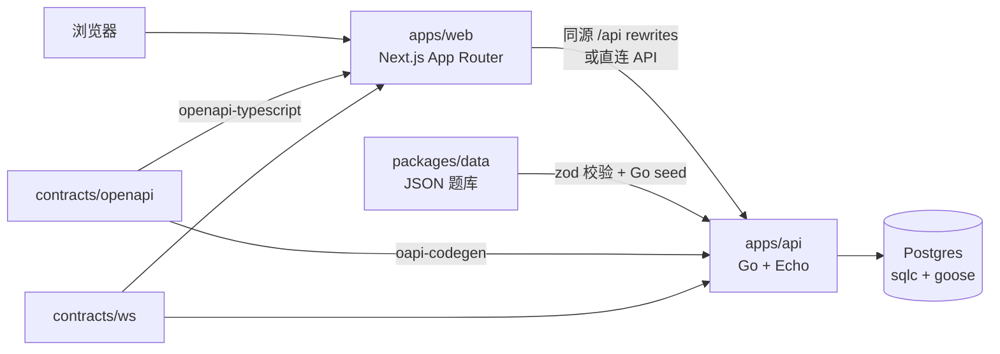
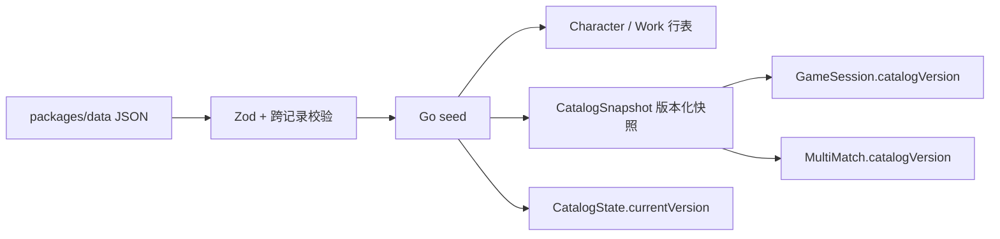

# 架构说明

本文说明 TouhouFlandre 的技术架构、数据流和长期维护约束。

## 总览

## 技术栈

| 层级 | 技术 | 用途 |
|---|---|---|
| 前端 | Next.js 16 App Router、React 19、TypeScript、Tailwind CSS v4 | 页面路由、交互组件、样式系统。 |
| 前端数据 | openapi-fetch、openapi-typescript、Dexie | 类型化 API 调用、IndexedDB 本地统计。 |
| 后端 | Go 1.26、Echo v5、pgx、coder/websocket | HTTP API、权威游戏规则、多人实时通道。 |
| 数据库 | Postgres 18、goose、sqlc | 题库、会话、每日题、多人房间和事件。 |
| 契约 | OpenAPI、WebSocket protocol YAML | HTTP 与实时事件协议。 |
| 测试 | Vitest、React Testing Library、Playwright、Go test | 单元、组件、端到端和真实 Postgres 集成测试。 |
| 部署 | Docker、Docker Compose、Next standalone、distroless Go 镜像 | 生产全栈部署。 |

## 契约优先

`contracts/openapi/openapi.yaml` 是 HTTP API 契约唯一入口。Go 侧通过 oapi-codegen 生成 strict handler 接口与 DTO，前端通过 openapi-typescript 生成类型并使用 openapi-fetch 调用。

生成物提交入库，CI 通过重新生成和 `git diff --exit-code` 防止漂移。生成目录不得手工编辑：

- `apps/api/internal/generated`
- `apps/web/src/generated`

WebSocket 事件协议记录在 `contracts/ws/protocol.yaml`，Go/TS 类型与协议通过检查脚本保持一致。

## 权威边界

- Go API 是答案选择、字段比较、每日题、随机题、会话和多人状态的权威来源。
- 前端只展示服务端返回状态，不选择答案，不重新计算反馈。
- `packages/shared` 保留前端类型、展示工具、模式配置、搜索归一化和分享文本。
- `packages/data` 负责源数据结构校验，seed 后以 Postgres 和题库快照作为运行时读取来源。
- 多人规则模块包含竞速和接力；模式枚举需要在 OpenAPI、WebSocket 协议、Go 领域类型和前端共享类型之间保持一致。

## 题库数据流

seed 会在单事务内 upsert 行表、写版本化快照并更新当前版本。会话和多人场次记录题库版本，恢复时按版本读取快照，因此题库更新不会改变已开始题局。

## 数据库

数据库迁移位于 `apps/api/migrations`，由 goose 管理。查询源位于 `apps/api/sql/queries`，由 sqlc 生成 Go 访问代码。迁移和查询变更必须同步生成并测试。

多人房间状态、成员、场次、回合、猜测与事件均持久化在 Postgres。Go 内存中的 hub 只保存 WebSocket 连接和热点投影，不作为权威状态。

## 前端结构

Next.js App Router 管理页面路由。交互组件使用 client component；纯展示页面和不依赖浏览器 API 的布局组件保持 server component。

重要前端边界：

- `src/lib/api.ts` 是前端 API 出口。
- `src/generated/api.ts` 是 OpenAPI 生成类型。
- `src/stats` 只管理浏览器本地统计，不上传历史记录。
- 样式 token 位于 `src/app/globals.css` 的 `@theme`。

## 后端结构

Go API 的关键目录：

| 目录 | 说明 |
|---|---|
| `cmd/server` | Echo 服务入口和优雅关闭。 |
| `cmd/seed` | 题库写入入口。 |
| `internal/game` | 单人权威规则，纯函数优先。 |
| `internal/handler` | OpenAPI strict handler、错误映射和业务编排。 |
| `internal/hub` | WebSocket 连接管理与事件扇出。 |
| `internal/multi` | 多人领域类型、投影和规则。 |
| `internal/generated` | oapi-codegen 与 sqlc 生成物。 |
| `internal/seed` | Go seed 逻辑。 |

业务错误使用稳定错误码，HTTP 响应形状以 OpenAPI 为准。

## 不变量

- 服务器是答案、猜测结果和多人状态的权威来源。
- 进行中的公开会话不返回答案。
- 会话和多人场次绑定创建时的题库快照。
- 每日题同一天答案固定。
- 同一角色不能在同一局中重复提交。
- 并发提交不能覆盖已经成功的猜测。
- 接力模式只有当前轮到的玩家可以行动，主动空过和超时空过共享空过额度。
- 浏览器本地统计与服务器会话相互独立。
- Token、房间号和对手昵称不得进入本地统计导出。

## 可观测性和可靠性

API 提供：

- `/livez`：进程探活。
- `/readyz`：数据库 readiness。
- `/api/health`：公开健康检查。

生产环境应配置结构化日志、数据库备份、恢复演练和基础监控。Docker 命名卷不是备份。
