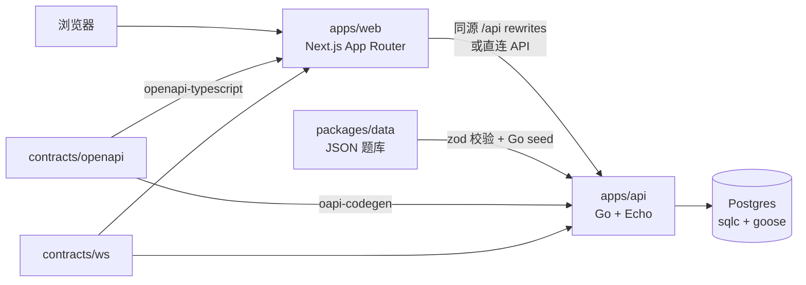
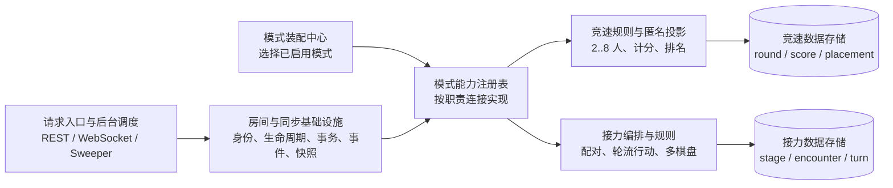
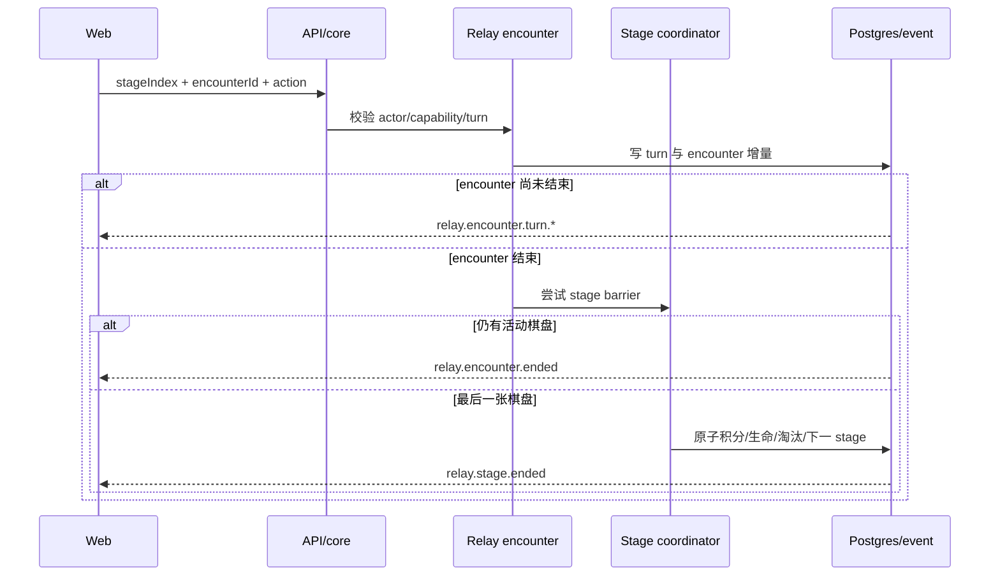
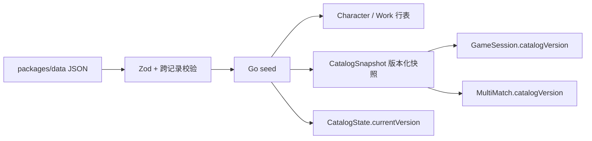
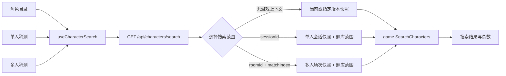

# 架构说明

本文说明 TouhouFlandre 的技术架构、数据流和长期维护约束。

## 总览

## 技术栈

| 层级     | 技术                                                         | 用途                                         |
| -------- | ------------------------------------------------------------ | -------------------------------------------- |
| 前端     | Next.js 16 App Router、React 19、TypeScript、Tailwind CSS v4 | 页面路由、交互组件、样式系统。               |
| 前端数据 | openapi-fetch、openapi-typescript、Dexie                     | 类型化 API 调用、IndexedDB 本地统计。        |
| 后端     | Go 1.26、Echo v5、pgx、coder/websocket                       | HTTP API、权威游戏规则、多人实时通道。       |
| 数据库   | Postgres 18、goose、sqlc                                     | 题库、会话、每日题、多人房间和事件。         |
| 契约     | OpenAPI、WebSocket protocol YAML                             | HTTP 与实时事件协议。                        |
| 测试     | Vitest、React Testing Library、Playwright、Go test           | 单元、组件、端到端和真实 Postgres 集成测试。 |
| 部署     | Docker、Docker Compose、Next standalone、distroless Go 镜像  | 生产全栈部署。                               |

## 契约优先

`contracts/openapi/openapi.yaml` 是 HTTP API 契约唯一入口。Go 侧通过 oapi-codegen 生成 strict handler 接口与 DTO，前端通过 openapi-typescript 生成类型并使用 openapi-fetch 调用。

生成物提交入库，CI 通过重新生成和 `git diff --exit-code` 防止漂移。生成目录不得手工编辑：

- `apps/api/internal/generated`
- `apps/web/src/generated`

WebSocket 事件协议记录在 `contracts/ws/protocol.yaml`，Go/TS 类型与协议通过检查脚本保持一致。

## 权威边界

- Go API 是角色搜索、答案选择、字段比较、每日题、随机题、会话和多人状态的权威来源。
- 前端只展示服务端返回状态，不选择答案，不重新计算反馈。
- `packages/shared` 保留前端类型、展示工具、模式配置、题库校验辅助和分享文本；运行时角色搜索由 Go API 统一执行。
- `packages/data` 负责源数据结构校验，seed 后以 Postgres 和题库快照作为运行时读取来源。
- 多人 match 以完整 `RuleSetRef`（`mode + ruleSetKey + ruleSetVersion`）选择权威实现。race 的 `scoringMode`（`wins | points | placement`）只保留为兼容投影；relay 使用 `legacy_wins | fixed_points | elimination`，共享 core 不解析任一模式的计分字段。

## 多人模式内核

多人应用核心只拥有身份、room lifecycle、冻结 roster、事务入口、事件 sequence、重放和 snapshot 水位。组合根 `internal/multi/assembly` 根据 `MULTI_MODE_REGISTRY=full|race-only|relay-only` 注册按需 capability；未知 profile 或缺失/未知 `RuleSetRef` 会明确失败，不能回退到默认规则。生产默认 `full`，rollout flag 只禁止新配置，不卸载能够恢复既有 match 的模块。

capability 包括 `RoomPolicy`、`MatchFactory`、`RuleSetParser`、`CommandHandler`、`CompletionDriver`、`SnapshotProjector`、`HistoryReader` 和 `RecoveryDriver`。core 不 import race/relay，race 与 relay 互不 import；只有 assembly 同时认识两个模式。`check:multiplayer-boundaries` 和 full/race-only/relay-only 装配测试保护这条依赖方向。删除 legacy relay adapter 的前提是所有 v2/旧双人房间及其保留期历史已经排空，并另开 contract migration issue；MRX-013 不删除兼容读取路径。

### Relay 数据流

relay match 以 stage 作为统一结算边界，以 encounter 作为独立棋盘，以 turn 记录单次动作。普通 guess/pass 只锁目标 encounter；进入终态时才尝试 stage 屏障，最后一个完成者在 stage 锁内幂等结算，避免四张棋盘被全局锁串行。

Snapshot 只包含当前 stage、standings、紧凑历史摘要和同步水位；已结束 stage 通过分页历史 API 按需读取。进行中答案在 adapter 投影前即被 capability policy 删除，terminal encounter 只揭示自己的答案。事件先持久化再通过 hub 广播，WS v3 的 `room.cursor`、`sync.complete` 与 snapshot 缺口修复保持同一房间 sequence 连续。

## 题库数据流

seed 会在单事务内 upsert 行表、写版本化快照并更新当前版本。会话和多人场次记录题库版本，恢复时按版本读取快照，因此题库更新不会改变已开始题局。

## 角色搜索

角色搜索采用单一权威实现。角色目录、单人猜测和多人猜测都通过前端 `useCharacterSearch` 调用 `GET /api/characters/search`；handler 负责根据游戏身份确定冻结的题库版本与角色范围，匹配、过滤、排序和分页统一由 `internal/game.SearchCharacters` 完成。前端只负责防抖、取消过期请求和展示结果，Postgres 负责保存题库数据与快照，不定义另一套搜索语义。

这种范围选择与题局的版本约束一致：题库重新 seed 后，角色目录使用新快照，已经开始的单人会话和多人场次仍搜索各自绑定的旧快照与 `selectedCharacterIds`。只传 `catalogVersion` 的非游戏搜索仅绑定版本，不应用题局角色范围。

搜索限制由命名过滤器按 AND 组合，并在文本匹配、排序和分页之前执行。默认过滤器包括 `enabledAsGuess`，请求可追加作品范围；游戏上下文在 `CHARACTER_SEARCH_QUESTION_SCOPE_FILTER_ENABLED=true` 时再追加当前局题库角色范围。该环境变量默认开启，设为 `false` 并重启 API 后只移除题库范围过滤器，保留版本绑定和其他搜索条件。

### 匹配模型

这里的“模糊搜索”特指归一化后的连续子串匹配，不包含拼写纠错、自动拼音转换或跨字段分词查询。处理顺序如下：

1. 从所选题库快照中排除不可猜角色，应用初登场作品筛选条件，并在游戏搜索中限制为该局 `selectedCharacterIds`。
2. 查询串和每个候选字段分别转为小写、执行 Unicode NFKC 归一化，并移除空白及 `_`、`.`、`・`、`·`、`-`。
3. 每个字段保留为独立搜索词元；每个别名和每个作品拼音缩写也分别形成词元。
4. 归一化后的完整查询串是任一词元的连续子串时，角色命中。
5. 命中集合按请求指定的顺序排序并分页，响应同时返回分页结果和命中总数。

搜索词元来自角色的简体名、繁体名、日文名、英文名、罗马字和每个别名，以及初登场作品的中文标题、作品 ID、正作编号 `THxx` 和每个中文拼音首字母缩写。具体数据维护规则见[数据规范](./data-guidelines.md#名称与搜索)。

字段独立是搜索模型的不变量。实现不会先执行 `normalize(name + alias + work)` 再做一次包含判断，因此字段末尾和下一个字段开头不能共同组成结果。例如查询“梦东”不能跨越姓名末尾的“梦”和作品名开头的“东”；查询“东方 灵异传”则会在归一化后匹配同一个作品标题词元。查询也不会按空格拆分后跨多个字段组合匹配。

### 兼容接口

`GET /api/catalog/characters` 以及 `CharacterSearchResult` 中的 `searchText`、`nameSortKey` 仅供旧客户端兼容，已在 OpenAPI 中标记为 deprecated。当前前端不依赖这些字段执行搜索；后续扩展搜索能力应修改 Go 领域实现和对应测试，而不是扩展兼容字段。

## 数据库

数据库迁移位于 `apps/api/migrations`，由 goose 管理。查询源位于 `apps/api/sql/queries`，由 sqlc 生成 Go 访问代码。迁移和查询变更必须同步生成并测试。

多人房间状态、成员、场次、回合、猜测与事件均持久化在 Postgres。race 继续拥有 `multi_round` 及其计分表；relay 新 match 使用 `multi_relay_stage`、`multi_relay_encounter`、`multi_relay_encounter_member`、`multi_relay_turn`、`multi_relay_stage_player` 和 `multi_relay_match_player_state`。迁移 `0015` 至 `0019` 为 expand-only，旧列与旧双人读取路径保留供应用回滚。Go 内存中的 hub 只保存 WebSocket 连接和热点投影，不作为权威状态。

## 前端结构

Next.js App Router 管理页面路由。交互组件使用 client component；纯展示页面和不依赖浏览器 API 的布局组件保持 server component。

重要前端边界：

- `src/lib/api.ts` 是前端 API 出口。
- `src/generated/api.ts` 是 OpenAPI 生成类型。
- `src/stats` 只管理浏览器本地统计，不上传历史记录。
- 样式 token 位于 `src/app/globals.css` 的 `@theme`。

## 后端结构

Go API 的关键目录：

| 目录                 | 说明                                         |
| -------------------- | -------------------------------------------- |
| `cmd/server`         | Echo 服务入口和优雅关闭。                    |
| `cmd/seed`           | 题库写入入口。                               |
| `internal/game`      | 角色搜索与单人权威规则，纯函数优先。         |
| `internal/handler`   | OpenAPI strict handler、错误映射和业务编排。 |
| `internal/hub`       | WebSocket 连接管理与事件扇出。               |
| `internal/multi`     | 多人领域类型、投影和规则。                   |
| `internal/generated` | oapi-codegen 与 sqlc 生成物。                |
| `internal/seed`      | Go seed 逻辑。                               |

业务错误使用稳定错误码，HTTP 响应形状以 OpenAPI 为准。

## 不变量

- 服务器是答案、猜测结果和多人状态的权威来源。
- 进行中的公开会话不返回答案。
- 会话和多人场次绑定创建时的题库快照。
- 每日题同一天答案固定。
- 同一角色不能在同一局中重复提交。
- 并发提交不能覆盖已经成功的猜测。
- 接力动作必须同时通过 room、match、stage、encounter membership 和当前 turn capability 校验；客户端浏览位置不是授权依据。
- 进行中 relay answer 不得进入 REST、WS、snapshot、history、错误、日志、metrics label 或前端 DOM。
- 浏览器本地统计与服务器会话相互独立。
- Token、房间号和对手昵称不得进入本地统计导出。

## 可观测性和可靠性

API 提供：

- `/livez`：进程探活。
- `/readyz`：数据库 readiness。
- `/api/health`：公开健康检查。

生产环境通过 `/metrics` 暴露 Prometheus 文本指标。低基数标签固定为 `mode + rule_set_key + rule_set_version`，未知持久化值折叠为 `unknown`；标签不得包含 room、match、stage、encounter、昵称、token、聊天正文或答案。仓库提供可选 Compose `monitoring` profile、Prometheus 告警和 Grafana `Multiplayer Relay Rollout` 面板，覆盖 active encounter、guess/history p95/p99、stage/barrier duration、snapshot/WS bytes、settlement retry、deadlock、queue drop 和 pool-too-small。

生产环境还必须配置结构化日志、数据库备份与恢复演练。Docker 命名卷不是备份。多人 relay 固定积分和淘汰赛入口默认开启；发生灰度问题时先关闭 Web/API 新入口、排空 v3 房间，再回滚不理解新规则集的旧 binary，同时保留 expand schema。
