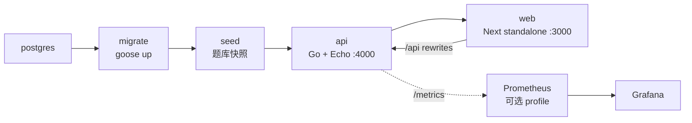

# 部署指南

本文说明 TouhouFlandre 的生产部署方式和运维注意事项。

## 部署拓扑

生产环境通过 Docker Compose 运行完整服务栈：



服务说明：

| 服务                     | 说明                                                                        |
| ------------------------ | --------------------------------------------------------------------------- |
| `postgres`               | Postgres 数据库，保存题库、会话、多人房间和事件。                           |
| `migrate`                | 一次性迁移任务，执行 goose 数据库迁移。                                     |
| `seed`                   | 一次性题库写入任务，生成版本化题库快照。                                    |
| `api`                    | Go API 与 WebSocket 服务。                                                  |
| `web`                    | Next standalone Web 服务。                                                  |
| `prometheus` / `grafana` | 可选 `monitoring` profile；采集 API `/metrics`、加载 relay 发布告警与面板。 |

生产栈使用独立 compose 项目名和数据卷，与本地开发数据库隔离。

## 环境变量

从仓库根目录创建 `.env`：

```bash
cp .env.example .env
```

部署前至少配置：

| 变量                                                                                       | 建议                                                                                                                           |
| ------------------------------------------------------------------------------------------ | ------------------------------------------------------------------------------------------------------------------------------ |
| `POSTGRES_PASSWORD`                                                                        | 使用生产强密码。                                                                                                               |
| `WEB_ORIGINS`                                                                              | 浏览器实际访问源，例如 `https://game.example.com`。                                                                            |
| `NEXT_PUBLIC_API_BASE_URL`                                                                 | 通常留空，使用同源 `/api`。                                                                                                    |
| `LOG_LEVEL`                                                                                | 生产建议 `info`。                                                                                                              |
| `CHARACTER_SEARCH_QUESTION_SCOPE_FILTER_ENABLED`                                           | 默认 `true`；对应 `gameScopeMode=strict`。设为 `false` 时游戏入口强制远程以保持 full 语义。                                    |
| `CHARACTER_SEARCH_MODE`                                                                    | 当前生产 Compose 默认 `local-primary`；首次混合部署或紧急回滚时显式设为 `remote`。API 收到非法/留空值仍按 `remote` fail-safe。 |
| `CHARACTER_SEARCH_POLICY_REVISION`                                                         | 默认 `v1`；索引 schema 不变但部署结构性修复时显式提升，确保浏览器丢弃旧策略/熔断状态。                                         |
| `ANSWER_MATCH_POLICY`                                                                      | 新对局答案判定，默认 `public_fields_v1`；可设为 `strict`，未知值会阻止 API 启动。                                              |
| `MULTI_MODE_REGISTRY`                                                                      | 默认 `full`；仅隔离演练可设为 `race-only` 或 `relay-only`，未知值会阻止 API 启动。                                             |
| `MULTI_N_PLAYER_RELAY_ENABLED` / `MULTI_RELAY_ELIMINATION_ENABLED`                         | API 多人 relay 固定积分和淘汰赛入口默认均为 `true`；可分别关闭。                                                               |
| `NEXT_PUBLIC_MULTI_N_PLAYER_RELAY_ENABLED` / `NEXT_PUBLIC_MULTI_RELAY_ELIMINATION_ENABLED` | Web 构建期入口必须与 API 对应开关一致；多人 relay 和淘汰赛默认均为 `true`。                                                    |
| `MULTI_RELAY_HISTORY_RATE_LIMIT`                                                           | 每名已鉴权成员每分钟 relay 历史请求上限，默认 60。                                                                             |
| `MULTI_SYSTEM_ANNOUNCEMENTS_ENABLED`                                                       | 默认 `true`；紧急时可停止生成新系统播报，已保存聊天历史继续可读。                                                              |
| `MULTI_*`                                                                                  | 其余 TTL、回合时长、聊天、投影密钥和 WebSocket 限制按 `.env.example` 调整。                                                    |

如果使用 cloudflared、nginx 或其他反向代理，公网入口通常指向宿主机 `http://localhost:3000`。API 的宿主机 `4000` 端口主要用于直连调试或单独代理。

## 启动

推荐使用 Task：

```bash
task prod:up
```

等价 Docker Compose 命令：

```bash
docker compose up -d --build --wait
```

生产数据库由 Compose 管理，不需要手动建库、迁移或 seed。完整启动会依次完成：

```bash
docker compose up -d --wait postgres
docker compose up --build migrate
docker compose up --build seed
docker compose up -d --build --wait api web
```

平时使用单条 `task prod:up` 即可；拆分命令主要用于排查具体失败环节。

HSO-007 发布门禁已完成，因此当前 Compose 在未覆盖 `CHARACTER_SEARCH_MODE` 时默认启用 `local-primary`。首次部署仍应按下文灰度顺序先显式设置 `CHARACTER_SEARCH_MODE=remote`；紧急回滚同样显式设置为 `remote` 后重新创建 API 容器。

查看状态和日志：

```bash
docker compose ps
task prod:logs
```

## 运行检查

| 地址                                      | 用途                                   |
| ----------------------------------------- | -------------------------------------- |
| `http://localhost:3000`                   | Web 入口。                             |
| `http://localhost:3000/api/health`        | 经 Web 同源代理访问 API 健康检查。     |
| `http://localhost:3000/api/announcements` | 经 Web 服务读取公告内容。              |
| `http://localhost:4000/livez`             | API 进程探活。                         |
| `http://localhost:4000/readyz`            | API 数据库与当前题库搜索源 readiness。 |

`readyz` 失败通常表示数据库不可达、迁移未完成、当前 CatalogSnapshot 缺失/不可解析或题库未就绪。浏览器索引的独立 wire 投影失败由索引 503 和 snapshot 指标暴露，不会把仍可工作的 Go 远程搜索实例摘出 readiness。

`http://localhost:4000/metrics` 输出 Prometheus 文本格式。多人和搜索指标都只使用固定低基数枚举；搜索覆盖 policy、source/snapshot、fallback reason、远程 outcome/latency 和索引构建耗时。标签与结构化日志不得包含查询词、题库版本、session/room/match/角色 ID、令牌、昵称、聊天正文或答案；仍建议只在受信网络内暴露。

## 更新

常规更新流程：

```bash
git pull
task prod:up
```

`migrate` 和 `seed` 每次启动都会作为一次性服务运行。题库 seed 会写入新的版本化快照；已经开始的会话继续引用旧版本和已冻结的答案判定策略，不受新题库影响。

API 运行中也可以单独执行版本化 seed。`catalog_state.current_version` 更新后，新建对局会按需加载新题库索引，无需重启 API；进行中的对局继续使用旧索引。直接修改 `character` 行表不是受支持的热更新方式，也不会改变已经缓存或冻结的题库。`catalog_snapshot` 不允许同版本覆盖：同版本同内容可幂等重跑，同版本不同内容会使 seed 失败并回滚事务。

角色搜索索引使用 `GET /api/catalog/{catalogVersion}/search-index/1`，响应为版本化 immutable 资源；策略使用 `GET /api/catalog/search-policy`，响应始终 `no-store`。若索引投影或 wire shape 改变，提升 URL 中的 `indexSchemaVersion`；仅修复策略/索引结构而不改 schema 时提升 `CHARACTER_SEARCH_POLICY_REVISION`。

### 角色搜索灰度与回滚

首次发布按以下顺序执行：

1. 备份数据库并先应用 additive 迁移 `0023_puzzle_resolve_idempotency.sql`。应用回滚时保留该表，不在生产执行 Down。
2. 以 `CHARACTER_SEARCH_MODE=remote` 部署全部 API 实例。fleet 尚有旧实例时不得启用 `local-primary`。
3. 逐实例检查策略、当前题库版本索引、真实缺失版本的结构化 `CATALOG_VERSION_NOT_FOUND`、错误 `Cache-Control: no-store`、CORS fallback header 和旧 `/api/characters/search`。
4. 从 Go 直连、Next 同源和最终代理/CDN 分别抽查索引的 `ETag`、`Cache-Control: public, max-age=31536000, immutable`、条件请求 `304`、实际 `Content-Encoding` 和传输体积。CDN 可压缩，但不得改变解压后的 JSON、ETag 语义或错误 no-store。
5. 先完成 Web 部署和 remote 冒烟，再把所有 API 实例统一改为 `local-primary`。观察角色目录、单人、竞速和接力；索引就绪后的输入不应继续请求 `/api/characters/search`。

可用以下只读请求取得抽查基线，版本替换为 `/api/catalog` 返回值：

```bash
curl -i https://game.example.com/api/catalog/search-policy
curl -i -H 'Accept-Encoding: gzip' https://game.example.com/api/catalog/<version>/search-index/1
curl -i -H 'If-None-Match: "<etag>"' https://game.example.com/api/catalog/<version>/search-index/1
curl -i https://game.example.com/api/catalog/missing-version/search-index/1
```

紧急回滚只改服务端配置：先把所有实例切回 `CHARACTER_SEARCH_MODE=remote`，确认策略 revision 已变化并等待最多 60 秒或让页面重新获得焦点，再抽查已打开页面停止本地搜索。之后才允许回滚 API binary；不发布 Web、不清浏览器缓存、不回滚迁移，也不结束当前题局。新 Web 遇到旧 API 的策略/索引 404/405 会省略新观测 header 并继续远程搜索，旧 Web 对新 API 仍使用原搜索和 create/get-session 接口。

观察窗口至少关注 `touhouflandre_search_policy_total`、`touhouflandre_search_source_total`、`touhouflandre_search_snapshot_total`、`touhouflandre_search_fallback_reason_total`、`touhouflandre_search_remote_total`、远程延迟和索引构建耗时。fallback、结构性错误或远程错误率出现无法解释的上升时立即切回 `remote`，保存指标/日志证据后再调查。

默认 Prometheus 规则同时提供三个搜索告警：`CharacterSearchFallbackSpike` 在 5 分钟内出现超过 5 次非正常 fallback 时告警，`CharacterSearchProviderFailure` 捕获 source/snapshot 加载、构建或 schema 故障，`CharacterSearchRemoteError` 捕获远程权威回退失败。发布演练可以用受控低频请求验证告警查询，但不得在生产注入高流量或把查询词、版本和题局标识加入标签。

紧急关闭等价判定时，将 `ANSWER_MATCH_POLICY=strict` 后重启 API。该操作只影响重启后创建的新随机题、新多人 match 和尚未创建的每日题；已有会话、已有 match 及已创建每日题保持原策略。恢复默认策略时使用相同步骤改回 `public_fields_v1`。

多人接力迁移 `0015` 至 `0019` 采用 expand-only：应用回滚时保留新表和旧可读列，不执行 Down。部署不理解 WS v3 或新 `RuleSetRef` 的旧 binary 前，必须先关闭新入口并让所有 v3 lobby/playing/finished 房间排空或收到明确 close 事件；不能让旧 binary 猜测新表状态。

停止生产栈：

```bash
task prod:down
```

## 数据与备份

- Docker 命名卷不是备份。
- 数据库迁移前应先备份。
- 公开部署应配置自动备份、恢复演练和明确 RPO/RTO。
- 对不可逆迁移采用 expand/contract 流程，避免一次性破坏旧代码读取路径。

## WebSocket 和反向代理

多人房间使用 `/api/rooms/{roomId}/ws` WebSocket 通道和 `touhouflandre-multi.v3` 子协议。反向代理需要支持 HTTP Upgrade，并确保浏览器 `Origin` 与 `WEB_ORIGINS` 精确匹配。多人令牌通过首帧 `hello` 发送，不应放入 URL 查询参数或日志。v2 页面必须收到刷新要求；切换时先停止新建旧房间，再按 retention 排空。

## 多人接力灰度与回滚

初次发布默认开启 API/Web 多人 relay 固定积分和淘汰赛入口。多人 relay 的 Web/API 开关必须保持一致；如需灰度暂停，可分别关闭对应开关。每次扩大前至少观察一个完整 `MULTI_FINISHED_RETENTION` 周期，并关注 `mode + rule_set_key + rule_set_version` 维度的 active encounter、guess/history 延迟、stage barrier、snapshot/WS bytes、settlement retry、deadlock 和 queue drop。

停止灰度的顺序是：先重新构建并发布关闭两个 Web flag 的 Web，再关闭两个 API flag；当前 binary 继续完成已冻结 match。active v3 rooms 归零后才允许回滚旧 binary，数据库 expand schema 保留。出现答案/权限泄漏、重复计分或淘汰、数据库死锁、不可恢复重连、持续错误率越线时立即停止扩大并按此顺序回滚。

## 监控 profile

启动可选监控栈：

```bash
docker compose --profile monitoring up -d prometheus grafana
```

Prometheus 和 Grafana 默认只绑定 `127.0.0.1:${PROMETHEUS_PORT:-9090}` 与 `127.0.0.1:${GRAFANA_PORT:-3001}`。公开 Grafana 前必须修改 `GRAFANA_ADMIN_PASSWORD` 并置于受控反向代理后。配置位于 `monitoring/prometheus.yml`、`monitoring/alerts.yml` 和 `monitoring/grafana/`；`docker compose --profile monitoring config` 可在部署前验证装配。

## 音乐静态资源

音乐播放器使用 `web` 服务下的本地 `/music/` 静态资源。公开部署前应确认反向代理没有改写或吞掉媒体响应头：

- MP3 返回 `Content-Type: audio/mpeg`；
- 带 `Range: bytes=<start>-<end>` 的请求返回 `206` 和正确的 `Content-Range`；
- 非 Range 请求仍返回完整文件，缓存策略不会把旧曲目路径改写成其他内容；
- 默认播放器只请求当前曲目的 metadata/range，不应在首屏并行下载全部 MP3。

可在部署环境使用类似请求检查响应（路径替换为实际曲目）：

```bash
curl -I https://example.com/music/tracks/<track>.mp3
curl -i -H 'Range: bytes=0-31' https://example.com/music/tracks/<track>.mp3
```

如果代理需要单独的 MIME 或 Range 配置，应在发布前完成并记录验证结果；不要通过外部 CDN 或远程热链绕过本地资源发布约束。

## 素材与合规

公开部署前需要核对第三方素材授权和署名信息。素材清单见 [`THIRD_PARTY_ASSETS.md`](../THIRD_PARTY_ASSETS.md)，内容规范见[数据规范](./data-guidelines.md)。
