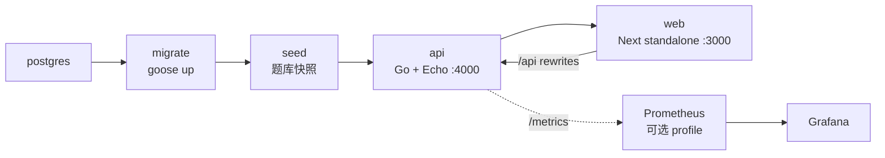

# 部署指南

本文说明 TouhouFlandre 的生产部署方式和运维注意事项。

## 部署拓扑

生产环境通过 Docker Compose 运行完整服务栈：



服务说明：

| 服务                     | 说明                                                                        |
| ------------------------ | --------------------------------------------------------------------------- |
| `postgres`               | Postgres 数据库，保存题库、会话、多人房间和事件。                           |
| `migrate`                | 一次性迁移任务，执行 goose 数据库迁移。                                     |
| `seed`                   | 一次性题库写入任务，生成版本化题库快照。                                    |
| `api`                    | Go API 与 WebSocket 服务。                                                  |
| `web`                    | Next standalone Web 服务。                                                  |
| `prometheus` / `grafana` | 可选 `monitoring` profile；采集 API `/metrics`、加载 relay 发布告警与面板。 |

生产栈使用独立 compose 项目名和数据卷，与本地开发数据库隔离。

## 环境变量

从仓库根目录创建 `.env`：

```bash
cp .env.example .env
```

部署前至少配置：

| 变量                                                                                       | 建议                                                                               |
| ------------------------------------------------------------------------------------------ | ---------------------------------------------------------------------------------- |
| `POSTGRES_PASSWORD`                                                                        | 使用生产强密码。                                                                   |
| `WEB_ORIGINS`                                                                              | 浏览器实际访问源，例如 `https://game.example.com`。                                |
| `NEXT_PUBLIC_API_BASE_URL`                                                                 | 通常留空，使用同源 `/api`。                                                        |
| `LOG_LEVEL`                                                                                | 生产建议 `info`。                                                                  |
| `MULTI_MODE_REGISTRY`                                                                      | 默认 `full`；仅隔离演练可设为 `race-only` 或 `relay-only`，未知值会阻止 API 启动。 |
| `MULTI_N_PLAYER_RELAY_ENABLED` / `MULTI_RELAY_ELIMINATION_ENABLED`                         | API 多人 relay 固定积分和淘汰赛入口默认均为 `true`；可分别关闭。                   |
| `NEXT_PUBLIC_MULTI_N_PLAYER_RELAY_ENABLED` / `NEXT_PUBLIC_MULTI_RELAY_ELIMINATION_ENABLED` | Web 构建期入口必须与 API 对应开关一致；多人 relay 和淘汰赛默认均为 `true`。         |
| `MULTI_RELAY_HISTORY_RATE_LIMIT`                                                           | 每名已鉴权成员每分钟 relay 历史请求上限，默认 60。                                 |
| `MULTI_*`                                                                                  | 其余 TTL、回合时长、聊天、投影密钥和 WebSocket 限制按 `.env.example` 调整。        |

如果使用 cloudflared、nginx 或其他反向代理，公网入口通常指向宿主机 `http://localhost:3000`。API 的宿主机 `4000` 端口主要用于直连调试或单独代理。

## 启动

推荐使用 Task：

```bash
task prod:up
```

等价 Docker Compose 命令：

```bash
docker compose up -d --build --wait
```

生产数据库由 Compose 管理，不需要手动建库、迁移或 seed。完整启动会依次完成：

```bash
docker compose up -d --wait postgres
docker compose up --build migrate
docker compose up --build seed
docker compose up -d --build --wait api web
```

平时使用单条 `task prod:up` 即可；拆分命令主要用于排查具体失败环节。

查看状态和日志：

```bash
docker compose ps
task prod:logs
```

## 运行检查

| 地址                                      | 用途                               |
| ----------------------------------------- | ---------------------------------- |
| `http://localhost:3000`                   | Web 入口。                         |
| `http://localhost:3000/api/health`        | 经 Web 同源代理访问 API 健康检查。 |
| `http://localhost:3000/api/announcements` | 经 Web 服务读取公告内容。          |
| `http://localhost:4000/livez`             | API 进程探活。                     |
| `http://localhost:4000/readyz`            | API 数据库 readiness。             |

`readyz` 失败通常表示数据库不可达、迁移未完成或题库未就绪。

`http://localhost:4000/metrics` 输出 Prometheus 文本格式。该端点的标签只有低基数玩法维度，不包含令牌、昵称、内部对象 ID、聊天正文或未揭示答案；仍建议只在受信网络内暴露。

## 更新

常规更新流程：

```bash
git pull
task prod:up
```

`migrate` 和 `seed` 每次启动都会作为一次性服务运行。题库 seed 会写入新的版本化快照；已经开始的会话继续引用旧版本，不受新题库影响。

多人接力迁移 `0015` 至 `0019` 采用 expand-only：应用回滚时保留新表和旧可读列，不执行 Down。部署不理解 WS v3 或新 `RuleSetRef` 的旧 binary 前，必须先关闭新入口并让所有 v3 lobby/playing/finished 房间排空或收到明确 close 事件；不能让旧 binary 猜测新表状态。

停止生产栈：

```bash
task prod:down
```

## 数据与备份

- Docker 命名卷不是备份。
- 数据库迁移前应先备份。
- 公开部署应配置自动备份、恢复演练和明确 RPO/RTO。
- 对不可逆迁移采用 expand/contract 流程，避免一次性破坏旧代码读取路径。

## WebSocket 和反向代理

多人房间使用 `/api/rooms/{roomId}/ws` WebSocket 通道和 `touhouflandre-multi.v3` 子协议。反向代理需要支持 HTTP Upgrade，并确保浏览器 `Origin` 与 `WEB_ORIGINS` 精确匹配。多人令牌通过首帧 `hello` 发送，不应放入 URL 查询参数或日志。v2 页面必须收到刷新要求；切换时先停止新建旧房间，再按 retention 排空。

## 多人接力灰度与回滚

初次发布默认开启 API/Web 多人 relay 固定积分和淘汰赛入口。多人 relay 的 Web/API 开关必须保持一致；如需灰度暂停，可分别关闭对应开关。每次扩大前至少观察一个完整 `MULTI_FINISHED_RETENTION` 周期，并关注 `mode + rule_set_key + rule_set_version` 维度的 active encounter、guess/history 延迟、stage barrier、snapshot/WS bytes、settlement retry、deadlock 和 queue drop。

停止灰度的顺序是：先重新构建并发布关闭两个 Web flag 的 Web，再关闭两个 API flag；当前 binary 继续完成已冻结 match。active v3 rooms 归零后才允许回滚旧 binary，数据库 expand schema 保留。出现答案/权限泄漏、重复计分或淘汰、数据库死锁、不可恢复重连、持续错误率越线时立即停止扩大并按此顺序回滚。

## 监控 profile

启动可选监控栈：

```bash
docker compose --profile monitoring up -d prometheus grafana
```

Prometheus 和 Grafana 默认只绑定 `127.0.0.1:${PROMETHEUS_PORT:-9090}` 与 `127.0.0.1:${GRAFANA_PORT:-3001}`。公开 Grafana 前必须修改 `GRAFANA_ADMIN_PASSWORD` 并置于受控反向代理后。配置位于 `monitoring/prometheus.yml`、`monitoring/alerts.yml` 和 `monitoring/grafana/`；`docker compose --profile monitoring config` 可在部署前验证装配。

## 素材与合规

公开部署前需要核对第三方素材授权和署名信息。素材清单见 [`THIRD_PARTY_ASSETS.md`](../THIRD_PARTY_ASSETS.md)，内容规范见[数据规范](./data-guidelines.md)。
