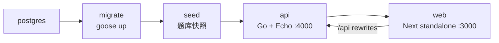

# 部署指南

本文说明 TouhouFlandre 的生产部署方式和运维注意事项。

## 部署拓扑

生产环境通过 Docker Compose 运行完整服务栈：



服务说明：

| 服务 | 说明 |
|---|---|
| `postgres` | Postgres 数据库，保存题库、会话、多人房间和事件。 |
| `migrate` | 一次性迁移任务，执行 goose 数据库迁移。 |
| `seed` | 一次性题库写入任务，生成版本化题库快照。 |
| `api` | Go API 与 WebSocket 服务。 |
| `web` | Next standalone Web 服务。 |

生产栈使用独立 compose 项目名和数据卷，与本地开发数据库隔离。

## 环境变量

从仓库根目录创建 `.env`：

```bash
cp .env.example .env
```

部署前至少配置：

| 变量 | 建议 |
|---|---|
| `POSTGRES_PASSWORD` | 使用生产强密码。 |
| `WEB_ORIGINS` | 浏览器实际访问源，例如 `https://game.example.com`。 |
| `NEXT_PUBLIC_API_BASE_URL` | 通常留空，使用同源 `/api`。 |
| `LOG_LEVEL` | 生产建议 `info`。 |
| `MULTI_*` | 按站点容量和玩法调整多人房间 TTL、回合时长和 WebSocket 限制。 |

如果使用 cloudflared、nginx 或其他反向代理，公网入口通常指向宿主机 `http://localhost:3000`。API 的宿主机 `4000` 端口主要用于直连调试或单独代理。

## 启动

推荐使用 Task：

```bash
task prod:up
```

等价 Docker Compose 命令：

```bash
docker compose up -d --build --wait
```

生产数据库由 Compose 管理，不需要手动建库、迁移或 seed。完整启动会依次完成：

```bash
docker compose up -d --wait postgres
docker compose up --build migrate
docker compose up --build seed
docker compose up -d --build --wait api web
```

平时使用单条 `task prod:up` 即可；拆分命令主要用于排查具体失败环节。

查看状态和日志：

```bash
docker compose ps
task prod:logs
```

## 运行检查

| 地址 | 用途 |
|---|---|
| `http://localhost:3000` | Web 入口。 |
| `http://localhost:3000/api/health` | 经 Web 同源代理访问 API 健康检查。 |
| `http://localhost:3000/api/announcements` | 经 Web 服务读取公告内容。 |
| `http://localhost:4000/livez` | API 进程探活。 |
| `http://localhost:4000/readyz` | API 数据库 readiness。 |

`readyz` 失败通常表示数据库不可达、迁移未完成或题库未就绪。

## 更新

常规更新流程：

```bash
git pull
task prod:up
```

`migrate` 和 `seed` 每次启动都会作为一次性服务运行。题库 seed 会写入新的版本化快照；已经开始的会话继续引用旧版本，不受新题库影响。

停止生产栈：

```bash
task prod:down
```

## 数据与备份

- Docker 命名卷不是备份。
- 数据库迁移前应先备份。
- 公开部署应配置自动备份、恢复演练和明确 RPO/RTO。
- 对不可逆迁移采用 expand/contract 流程，避免一次性破坏旧代码读取路径。

## WebSocket 和反向代理

多人房间使用 `/api/rooms/{roomId}/ws` WebSocket 通道。反向代理需要支持 HTTP Upgrade，并确保浏览器 `Origin` 与 `WEB_ORIGINS` 精确匹配。多人令牌通过首帧 `hello` 发送，不应放入 URL 查询参数或日志。

## 素材与合规

公开部署前需要核对第三方素材授权和署名信息。素材清单见 [`THIRD_PARTY_ASSETS.md`](../THIRD_PARTY_ASSETS.md)，内容规范见[数据规范](./data-guidelines.md)。
