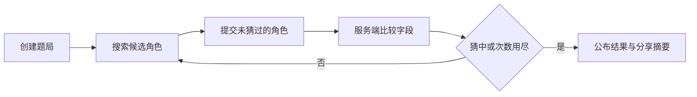

# 游戏规则

本文说明 TouhouFlandre（东方芙一把）的公开玩法、反馈含义与结算规则。

## 游戏目标

每局游戏会从题库答案池中选出一名隐藏角色。玩家通过名称、别名或初登场作品搜索候选角色，提交后获得结构化字段反馈，并据此缩小范围直到猜中答案或用完猜测次数。

## 游戏模式

| 模式     | 规则                                                                                                                                  |
| -------- | ------------------------------------------------------------------------------------------------------------------------------------- |
| 每日题   | 服务端按 `Asia/Shanghai` 自然日固定答案，同一天答案不变；浏览器保存会话标识以便恢复。                                                 |
| 随机题   | 每局从当前答案池随机选取角色；新会话与每日题互不影响。                                                                                |
| 多人房间 | 游客创建或加入多人房间；竞速支持 2..8 人，接力支持 2/4/6/8 人。两种模式均保留双人规则，并为多人 roster 提供各自独立的积分或淘汰规则。 |

每日题、随机题和多人对局都绑定创建时的题库快照。题库更新不会改变已经开始的题局答案和反馈结果。

## 反馈字段

`public_fields_v1` 公开词条版本包含六个字段：

| 字段       | 类型 | 比较方式                                     |
| ---------- | ---- | -------------------------------------------- |
| 初登场作品 | 层级 | 作品相同为完全匹配；媒介类型相同为部分匹配。 |
| 初登场年份 | 数值 | 年份相同为完全匹配；否则箭头指向答案年份。   |
| 种族       | 多值 | 集合完全相同、存在交集或无交集。             |
| 阵营       | 多值 | 集合完全相同、存在交集或无交集。             |
| 主要地点   | 多值 | 集合完全相同、存在交集或无交集。             |
| 头发颜色   | 多值 | 集合完全相同、存在交集或无交集。             |

每局可以隐藏部分词条，年份还可以切换为仅精确比较；实际棋盘列以创建对局时服务端冻结并返回的字段列表为准。能力、角色定位等资料可以存在于题库中，但不属于 `public_fields_v1`，也不参与该版本的等价判定。

## 反馈含义

| 标记 | 含义     | 说明                                       |
| ---- | -------- | ------------------------------------------ |
| `O`  | 完全匹配 | 猜测值与答案值一致。                       |
| `~`  | 部分匹配 | 多值字段存在交集，或层级字段属于同一类别。 |
| `X`  | 不匹配   | 两者没有可用于缩小范围的重合。             |
| `↑`  | 答案更晚 | 答案的初登场年份晚于猜测角色。             |
| `↓`  | 答案更早 | 答案的初登场年份早于猜测角色。             |
| `?`  | 未知     | 数据不足，系统不据此作出判断。             |

多值字段只有标准化集合完全相同时才算完全匹配。任何非空交集均为部分匹配。

## 胜负与会话

- 默认判定策略为 `public_fields_v1`：提交角色与隐藏答案 ID 相同，或两者的六个公开词条全部精确相同，题局立即获胜。
- 等价关系始终按完整 `public_fields_v1` 计算，与本局隐藏了哪些词条无关；只开启少量词条不会扩大正确答案范围。
- 任一公开词条缺失或为 `unknown` 的角色不参与自动等价分组。多值词条按集合比较，不受数组顺序影响。
- 等价命中会标注为“等价角色命中”，终局仍揭示本局实际抽中的角色，不会用提交角色替换隐藏答案。
- 达到最大猜测次数仍未命中时，题局结束并公布答案。
- 每日题固定 8 次猜测；随机题与多人房间的上限由题库设置决定，关闭次数限制时视为无次数限制。
- 已结束的会话不再接受新的猜测。
- 同一角色在同一局中不能重复提交。
- 单人会话可以主动放弃；放弃后立即公布答案并进入终态。
- 游戏结束后可复制不包含答案名称的分享文本。

服务器也可以为新对局启用严格 ID 策略。判定策略与题库版本都会在每日题、单人会话和多人场次创建时冻结，因此服务重启、配置切换或题库更新不会改变进行中的对局。同一每日题创建出的所有会话继承该每日题首次创建时的策略。

## 多人规则

多人房间支持两种玩法：竞速和接力。

| 玩法 | 规则                                                                                                                     |
| ---- | ------------------------------------------------------------------------------------------------------------------------ |
| 竞速 | 2..8 名玩家同时竞猜同一个隐藏角色。2 人时按 BO1/3/5/7 总局数进行胜场制；3 人及以上可在积分累计不淘汰与积分淘汰之间切换。 |
| 接力 | 2 人沿用一张棋盘的 BO 胜场制；4/6/8 人每轮随机两两配对，每对使用独立答案和轮流行动的棋盘，所有棋盘结束后统一结算。       |

竞速房间至少有两名玩家且当前玩家全员准备后即可开始，不要求坐满设置的玩家上限。房主在 3 人及以上时可以切换积分赛淘汰开关；2 人时该开关不可用。主动放弃只影响当前小局，下一局是否继续参与取决于是否被 placement 规则淘汰。对局中离开或断线宽限逾期会退出本场 roster，其他玩家继续；仅剩一名 active 玩家时其直接赢得整场。

接力房间上限只允许 2/4/6/8，当前入座玩家必须为偶数、全部在线且准备后才能开始，不要求坐满上限。实际 2 人开局时无论淘汰开关状态如何都沿用双人 BO。实际 4/6/8 人开局时，关闭淘汰为固定积分赛：胜 +2、平各 +1、负 +0，BO1/3/5/7 表示恰好进行 1/3/5/7 个全场轮次；开启淘汰时每人从 10 分开始，胜者 +1（最多 10）、败者扣当前轮次序号、平局双方各扣 `floor(轮次/2)`。首次降到 0 或以下进入濒死并保留，之后再受到负分才淘汰；存留人数为奇数时一人轮空，且不会连续轮空。

每张接力棋盘独立计算轮次和 deadline。只有当前轮到的玩家可以操作；主动空过和超时空过共享每人每张棋盘 2 次额度，额度耗尽后再次空过判负。主动放弃只判当前棋盘的对手胜。一张棋盘结束不会打断同轮其他棋盘，最后一张结束后才统一更新积分、濒死、淘汰和排名。

多人答案仍按角色 ID 保持原有抽取权重，但同一场内不会重复使用已经出现过的等价组。剩余可用等价组不足时按题池不足处理，不会退回到重复答案。

## 多人可见性

多人房间的可见性按规则区分：

| 模式 | 进行中可见内容                                                                                                   | 局末可见内容                                                       |
| ---- | ---------------------------------------------------------------------------------------------------------------- | ------------------------------------------------------------------ |
| 竞速 | 自己的棋盘展示完整猜测与反馈；其他玩家棋盘只展示匿名矩阵，即行顺序和字段反馈颜色，不展示其提交的角色名或标签值。 | 揭示答案、全员比分、所有玩家完整棋盘和结算结果。                   |
| 接力 | 所有参与者可分页查看当前轮的完整棋盘标签；只有自己所在的活动棋盘且轮到本人时可操作。任何进行中棋盘都不揭示答案。 | 每张已结束棋盘只揭示自己的答案；全轮结束后统一展示积分与状态变化。 |

观战者在竞速进行中可分页查看所有玩家的完整棋盘，在接力中每页查看一张完整 encounter 棋盘，但不能准备、猜测、放弃、空过或请求再来一局。接力中的轮空、已完成 encounter 和淘汰玩家同样为只读。大厅仍有空席时，观战者可以沿用当前房间身份认领席位并以未准备玩家身份加入。竞速的积分累计与积分淘汰共用匿名矩阵；只有 placement 模式会把淘汰者切换为只读完整棋盘。

## 公平性原则

- 服务器是答案、猜测结果和多人状态的权威来源。
- 进行中的公开会话不返回答案。
- 公开字段必须采用稳定、可解释的判定标准。
- 争议属性应记录来源；无法可靠判断时使用未知状态。
- 每个启用为答案的角色必须具备全部核心字段。
- 分享内容不得在游戏结束前泄露答案。

字段来源、标准化方式和纠错流程见[数据规范](./data-guidelines.md)。
