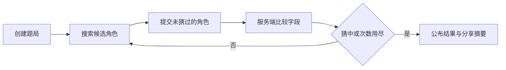

# 游戏规则

本文说明 TouhouFlandre（东方芙一把）的公开玩法、反馈含义与结算规则。

## 游戏目标

每局游戏会从题库答案池中选出一名隐藏角色。玩家通过名称、别名或初登场作品搜索候选角色，提交后获得结构化字段反馈，并据此缩小范围直到猜中答案或用完猜测次数。

## 游戏模式

| 模式 | 规则 |
|---|---|
| 每日题 | 服务端按 `Asia/Shanghai` 自然日固定答案，同一天答案不变；浏览器保存会话标识以便恢复。 |
| 随机题 | 每局从当前答案池随机选取角色；新会话与每日题互不影响。 |
| 多人房间 | 两名游客创建或加入房间，选择 BO1/3/5/7 赛制，并在竞速或接力规则下完成实时对局。 |

每日题、随机题和多人对局都绑定创建时的题库快照。题库更新不会改变已经开始的题局答案和反馈结果。

## 反馈字段

公开猜测反馈使用六个字段：

| 字段 | 类型 | 比较方式 |
|---|---|---|
| 初登场作品 | 层级 | 作品相同为完全匹配；媒介类型相同为部分匹配。 |
| 初登场年份 | 数值 | 年份相同为完全匹配；否则箭头指向答案年份。 |
| 种族 | 多值 | 集合完全相同、存在交集或无交集。 |
| 阵营 | 多值 | 集合完全相同、存在交集或无交集。 |
| 主要地点 | 多值 | 集合完全相同、存在交集或无交集。 |
| 头发颜色 | 多值 | 集合完全相同、存在交集或无交集。 |

能力、角色定位等资料可以存在于题库中，但不参与公开猜测反馈。

## 反馈含义

| 标记 | 含义 | 说明 |
|---|---|---|
| `O` | 完全匹配 | 猜测值与答案值一致。 |
| `~` | 部分匹配 | 多值字段存在交集，或层级字段属于同一类别。 |
| `X` | 不匹配 | 两者没有可用于缩小范围的重合。 |
| `↑` | 答案更晚 | 答案的初登场年份晚于猜测角色。 |
| `↓` | 答案更早 | 答案的初登场年份早于猜测角色。 |
| `?` | 未知 | 数据不足，系统不据此作出判断。 |

多值字段只有标准化集合完全相同时才算完全匹配。任何非空交集均为部分匹配。

## 胜负与会话

- 提交角色与隐藏答案相同时，题局立即获胜。
- 达到最大猜测次数仍未命中时，题局结束并公布答案。
- 默认上限为 8 次猜测，最终值以服务端会话配置为准。
- 已结束的会话不再接受新的猜测。
- 同一角色在同一局中不能重复提交。
- 单人会话可以主动放弃；放弃后立即公布答案并进入终态。
- 游戏结束后可复制不包含答案名称的分享文本。

## 多人规则

多人房间支持两种规则：

| 模式 | 规则 |
|---|---|
| 竞速 | 双方同时竞猜同一个隐藏角色；先提交正确答案的一方赢得本局。双方都用尽猜测次数或整局超时时，本局平局。 |
| 接力 | 双方共用一张猜测棋盘并轮流行动；只有当前轮到的玩家可以猜测或主动空过。猜中者赢得本局，空过或超时会推进到下一手。 |

接力模式中，每名玩家每局最多消耗 8 次轮次。主动空过和超时空过共享每人每局 2 次空过额度；额度耗尽后再次空过，该玩家本局判负。多人房间也支持主动放弃当前小局，放弃者本局判负。

## 多人可见性

多人房间的可见性按规则区分：

| 模式 | 进行中可见内容 | 局末可见内容 |
|---|---|---|
| 竞速 | 自己的棋盘展示完整猜测与反馈；对手棋盘只展示匿名矩阵，即行顺序和字段反馈颜色，不展示对手提交的角色名或标签值。 | 揭示答案、比分、双方完整棋盘和结算结果。 |
| 接力 | 双方共享同一棋盘，已接受的猜测、主动空过和超时空过都会作为共享行展示。 | 揭示答案、比分、共享棋盘和结算结果。 |

## 公平性原则

- 服务器是答案、猜测结果和多人状态的权威来源。
- 进行中的公开会话不返回答案。
- 公开字段必须采用稳定、可解释的判定标准。
- 争议属性应记录来源；无法可靠判断时使用未知状态。
- 每个启用为答案的角色必须具备全部核心字段。
- 分享内容不得在游戏结束前泄露答案。

字段来源、标准化方式和纠错流程见[数据规范](./data-guidelines.md)。
