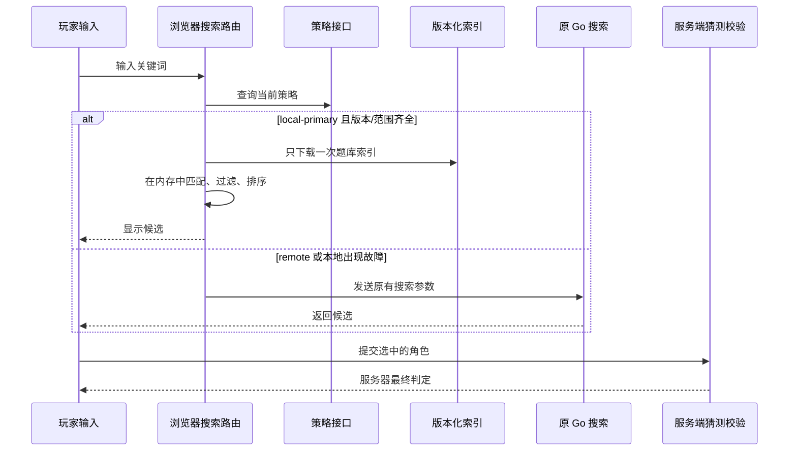
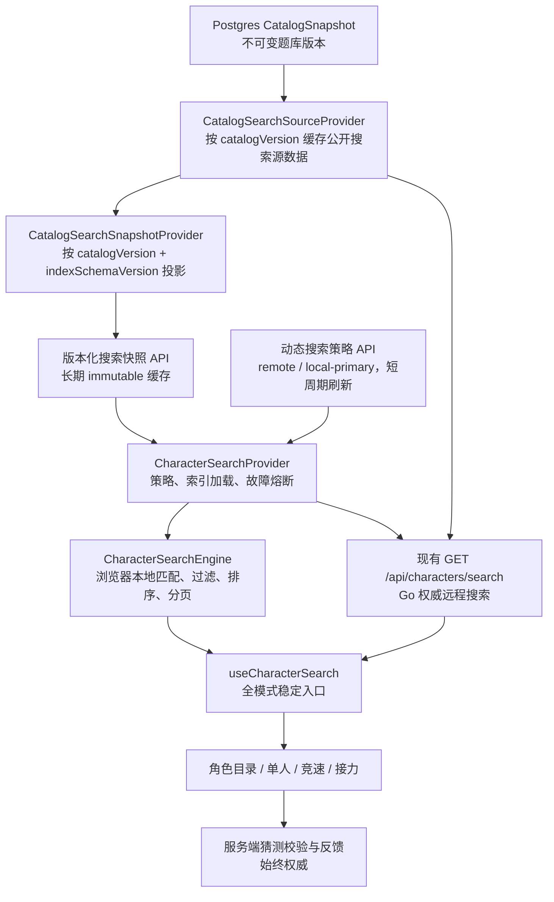
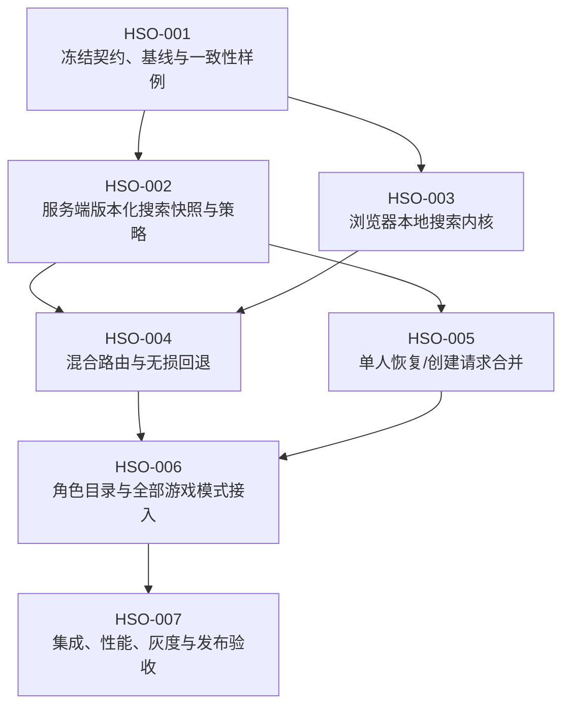

# 混合搜索架构与题局加载优化开发计划

本文档组将角色搜索改造成“服务端维护版本化搜索快照，浏览器优先执行统一搜索，现有 Go 搜索随时可接管”的混合架构，同时把单人题局的恢复/创建收敛为一次请求。目标是在弱网下减少可感知等待，并保持当前题库冻结、多人范围、答案判定和回滚能力。

## 当前基线与问题

| 当前行为                                   | 代码基线                                                                 | 问题                                                                                   |
| ------------------------------------------ | ------------------------------------------------------------------------ | -------------------------------------------------------------------------------------- |
| 角色目录、单人和多人统一调用远程搜索       | `apps/web/src/hooks/useCharacterSearch.ts`、`GET /api/characters/search` | 每个新查询都包含固定防抖和公网往返，网络波动直接表现为建议延迟                         |
| 搜索上下文由服务端解析                     | 单人使用 `sessionId`，多人使用 `roomId + matchIndex`                     | 权威范围正确，但本地搜索迁移后必须显式携带等价的题库版本和允许角色集合                 |
| Go 是唯一搜索实现                          | `apps/api/internal/game/search.go`                                       | 语义稳定，可作为本地方案的对照和紧急回退；本计划不删除它                               |
| 版本快照每次可能重新读取并反序列化         | `apps/api/internal/multi/characters.go`                                  | 重复数据库和 JSON 工作增加尾延迟；现有 `CatalogRuntimeProvider` 只服务答案匹配策略     |
| 随机题创建前读取 `/api/catalog/full`       | `SingleGamePage.loadSession`                                             | 新题局至少需要两次串行公网请求                                                         |
| 每日题由浏览器先取日期、再恢复、必要时创建 | `SingleGamePage.loadSession`                                             | 恢复判断散落在浏览器，多次串行请求会放大弱网影响                                       |
| 旧完整角色表接口仍存在                     | `GET /api/catalog/characters`                                            | 仅保留兼容当前版本，缺少历史版本、索引 schema 和可靠浏览器失效策略，不直接复用为新契约 |

前期公网采样记录为：热 HTTP/2 搜索请求约 `229–236ms`，独立搜索约 `360–710ms`，现有前端另有 `120ms` 防抖；`/api/catalog/full` 约 `510–930ms`。这些数字只作为改造前基线，HSO-001 必须用固定脚本重新记录可复现结果。

## 给新手的整体说明

可以把角色搜索想成“先把本题库的目录下载到浏览器，再在本地查找”。浏览器仍然只负责给出候选角色，真正提交答案时服务器会再次检查范围和答案。这样网络慢时，逐字输入不必每次都等待服务器；如果目录还没准备好或出现故障，仍会调用原来的 Go 搜索。

单人题局也会把“读取旧局、判断是否能恢复、必要时创建新局”合并成一次 `resolve` 请求。请求带有客户端生成的幂等键，因此网络超时后重试不会意外创建第二局。刷新页面后的离线搜索不在本次范围内；本次只保证同一页面已经加载并校验的索引在短暂断网时继续可用。

## 目标架构

本地模式下，浏览器按题库版本下载一次搜索快照，后续每次输入只在内存中搜索。远程模式、冷启动策略不可用、索引不兼容、索引加载失败或本地引擎异常时，原参数无损转发到现有 Go 接口。瞬时故障使用带退避的单探针半开恢复，结构性故障等待版本/revision 变化或显式重试；策略短暂波动只在已有已校验内存索引时使用最长 5 分钟的 last-known-good，成功取得 `remote` 策略仍立即接管。`gameScopeMode=strict` 时游戏本地搜索严格使用允许角色 ID；`full` 时游戏上下文保留远程全快照语义并强制远程，角色目录仍可本地搜索。切换模式不改变各页面的搜索语义，也不改变提交猜测后的服务端校验。刷新页面或超过宽限期后，即使浏览器缓存里有索引字节，也不承诺离线搜索。

单人题局加载采用独立但互补的优化：新增 `POST /api/puzzles/{mode}/resolve`，接受客户端生成的 `idempotencyKey` 和可选 `resumeSessionId`，由服务端一次完成“恢复有效旧局，否则创建新局”。同一幂等键的重试或并发只返回首次结果，不会创建第二局。旧的创建端点保持原义，因此新 Web 遇到旧 API 的 404 可以安全退回现有流程，不会先误创建题局；随机题在新流程中不再为了创建题局而先等待完整题库。

## 跨 Issue 不变量

1. **远程方案持续可用**：本计划不删除、不废弃 `GET /api/characters/search`、Go 搜索实现及其回归测试。
2. **回退默认安全**：冷启动策略缺失、未知模式、旧 API binary、未知索引 schema、缓存强制修复仍失败或本地异常一律选择远程搜索；只有已成功验证的本地策略与内存索引可在策略瞬时故障时使用短期宽限。合法的本地空结果不是故障，不触发回退。
3. **波动可恢复但不反复打扰**：单次本地故障只影响当前查询；瞬时故障按有界退避半开恢复，结构性故障不按固定周期盲目重试，策略瞬时失败不会立刻废弃已经校验且仍在内存中的索引。
4. **缓存可精确失效并可修复**：搜索快照缓存键和 URL 同时包含 `catalogVersion` 与 `indexSchemaVersion`；题库内容或索引结构任一变化都会产生新资源。缓存校验失败必须清理内存条目并强制绕过 HTTP 缓存修复一次，不能要求玩家手工清缓存。
5. **远程回退隔离**：远程 Go 搜索可复用按题库版本解析的公开源数据，但不得依赖浏览器索引的 schema 投影、序列化或校验成功。
6. **游戏范围 fail closed**：单人/多人缺少题库版本或允许角色 ID 时不得退化为全题库本地搜索，只能使用对应远程上下文或显示可重试错误。
7. **服务端仍是游戏权威**：浏览器搜索只生成候选项；答案、可猜范围、重复猜测、反馈、胜负和并发校验继续由服务端决定。
8. **全模式共用入口**：角色目录、单人、竞速和接力继续只依赖 `useCharacterSearch`，不得在页面或模式目录内复制匹配算法。
9. **本地搜索不缓存单个查询**：快照和派生索引是主要缓存；不引入短期 128 条查询结果缓存，避免以低命中率复杂化状态。
10. **兼容部署顺序**：新 Web 对旧 API 自动远程回退；旧 Web 对新 API 继续调用旧搜索接口。先升级整个 API fleet 并保持 `remote`，抽查索引和缓存后才能启用 `local-primary`；回滚先切 `remote` 再回滚 binary。回退不依赖清理浏览器数据或重新发布前端，但 resolve 幂等键允许一次 additive 数据库迁移。
11. **协议边界稳定**：不升级 WebSocket 版本；多人已有 `catalogVersion` 与 `questionScope.selectedCharacterIds` 是本地搜索范围来源。策略必须声明 `gameScopeMode`，缺失时游戏上下文不得启用本地路径。
12. **可观测但不泄漏**：策略、索引和远程 fallback 原因使用固定低基数生产指标，恢复时长与半开结果由可控测试 trace 记录；查询词、题库版本、题局/房间 ID 和答案不得进入指标标签。
13. **生成物由源契约产生**：OpenAPI 源文件是接口事实来源，Go/TypeScript 生成物不得手工编辑。

详细契约和失败语义见[架构决策](./decisions.md)。

## Issue 依赖

HSO-002 与 HSO-003 在 HSO-001 完成后可以并行。HSO-002 完成后，HSO-004 与 HSO-005 可分别处理搜索路由和单人加载；两者分别拥有搜索/题局 adapter，不共同扩展 `apps/web/src/lib/api.ts`。HSO-006 才统一修改各调用方，避免多个 Issue 同时争用 `SingleGamePage` 和生成契约。

| 阶段          | Issue                                                        | 独立交付物                                              | 依赖             |
| ------------- | ------------------------------------------------------------ | ------------------------------------------------------- | ---------------- |
| M0 契约与基线 | [HSO-001](./HSO-001-contract-baseline-and-fixtures.md)       | 搜索快照/策略契约、黄金样例、可重复性能基线             | 无               |
| M1A 服务端    | [HSO-002](./HSO-002-versioned-search-snapshot-and-policy.md) | 版本化搜索快照 Provider/API、动态策略、远程搜索缓存复用 | HSO-001          |
| M1B Web 内核  | [HSO-003](./HSO-003-browser-search-engine.md)                | 纯 TypeScript 搜索内核、索引仓库、Go 语义一致性测试     | HSO-001          |
| M2B 单人加载  | [HSO-005](./HSO-005-single-session-resolve-or-create.md)     | 一次请求恢复或创建每日/随机题局，保留统计语义           | HSO-002          |
| M2 搜索路由   | [HSO-004](./HSO-004-hybrid-routing-and-fallback.md)          | 服务端开关、本地优先、自动回退和旧请求保真              | HSO-002、HSO-003 |
| M3 全模式接入 | [HSO-006](./HSO-006-all-mode-search-integration.md)          | 目录、单人、竞速、接力统一使用混合搜索                  | HSO-004、HSO-005 |
| M4 发布收口   | [HSO-007](./HSO-007-integration-performance-and-rollout.md)  | 性能证据、兼容矩阵、紧急回退演练和发布文档              | HSO-006          |

## 明确不纳入

- 不删除 Go 搜索实现或现有远程搜索 API。
- 不引入 Redis、独立搜索服务、Service Worker、Web Worker 或新的前端状态库。
- 不把题局答案、未授权对手棋盘或其他私有信息放入搜索快照。
- 不实现离线创建题局、离线提交猜测或离线多人游戏。
- 不修改角色匹配规则、排序规则、作品筛选语义或题库范围语义。
- 不为搜索快照迁移 Postgres schema；现有不可变 `CatalogSnapshot` 已能按版本提供数据。HSO-005 允许为 resolve 幂等绑定增加一次 additive 迁移/幂等记录，不得借此修改题库或题局语义。
- 不以浏览器查询结果缓存作为主要优化，也不要求 Cloudflare 配置才能正确运行。
- 不实现刷新页面后的离线搜索；断网承诺仅限同一页面已有已校验内存索引且仍在 5 分钟宽限内。
- 不顺带重写题库设置对话框、多人房间规则或统计模块。

## 完成定义

全部 Issue 完成且[发布闸门](./release-gate.md)有证据通过后，才可将生产策略从 `remote` 切换为 `local-primary`。完成态必须证明：本地模式无逐词搜索请求、所有模式结果与 Go 基线一致、一次瞬时波动能自行恢复且不会形成永久降级、结构性故障不会周期性打扰玩家、坏 HTTP 缓存可自动修复或稳定远程接管、旧 API 可立即接管、单人加载减少串行请求且 resolve 重试不重复创建、跨版本/跨场次不串数据，并且紧急回退不要求清除浏览器缓存或回滚数据库。离线证据仅覆盖同页内存索引窗口，不得扩展为刷新后离线承诺。
