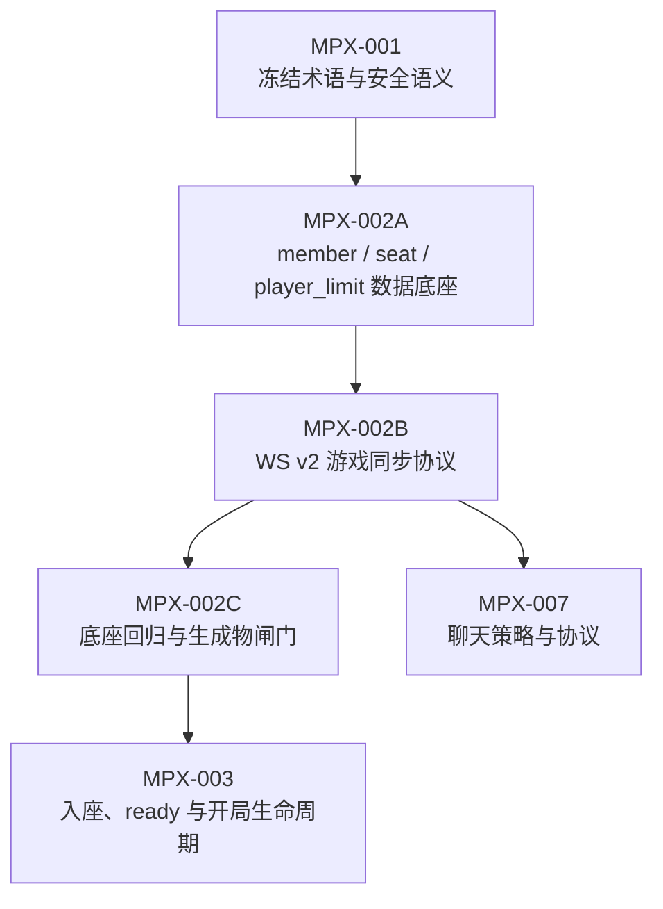

# MPX-002：member/seat 与 WS v2 底座拆分总览

**类型**：拆分总览 / 路线 Issue

**优先级**：P0

**依赖**：MPX-001

**建议标签**：`type:planning` `area:db` `area:contracts` `area:shared`

**决策依据**：[MPX 多人扩展决策记录](./decisions.md)

## 为什么拆分

最初的 MPX-002 同时承担三类工作：

1. 房间里“谁是谁、坐哪儿、最多几人”的数据底座。
2. WebSocket v2 中“实时消息怎么编号、跳过和补齐”的同步协议。
3. 迁移、生成物和双人回归的收口验证。

这三类工作会改同一批契约和生成物，但风险形态不同。把它们放在一个 PR 里，会让评审者很难判断问题来自数据模型、实时协议，还是迁移/回归。拆分后，每一步都可以独立验证，并为 MPX-003、MPX-004、MPX-007 提供更稳定的基线。

## 拆分后的任务

| ID | 标题 | 主要边界 | 完成后解锁 |
|---|---|---|---|
| [MPX-002A](./MPX-002A-member-seat-data-foundation.md) | 建立 member、seat 与 player_limit 数据底座 | 数据库约束、Go helper、公开 memberId、双人集合适配、共享类型 | WS v2 可以基于稳定身份/座位建模 |
| [MPX-002B](./MPX-002B-ws-v2-game-sync-foundation.md) | 建立 WS v2 游戏事件同步协议 | `lastGameSequence`、cursor envelope、`sync.complete`、snapshot 缺口补齐、v2 握手 | MPX-003 可以在可靠同步上改生命周期，MPX-007 可以扩展聊天 cursor |
| [MPX-002C](./MPX-002C-foundation-regression-gate.md) | 完成底座回归与生成物闸门 | 迁移演练、生成物漂移、双人 race/relay、重连/缺口、旧数据兼容 | MPX-003、MPX-004 进入功能实现阶段 |

## 顺序约束

- MPX-002A 必须先于 MPX-002B，因为同步协议需要稳定的 `memberId`、`seat` 和集合 shape。
- MPX-002B 必须先于 MPX-002C，因为回归闸门要验证最终 v2 同步语义。
- MPX-003 依赖 MPX-002C，而不是只依赖 MPX-002A；生命周期里的 claim-seat、ready/start 和 reconnect 都需要最终同步行为稳定。
- MPX-007 逻辑上依赖 MPX-002B 的 v2 frame 分类与 `sync.complete` 语义，但操作上仍按 README 的执行路线排在 MPX-005 之后，避免多个后端分支同时修改契约、SQL 和生成代码。

## 共同不变量

- `memberId` 是房间内稳定、可公开的参与者标识；不是令牌，也不授予权限。
- `seat` 只负责展示顺序和本轮 seat 1 房主规则，不能代替 `memberId` 作为身份键。
- `player_limit` 是入座容量上限，不是必须凑满的开局人数。
- 游戏事件继续使用 `room_event.sequence`；投影没有业务内容时必须发送 cursor envelope，不能制造假缺口。
- 聊天不进入 MPX-002 的实现范围。MPX-007/008 会在 MPX-002B 的 v2 握手基础上增加独立的 `lastChatCursor` 和聊天历史。

## 本文件不直接落代码

本文件只说明拆分关系。实现和验收分别落在 MPX-002A、MPX-002B、MPX-002C 中；后续 Issue 应引用具体子任务，而不是泛称“MPX-002 已完成”。
