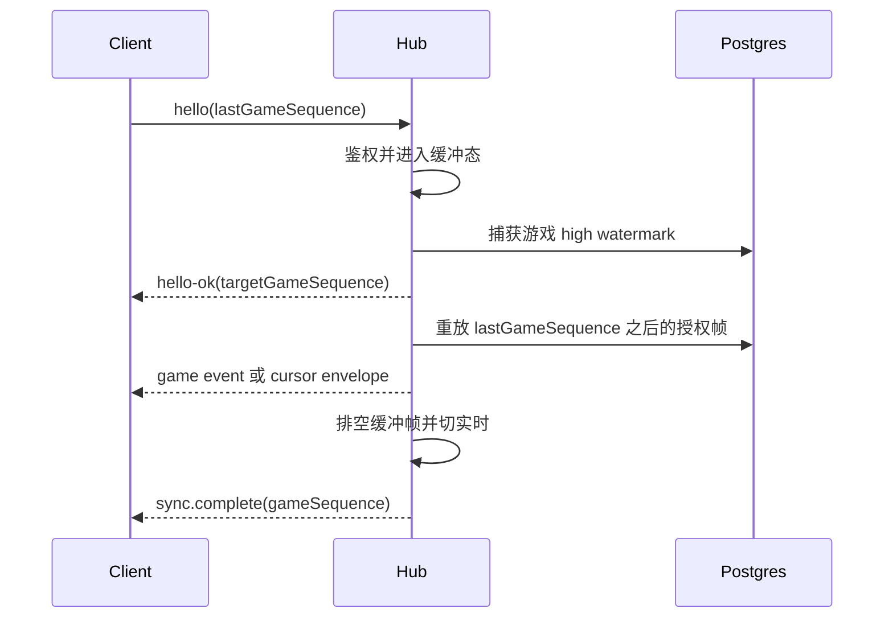

# MPX-002B：建立 WS v2 游戏事件同步协议

**类型**：功能 / 实时协议 Issue

**优先级**：P0

**依赖**：MPX-002A

**建议标签**：`type:feature` `area:contracts` `area:ws` `area:web`

**决策依据**：[WS v2 游戏 sequence 与同步屏障](./decisions.md#ws-v2-游戏-sequence-与同步屏障)

## 要解决的问题

当前 WebSocket 使用单一 `lastSequence` 和房间级连续 `room_event.sequence` 做重放，但投影可能对不同观察者跳过业务 payload。客户端又只去重并推进水位，无法区分“服务端有意隐藏/跳过”和“真的丢了一帧”。一旦 N 人集合和聊天扩展叠上来，旧语义会让客户端误判缺口、提前持久化水位，或者在重连时漏掉事件。

## 目标

在 MPX-002A 已稳定的 memberId/seat 集合上，建立 `touhouflandre-multi.v2` 的游戏事件同步语义，让每个观察者都能可靠判断自己是否缺帧。

目标行为：

- hello 将游戏水位命名为 `lastGameSequence`，不再使用含义模糊的单一 `lastSequence`。
- 服务端对每个 `room_event.sequence` 要么发送授权后的业务事件，要么发送同 sequence 的 cursor envelope；投影跳过不再表现为缺帧。
- 客户端只有发现游戏 sequence 真正不连续时才请求 snapshot；cursor envelope 只推进水位，不进入游戏 reducer。
- `hello-ok` 只声明鉴权和捕获到的目标水位；重放/缓冲帧全部交付后，FIFO 队尾的 `sync.complete` 才确认可持久化的完成水位。
- 连接建立采用“注册缓冲 -> 捕获 high watermark -> 重放至水位 -> 排空较新缓冲帧 -> 切实时”的屏障，避免历史和实时之间留下窗口。
- MPX-007/008 会在同一 v2 握手基础上增加独立 `lastChatCursor`；本任务只实现游戏事件水位，不实现聊天。

## 属于本 Issue

- `contracts/ws/protocol.yaml` 中 v2 hello、hello-ok、cursor envelope、sync.complete 和游戏 event envelope。
- hub 实时推送、重放、snapshot 补齐和 Web reducer 的连续 sequence 处理。
- 对“投影无业务内容”的 room event 发送 cursor envelope，而不是静默跳过。
- 客户端只在 `sync.complete` 后持久化完成水位；重叠帧按 eventId/sequence 去重。
- hello 水位小于 0、超过服务端高水位、超出事件保留范围或格式错误时的稳定 resync-required 路径。
- 旧 v1 房间/页面的短期兼容或刷新提示策略草案；最终切换演练由 MPX-010 验收。

## 不属于本 Issue

- 不新增聊天表、聊天 cursor、聊天 history 或 `chat.message` frame；这些属于 MPX-007/008。
- 不改变 member/seat/playerLimit 数据模型；这些由 MPX-002A 冻结。
- 不改变 N 人竞速计分、胜者和棋盘存储；这些属于 MPX-004。
- 不实现 N 人 Web 布局；这些属于 MPX-006。

## 验收标准

- v2 观察者对每个 `room_event.sequence` 都收到业务事件或 cursor envelope；客户端发现真正缺口时只触发一次 snapshot 对齐。
- 在注册、捕获游戏高水位、重放和切实时各阶段并发写入 room event，客户端都按 sequence 收齐且重复事件只应用一次。
- `sync.complete` 前断线时，客户端从上一次完成水位恢复，不会持久化 `hello-ok` 的目标水位。
- hello 的游戏水位小于 0、超过当前高水位、不可从保留事件连续补齐或协议版本不匹配时，不会被静默接受。
- 两人 race/relay 在最终 v2 游戏事件/cursor 契约下完成现有流程；v1 不再继续扩展。
- `go test ./...`、`pnpm typecheck`、`task gen`、OpenAPI/WS 检查通过；Go/Web 生成目录无未预期漂移。

## 可能涉及的代码

`apps/api/internal/hub/`、`apps/api/internal/multi/projection.go`、`apps/api/internal/handler/{snapshot.go,ws.go}`、`contracts/ws/protocol.yaml`、`packages/shared/src/multi.ts`、`apps/web/src/hooks/useRoom.ts` 及其测试/生成物。
