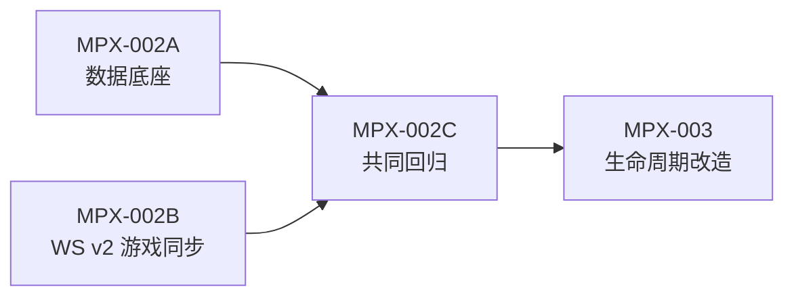

# MPX-002C：完成底座回归与生成物闸门

**类型**：质量 / 回归 Issue

**优先级**：P0

**依赖**：MPX-002B

**建议标签**：`type:quality` `area:test` `area:contracts`

**决策依据**：[术语与生命周期](./decisions.md#术语与生命周期)、[WS v2 游戏 sequence 与同步屏障](./decisions.md#ws-v2-游戏-sequence-与同步屏障)

## 要解决的问题

MPX-002A 会改变数据底座，MPX-002B 会改变实时同步语义。即使两个 PR 各自测试通过，也可能在组合后出现旧数据迁移漂移、生成物不一致、双人流程回归、重连水位错误或客户端状态误用 memberId/seat 的问题。MPX-003 之后会开始改房间生命周期，一旦带着这些问题继续推进，定位成本会迅速升高。

## 目标

在进入 MPX-003 前，对 member/seat 数据底座和 WS v2 游戏同步做一次共同回归，确保后续 Issue 可以把它当成稳定基础。

## 属于本 Issue

- 对一次性测试库执行升级/Down 演练，确认既有房间、玩家、观战者和 `player_limit=2` 回填可恢复验证。
- 运行 `task gen` 并检查 Go/Web 生成目录、OpenAPI/WS 契约和 shared 类型没有未解释漂移。
- 双人 race/relay、观战、finished retention、snapshot、断线重连和 v2 cursor envelope 回归。
- 客户端 `useRoom` 对业务事件、cursor envelope、重复帧、真正缺口和 `sync.complete` 的状态处理回归。
- 写下 MPX-003 的进入条件：当前集成分支必须通过哪些命令、哪些生成物必须保持干净、哪些已知风险需要单独 Issue 跟进。

## 不属于本 Issue

- 不继续改 member/seat 数据模型；发现模型问题回到 MPX-002A。
- 不继续改 v2 握手和同步语义；发现协议问题回到 MPX-002B。
- 不改 join/claim-seat/ready/start 生命周期；这些属于 MPX-003。
- 不做 N 人竞速、聊天或 Web N 人布局；这些属于 MPX-004 以后。

## 验收标准

- `pnpm typecheck`、`pnpm test`、`pnpm lint:openapi`、`pnpm check:openapi-refs`、`pnpm check:ws-protocol`、`task gen`、`cd apps/api && go test ./...` 全部通过。
- Go/Web 生成目录无未预期漂移；若有漂移，必须说明来源并在对应任务中修正。
- 真实 Postgres 测试库完成至少一次升级/Down 演练；生产回滚策略仍保留 expand schema，不依赖 Down 删除新数据。
- 两人 race/relay 的现有用户流程、观战只读、断线重连和 finished retention 在 v2 下无回归。
- 客户端不会把 cursor envelope 当作业务事件，也不会在 `sync.complete` 前持久化尚未完整交付的水位。
- MPX-003 的执行者可以从本任务结果中直接看到通过的命令、已知限制和剩余风险。

## 可能涉及的代码与工具

`.github/workflows/`、`Taskfile.yml`、`apps/api/internal/*_test.go`、`apps/web/e2e/multiplayer.spec.ts`、生成目录检查脚本、`docs/multiplayer-expansion/README.md` 的进入条件说明。
