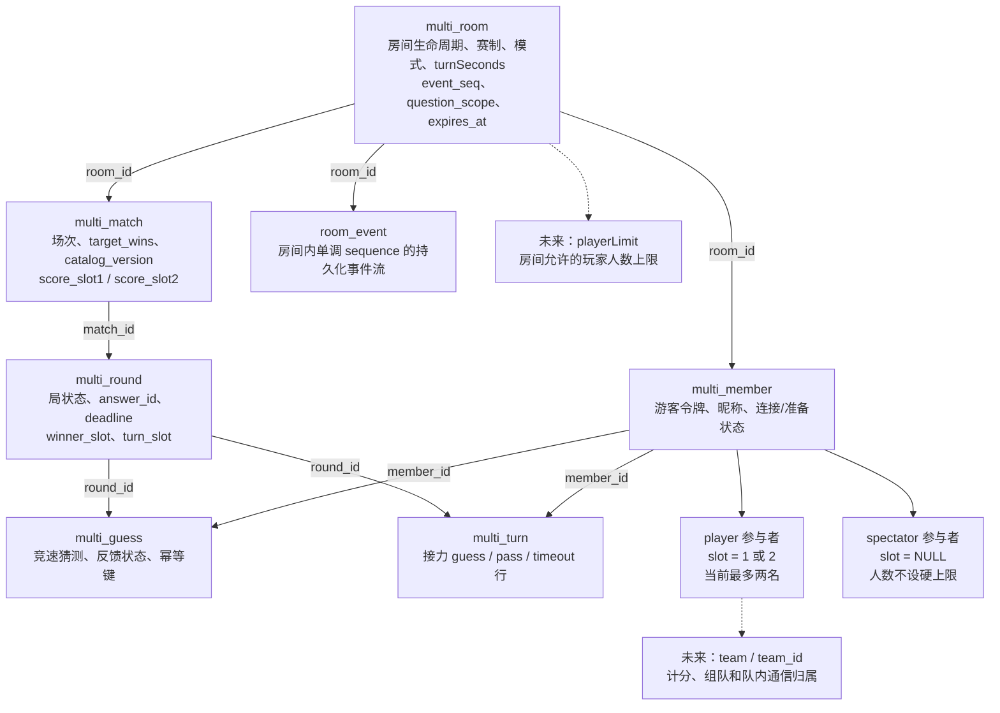
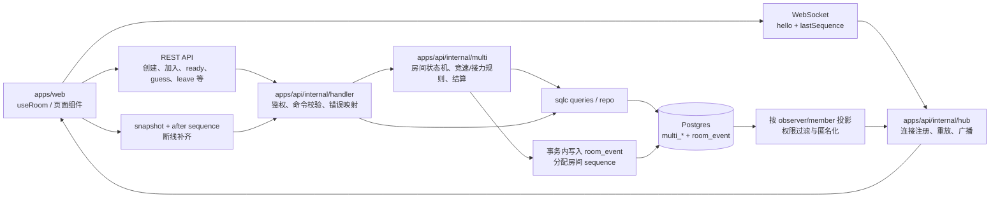
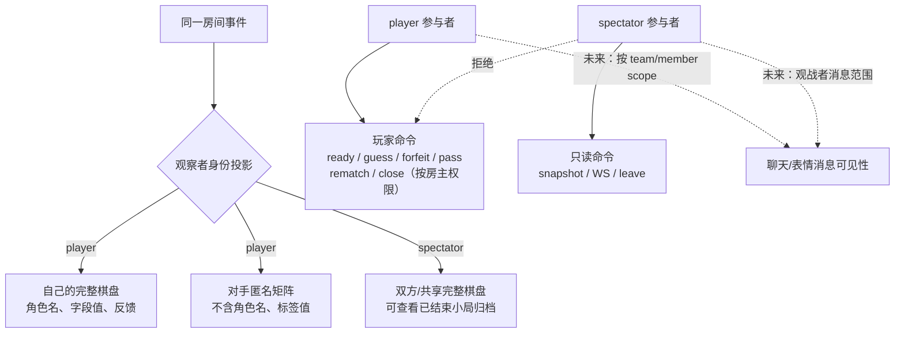
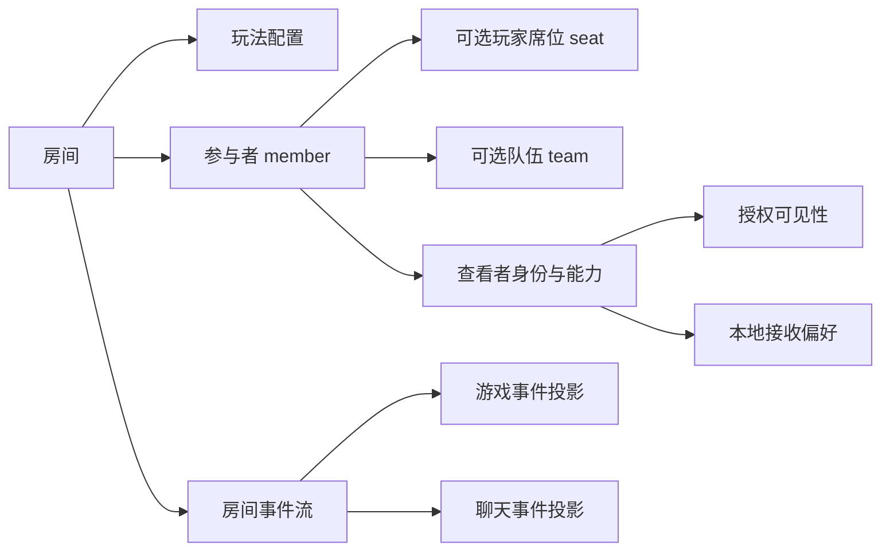
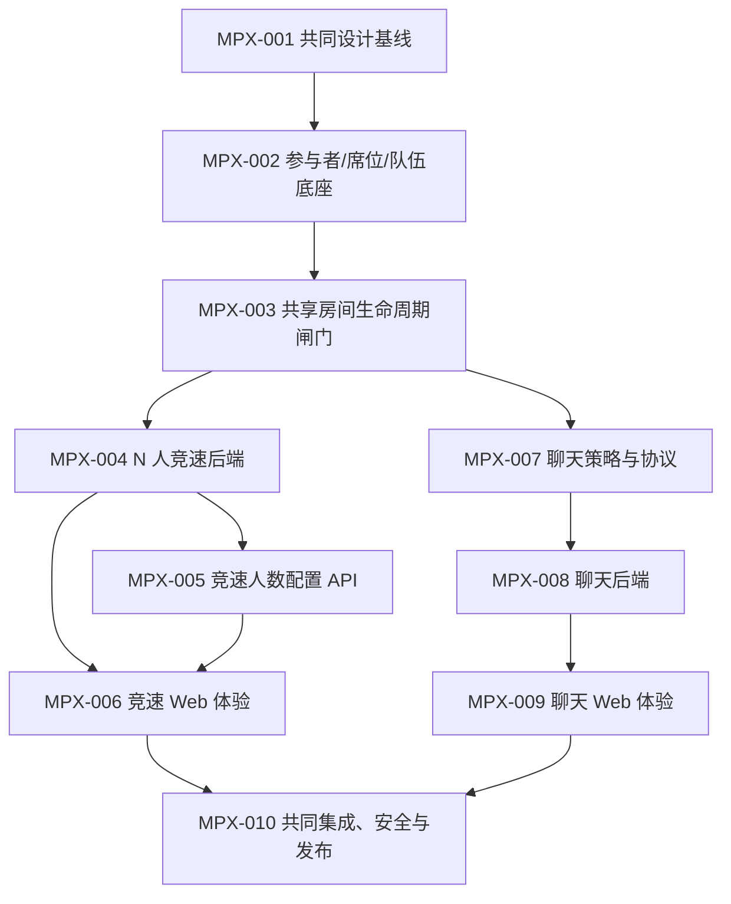
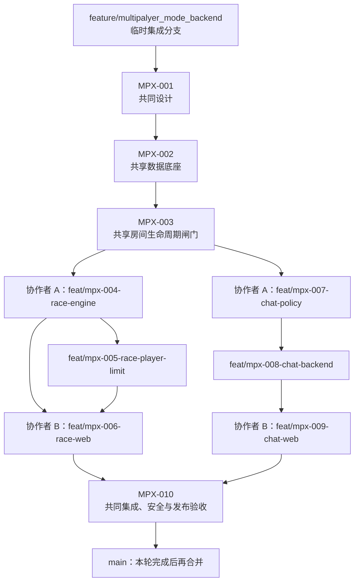

# 多人房间扩展开发计划

本文档组是多人房间下一阶段的协作工作台。它描述的是可以被不同维护者认领的 Issue 边界、依赖顺序和验收标准，不替代已经生效的[多人房间规则](../multiplayer.md)或具体代码注释。

## 背景与当前基线

当前实现已经支持 `player` / `spectator` 两种参与者身份、观战只读权限、结束态保留和按观察者投影事件，但实际对局仍是严格的两名 PK 玩家：

- `multi_member.slot` 仍被数据库约束为 `1/2`；
- `multi_match` 使用 `score_slot1/score_slot2`；
- `multi_round.winner_slot`、`turn_slot`、棋盘和快照都以两个 slot 为中心；
- 竞速、接力规则和前端双栏组件默认存在两名玩家；
- WebSocket 使用房间级连续 `sequence` 做重放和 snapshot 补齐。

因此本计划把“参与者身份”“玩家席位”“队伍”“玩法人数”“消息可见性”拆成不同层次。完成底座后，增加人数或新身份不应再依赖“没有 slot 就是观战者”这类隐式判断。

## 当前实现结构（开发基线）

下面的图表描述当前代码已经实现的结构，**不代表本目录 Issue 完成后的目标状态**。其中 `slot1/slot2`、`winnerSlot` 和双栏棋盘是当前仍存在的双人假设；虚线节点表示本计划后续要引入的抽象。

### 房间数据与参与者



当前数据库约束保证玩家席位在房间内唯一，`player` 必须占用 `slot 1/2`，`spectator` 不占玩家席位。当前还没有独立的 `team` 表，也没有可配置的 `playerLimit`；这正是 MPX-002 至 MPX-005 的改造范围。

### 请求、事务与事件投影



所有改变房间状态的命令先在 Postgres 事务中完成，再写入 `room_event`，最后由 hub 广播。WebSocket 断线重连时携带 `lastSequence`；客户端发现房间级 sequence 缺口，则通过 snapshot 获取权威状态和事件补齐。

### 玩家与观战者的当前可见性/权限



当前的“玩家看自己/匿名对手、观战者看完整棋盘”由服务端投影保证，前端不能自行恢复被隐藏字段。聊天的 `players`、`spectators`、`team` 等 scope 以及 `receiveChat` 本地闭麦仍未实现，详见 MPX-007 至 MPX-009。

## 目标模型



必须区分以下概念：

| 概念 | 含义 | 当前/目标形态 |
|---|---|---|
| `participant/member` | 房间内的游客身份和令牌边界 | `player`、`spectator`，未来可增加裁判/解说等角色 |
| `seat/slot` | 参与者在某种玩法中的玩家位置 | 当前是 1/2；底座改为房间内唯一的正整数，观战者无 seat |
| `team` | 计分、组队和队内通信的归属 | 当前两名玩家各自一队；观战者不自动入队 |
| `playerLimit` | 该房间允许入座的玩家人数上限 | 默认 2；第一阶段只对 `race` 开放房主设置 |
| `audience` | 消息的服务器授权可见范围 | 玩家全体、观战者全体、指定队伍/成员等可扩展 scope |
| `receiveChat` | 查看者是否在客户端显示他人消息 | 本地显示偏好，不改变服务器授权和事件序列 |

## 里程碑与依赖



| 阶段 | Issue | 可认领交付物 | 依赖 |
|---|---|---|---|
| M0 共同设计 | MPX-001 | 决策记录、状态/权限/可见性矩阵 | 无 |
| M1 共享基础 | MPX-002、MPX-003 | 数据库、共享类型、契约和房间生命周期 | 001；003 依赖 002 |
| M2A 服务端竞速链（协作者 A） | MPX-004、MPX-005 | N 人竞速规则、计分、人数配置 API | 003；005 依赖 004 |
| M2B 服务端聊天链（协作者 A） | MPX-007、MPX-008 | 聊天策略/协议、消息持久化与投影 | 003；008 依赖 007 |
| M3 Web 交付链（协作者 B） | MPX-006、MPX-009 | 竞速大厅/棋盘、聊天面板与闭麦 | 006 依赖 004、005；009 依赖 008 |
| M4 共同验收 | MPX-010 | 安全/性能/e2e、迁移和发布回滚 | 006、009 |

Issue 之间应保持“一 Issue 一主题、一 PR 可回滚”。生成代码必须和它的契约/SQL 源在同一个 PR 中更新，不能手工单独修改 `apps/api/internal/generated` 或 `apps/web/src/generated`。

## 分支与双人协作流程

本轮扩展暂不要求当前多人开发分支并入 `main`。在 MPX-010 完成前，当前的 `feature/multipalyer_mode_backend` 作为临时多人扩展集成分支；所有 MPX 功能分支最终合并回它，不能直接合并到 `main`。

### 分支拓扑



### 执行约定

1. 先在当前集成分支完成 MPX-001、MPX-002、MPX-003。MPX-003 合并后创建明确的共享基线；可添加本地 tag `mpx-003-base`，两位协作者从同一提交分叉。
2. MPX-001 由两人共同评审；MPX-002、MPX-003 由协作者 A 主实现，协作者 B 负责契约、迁移和兼容性审查。共享基础未通过前，不开始两条功能链的实现。
3. 协作者 A 负责所有服务端与协议工作：MPX-004 → MPX-005，以及 MPX-007 → MPX-008。A 的多人 Go、SQL、OpenAPI/WS 和生成代码改动按顺序合并，避免两个后端 PR 同时改同一批生成文件。
4. 协作者 B 负责所有 Web 工作：MPX-006 和 MPX-009。MPX-006 等 MPX-004、MPX-005 的契约稳定后开始；MPX-009 等 MPX-008 的聊天 API/WS 契约稳定后开始。B 不修改服务端规则、数据库迁移或聊天授权。
5. 每个节点使用独立短期分支和独立 PR；后续节点从最新的集成分支创建。不要让一个长期分支同时承载多个 Issue，也不要把一个 Issue 拆成跨两位协作者的互相等待 PR。
6. 两位协作者不要直接向集成分支推送。PR 目标统一为 `feature/multipalyer_mode_backend`，推荐合并顺序为 `001 → 002 → 003 → ((004 → 005) ∥ (007 → 008)) → (006 ∥ 009) → 010`；其中 006/009 分别等待自己的服务端契约合并后即可并行。
7. A 是 `contracts/ws/protocol.yaml`、OpenAPI 源、SQL 查询、migration、Go handler/domain 的唯一实现负责人；B 只消费生成后的契约。B 可以审查这些变更，但不在自己的功能 PR 中手改同一套源文件。
8. 每次合并后在集成分支运行至少 `pnpm typecheck`、`pnpm test`、`cd apps/api && go test ./...`；涉及契约或 SQL 时追加 `task gen`、`task check:generated` 和 `pnpm check:ws-protocol`。
9. MPX-010 由两位协作者共同完成，包含迁移/回滚、并发、安全、e2e 和移动端回归。只有 MPX-010 通过后，才将整个集成分支作为一个完整多人扩展合并到 `main`。

### 推荐的 worktree

两位协作者应使用不同的 worktree，避免在同一工作目录反复切换分支。MPX-003 共享基础准备好后，可按实际仓库路径执行。服务端协作者先创建 MPX-004 分支；Web 协作者应在 MPX-004/005 合并后再创建 MPX-006 分支：

```bash
git worktree add ../TouhouFriberg-mpx-server \
  -b feat/mpx-004-race-engine mpx-003-base

# MPX-004/005 合并后，在最新集成分支上创建 Web 分支
git worktree add ../TouhouFriberg-mpx-web \
  -b feat/mpx-006-race-web feature/multipalyer_mode_backend
```

示例中的 `mpx-003-base` 是共享基础完成后的基线 tag；如果没有创建 tag，则使用 MPX-003 的完整提交哈希。服务端 worktree 后续还会创建聊天链分支；Web worktree 后续还会创建聊天 UI 分支。worktree 只用于隔离本地工作，PR 仍统一以当前集成分支为目标。

## Issue 清单

| ID | 标题 | 建议标签 | 结果 |
|---|---|---|---|
| [MPX-001](./MPX-001-contract-and-invariants.md) | 冻结参与者、席位、队伍与消息可见性术语 | `type:design`, `area:docs` | 后续实现有唯一口径 |
| [MPX-002](./MPX-002-participant-seat-team-foundation.md) | 建立可扩展的参与者/玩家席位/队伍数据底座 | `type:feature`, `area:db`, `area:contracts` | 默认两人行为不变，数据不再写死 1/2 |
| [MPX-003](./MPX-003-room-lifecycle-and-team-assignment.md) | 将容量、入座、队伍分配接入房间生命周期 | `type:feature`, `area:api`, `area:multi` | 共享基础闸门，后续两条链均依赖 |
| [MPX-004](./MPX-004-n-player-race-engine.md) | 将竞速模式扩展为 N 人独立队伍竞速 | `type:feature`, `area:multi`, `area:api` | 协作者 A 的竞速服务端起点 |
| [MPX-005](./MPX-005-race-player-limit-setting.md) | 提供竞速玩家人数配置 API | `type:feature`, `area:api`, `area:contracts` | 房主配置可校验、冻结并广播 |
| [MPX-006](./MPX-006-n-player-race-web-ui.md) | 实现 N 人竞速大厅、棋盘与观战 Web 体验 | `type:feature`, `area:web` | 协作者 B 消费 004/005 契约 |
| [MPX-007](./MPX-007-chat-policy-and-protocol.md) | 冻结聊天消息模型、可见性策略与接收偏好语义 | `type:design`, `area:docs`, `area:contracts` | 协作者 A 的聊天服务端起点 |
| [MPX-008](./MPX-008-chat-backend-pipeline.md) | 实现房间聊天消息的持久化、授权和实时投影 | `type:feature`, `area:api`, `area:db`, `area:contracts` | 协作者 A 消费 007 契约 |
| [MPX-009](./MPX-009-chat-web-and-mute.md) | 实现聊天 Web 体验、历史和闭麦设置 | `type:feature`, `area:web` | 协作者 B 消费 008 契约 |
| [MPX-010](./MPX-010-integration-security-rollout.md) | 完成跨模式验收、安全审计和分阶段发布 | `type:quality`, `area:test`, `area:ops` | 可回滚、可观测、无隐私泄漏 |

## 明确暂不纳入本轮

- 接力模式扩展到三人以上或队伍轮流规则；需要另开“团队玩法规则” Issue，不能在竞速 N 人 PR 中顺手改动。
- 账号系统、跨设备身份合并、好友关系和全站私聊。
- 表情包图片上传、对象存储、内容审核和版权素材。文本/Unicode 表情完成后另开媒体 Issue。
- 管理员踢人、禁言、举报和聊天审计后台。聊天 scope 预留能力，但本轮不实现管理角色。
- 把客户端“闭麦”当作权限控制。它只能改变本地显示，不能阻止服务器向有权查看者投影消息。

## 认领与 PR 规则

认领 Issue 时，在 Issue 中写明负责人、预计拆分的 PR、依赖是否已合并以及验证命令。分支名建议使用 `codex/mpx-<id>-<short-name>` 或项目现有约定；PR 标题沿用 Conventional Commits，并在描述中链接本目录对应文档。

每个实现 Issue 至少应覆盖：数据库迁移回滚策略、OpenAPI/WS 契约、服务端授权测试、前端状态/错误状态（若涉及前端）和文档更新。只有 MPX-010 完成后，才把“支持 N 人竞速”和“房间聊天”作为默认可见功能发布。
