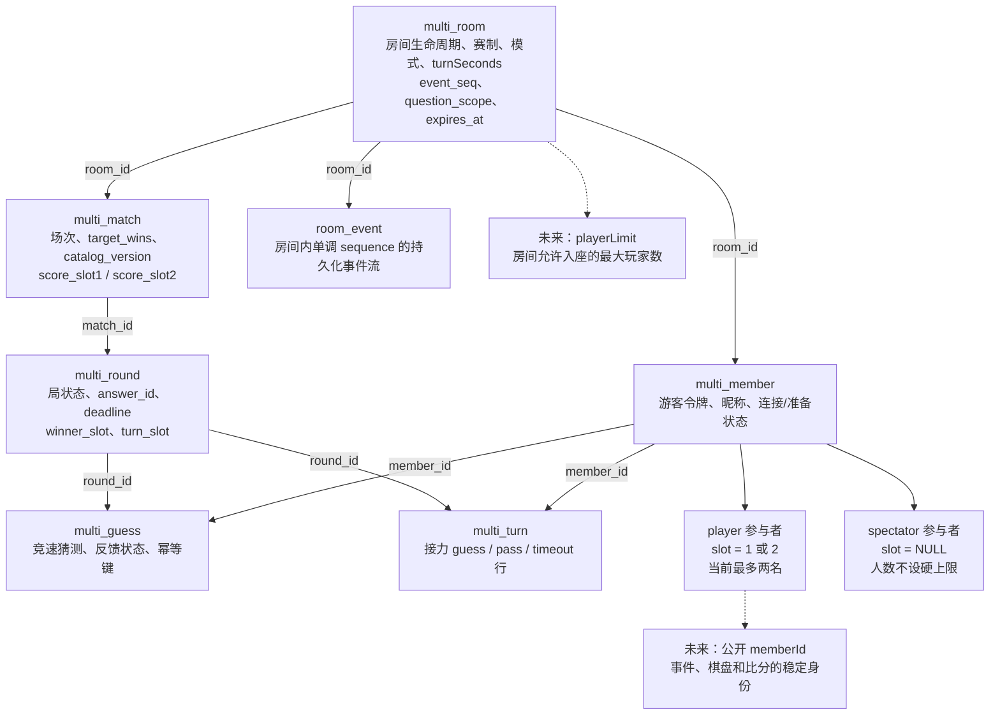
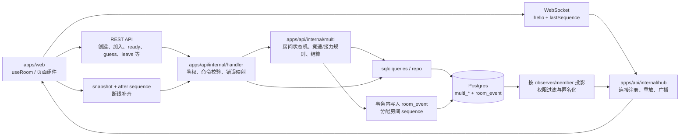
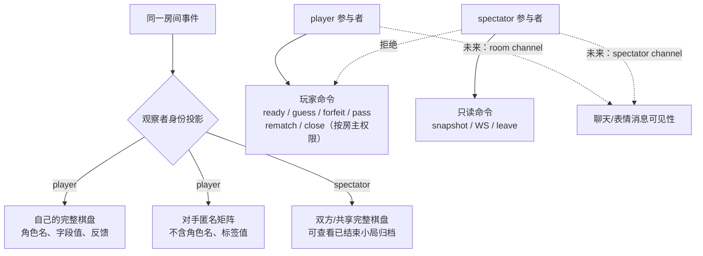
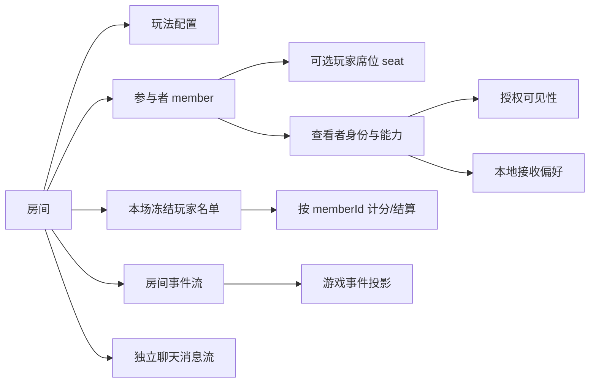
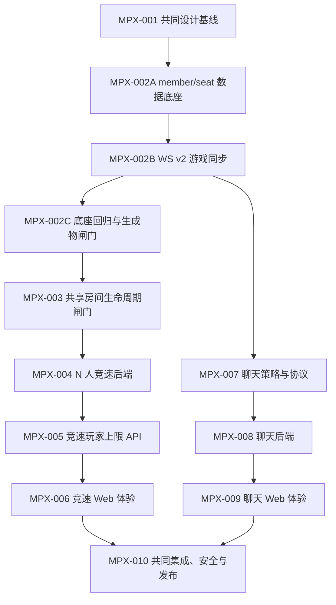
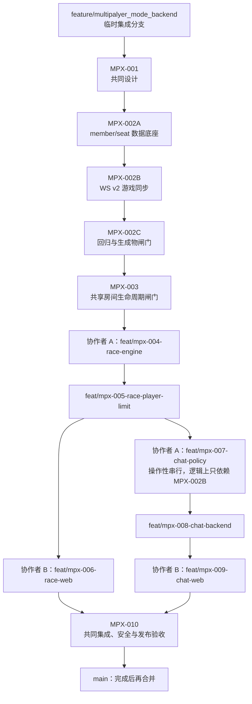

# 多人房间扩展开发计划

本文档组是多人房间下一阶段的协作工作台。它描述的是可以被不同维护者认领的 Issue 边界、依赖顺序和验收标准，不替代已经生效的[多人房间规则](../multiplayer.md)或具体代码注释。

## 现有基线

现有系统已经支持 `player` / `spectator` 两种参与者身份、观战只读权限、结束态保留和按观察者投影事件，但实际对局仍是严格的两名 PK 玩家：

- `multi_member.slot` 仍被数据库约束为 `1/2`；
- `multi_match` 使用 `score_slot1/score_slot2`；
- `multi_round.winner_slot`、`turn_slot`、棋盘和快照都以两个 slot 为中心；
- 竞速、接力规则和前端双栏组件默认存在两名玩家；
- WebSocket 使用房间级连续 `sequence` 做重放和 snapshot 补齐。

因此本计划把“参与者身份”“玩家席位”“本场玩家名单”“玩法人数”和“消息可见性”拆成不同层次。完成底座后，增加人数不应再依赖“没有 slot 就是观战者”或“对手就是另一个 slot”这类隐式判断。

本轮只做每名玩家独立计分的 N 人竞速，不引入 `team` 表或队内玩法。团队归属、队内聊天和 N 人接力都没有当前消费者，提前建模会同时放大迁移、投影和生命周期复杂度；等团队玩法规则确定后再单独设计。

## 当前实现结构（开发基线）

下面的图表描述现有代码结构，用来说明本计划从哪里出发。`slot1/slot2`、`winnerSlot` 和双栏棋盘是现有双人假设；虚线节点表示后续要引入的抽象。

### 房间数据与参与者



现有数据库约束保证玩家席位在房间内唯一，`player` 必须占用 `slot 1/2`，`spectator` 不占玩家席位。公开视图尚未引入 `memberId`，人数、胜者、比分、棋盘和浏览器本地多人统计也都写死为 1/2；后续由 MPX-002A、MPX-002B、MPX-002C 依次承接数据底座、同步协议和回归闸门，覆盖 MPX-002A 至 MPX-006 的范围。

### 请求、事务与事件投影



所有改变房间状态的命令先在 Postgres 事务中完成，再写入 `room_event`，最后由 hub 广播。WebSocket 断线重连时携带 `lastSequence`；协议要求 sequence 缺口通过 snapshot 补齐，但现有 `useRoom` 只去重并推进水位，没有严格检查 `sequence === lastSequence + 1`，且服务端会对猜测者跳过自己的猜测事件。MPX-002B 负责修正这两个同步问题，MPX-002C 再把修正后的语义收进回归闸门，不能直接把现状当作可靠的连续流。

### 玩家与观战者的可见性/权限



现有的“玩家看自己/匿名对手、观战者看完整棋盘”由服务端投影保证，前端不能自行恢复被隐藏字段。聊天仍未实现；服务端根据发送者身份固定选择 `room` 或 `spectator` channel，客户端不能提交任意 scope，详见 MPX-007 至 MPX-009。

## 目标模型



必须区分以下概念：

| 概念 | 含义 | 现状 / 规划形态 |
|---|---|---|
| `participant/member` | 房间内的游客身份和令牌边界 | 本轮只有 `player`、`spectator`；增加其他角色必须另做权限设计 |
| `memberId` | 房间内稳定、可公开的参与者标识 | 事件、比分、棋盘和运行时本地状态的关联键；不是令牌，也不授予权限；统计落盘和导出不保留任何房间成员标识 |
| `seat/slot` | 玩家在房间中的展示顺序与本轮房主位置 | 当前是 1/2；底座改为房间内唯一的正整数，观战者无 seat，seat 1 仍表示房主；不能替代 memberId 作为身份 |
| `match roster` | 对局开始时冻结的玩家集合 | race 按 roster 计分和结算；relay 继续固定两人 |
| `playerLimit` | 房间允许入座的最大玩家数 | 默认 2；race 可设 2..服务端上限，relay 固定 2；它是容量上限，不是必须凑满的开局人数 |
| `minPlayers` | 允许开局的最少玩家数 | 服务端固定为 2，不开放房主设置；玩家达到下限且全员连接、准备后，以当时阵容开局 |
| `spectatorCap` | 单房间观战者的服务端安全上限 | 首版固定 32；不占 playerLimit、不可由房主设置；用于限制成员行、WS 连接和广播扇出 |
| `chat channel` | 消息的服务器授权可见范围 | player 固定发到 `room`（玩家和观战者可见）；spectator 固定发到 `spectator`（仅观战者可见） |
| `receiveChat` | 查看者是否在客户端显示他人消息 | 本地显示偏好，不改变服务器授权、游戏 sequence 或 chat cursor |

lobby 中因满员进入的 spectator 不会在容量增加时被自动提升权限；出现空席位后，可由本人显式执行 claim-seat，在房间锁下沿用原 memberId/token 转为未准备的 player 并取得最小可用 seat。若最终 ready 先提交并已开局，claim-seat 稳定失败；若 claim-seat 先提交，新玩家进入 roster 候选并阻止开局直至准备。playing/finished 不允许角色转换。

### 为什么升级到 WS v2

`playerLimit` 字段本身不要求升级 WebSocket 版本；真正需要 v2 的是同时引入了以下不兼容变化：

- member、棋盘、比分和结果从 `slot1/slot2` 固定结构改为包含 `memberId` 的集合，旧客户端无法正确表达或渲染第三名及后续玩家；
- hello 的单一 `lastSequence` 拆分为游戏 `lastGameSequence` 与独立的 `lastChatCursor`，两种水位不再共享语义；
- 投影跳过改为显式 room cursor，并增加 `sync.complete` 等同步控制帧，旧客户端忽略这些帧后可能误判 sequence 缺口或提前提交尚未完成的同步水位；
- N 人胜者、比分、棋盘和 viewer result 的 payload 不再保留双人字段，不能让旧客户端在结构不完整时仍表面连接成功。

因此 v2 的目的不是给 `playerLimit` 换名字，而是让服务端在握手阶段明确拒绝不理解新集合和重放语义的旧客户端，避免“连接成功但状态错误”的隐性不兼容。wire 集合统一为包含 `memberId` 的数组并按 seat 稳定排序，客户端再按 memberId 建索引；不保留 `slot1/slot2` 双写，也不使用动态 JSON key。

理论上可以在 v1 中增加可选字段并长期维护两套 payload，但多人分支尚未合入 `main`，房间数据也只短期保留，双协议适配、测试和排障成本高于兼容收益。因此本计划选择直接使用 `touhouflandre-multi.v2`，部署时停止创建 v1 房间并等待其排空或关闭，同时向旧页面显示刷新提示；具体演练由 MPX-010 验收。

游戏/生命周期事件继续使用 `room_event.sequence`。任何因观察者投影而没有业务 payload 的事件，都发送同 sequence 的无内容 cursor 帧，使 v2 客户端可以严格检查连续性并在真正丢帧时拉 snapshot。聊天使用独立的消息游标和历史接口，不占用游戏 sequence；重连后按 chat cursor 补历史，从根源上避免“无权查看的聊天”制造房间事件假缺口。

v2 重连握手分别携带 `lastGameSequence` 和可选的 `lastChatCursor`。服务端鉴权后先让连接进入缓冲态，再捕获游戏/聊天高水位，按观察者权限重放到该水位，最后排空水位之后的缓冲帧并切到实时；`hello-ok` 只确认鉴权和目标水位，FIFO 队列末尾另发 `sync.complete`，携带真正完成同步的游戏 sequence 与已扫描聊天 cursor。客户端只在处理 `sync.complete` 后持久化同步水位，并对重叠帧去重。这个订阅/重放屏障必须同时覆盖游戏与聊天，不能用“先拉历史、再订阅实时”的无保护窗口。

## 里程碑与依赖



| 阶段 | Issue | 可认领交付物 | 依赖 |
|---|---|---|---|
| M0 共同设计 | MPX-001 | 决策记录、状态/权限/可见性矩阵 | 无 |
| M1 共享基础 | MPX-002A、MPX-002B、MPX-002C、MPX-003 | memberId/seat、WS v2、回归闸门和房间生命周期 | 001；003 依赖 002C |
| M2A 服务端竞速链（协作者 A） | MPX-004、MPX-005 | N 人竞速规则、计分、玩家上限 API | 003；005 依赖 004 |
| M2B 服务端聊天链（协作者 A） | MPX-007、MPX-008 | 独立聊天游标、消息持久化与授权投影 | 002B；008 依赖 007 |
| M3 Web 交付链（协作者 B） | MPX-006、MPX-009 | 竞速大厅/棋盘、聊天面板与闭麦 | 006 依赖 004、005；009 依赖 008 |
| M4 共同验收 | MPX-010 | 安全/性能/e2e、迁移和发布回滚 | 006、009 |

Issue 之间应保持“一 Issue 一主题、一 PR 可回滚”。生成代码必须和它的契约/SQL 源在同一个 PR 中更新，不能手工单独修改 `apps/api/internal/generated` 或 `apps/web/src/generated`。

## 执行路线图

按下面顺序从集成分支推进。每个步骤都从最新的 `feature/multipalyer_mode_backend` 创建短期分支，通过本阶段闸门后合并回集成分支，再开始依赖它的下一步。

| 步骤 | Issue / 执行内容 | 负责人 | 进入条件 | 完成闸门 |
|---|---|---|---|---|
| 0. 基线确认 | 确认现有双人 race/relay、观战、WS 重放和本地统计测试基线 | 两人共同 | 集成分支可构建 | 基线测试结果已记录，工作区生成物无未解释漂移 |
| 1. 冻结决策 | MPX-001：冻结 `playerLimit`、memberId/seat、roster、权限、聊天 channel 和 v2 原因 | 两人共同评审，A 落文档 | 步骤 0 完成 | 状态/权限/可见性矩阵无待定安全语义，002A—002C 与 003—010 均引用同一口径 |
| 2A. 建立数据底座 | MPX-002A：memberId/seat、`player_limit`、公开 memberId、两人集合适配 | A 实现，B 审查客户端状态 | MPX-001 合并 | 两人 race/relay 的公开数据模型稳定；迁移和生成物通过 |
| 2B. 建立同步协议 | MPX-002B：WS v2 游戏集合、cursor、`sync.complete` 与 snapshot 屏障 | A 实现，B 审查客户端状态 | MPX-002A 合并 | 两人 race/relay 在 v2 下完整回归；sequence 缺口测试通过 |
| 2C. 收口回归 | MPX-002C：迁移、生成物、重连和双人回归闸门 | 两人共同 | MPX-002B 合并 | 创建 `mpx-003-base` 共享基线 |
| 3. 接入共享生命周期 | MPX-003：join/claim-seat、ready/unready、容量、开局冻结、rematch 和 spectator cap | A 实现，B 审查契约 | MPX-002C 合并 | 并发入座/最终 ready 可串行化 |
| 4. 完成竞速服务端 | MPX-004 → MPX-005：N 人 roster/计分/退出语义，再开放房主设置 `playerLimit` | A | MPX-003 合并 | 2/3/4/8 人服务端测试通过；容量设置、降容压紧 seat 和并发边界稳定 |
| 5A. 交付竞速 Web | MPX-006：N 人大厅、棋盘、观战和本地统计迁移 | B | MPX-004、005 合并 | 桌面/移动端 2/3/4/8 人 e2e、隐私投影和统计 v3 导入回归通过 |
| 5B. 交付聊天服务端 | MPX-007 → MPX-008：先用文档 PR 冻结聊天契约，再由 MPX-008 在一个实现 PR 中同步落地生效契约、生成物、持久化、授权、历史和实时同步 | A | 操作上等待 MPX-005 合并；逻辑基线为 MPX-002B | channel 权限、幂等、cursor、重连无缺口和 XSS/限流测试通过 |
| 6. 交付聊天 Web | MPX-009：聊天面板、历史、重连、未读和 `receiveChat` | B | MPX-008 合并；可与已完成的 MPX-006 汇合 | 玩家/观战者可见性、角色变化、闭麦、断线和移动端 e2e 通过 |
| 7. 集成与发布闸门 | MPX-010：迁移、并发、安全、性能、灰度、回滚、文档和用户公告 | 两人共同 | MPX-006、009 均合并 | 全量检查、v1 房间排空和生产回滚演练完成；用户公告评审通过，并在默认开放时同步发布，之后才完成发布流程 |

步骤 0 的实测命令、生成物收口和已知限制记录在[多人扩展施工基线](./baseline.md)。后续节点发现基线语义变化时，应在拥有该变化的 Issue 中更新记录，不能覆盖原始结果。

步骤 5A 与 5B 是本路线图的主要并行窗口：MPX-005 合并后，B 开始 MPX-006，A 同时按 MPX-007 → MPX-008 推进；B 在 MPX-008 合并后再开始 MPX-009。功能依赖链分别为 `001 → 002A → 002B → 002C → 003 → 004 → 005 → 006 → 010` 和 `001 → 002A → 002B → 002C → 007 → 008 → 009 → 010`；为避免 A 的契约、SQL 和生成代码冲突，实际合并顺序固定为 `001 → 002A → 002B → 002C → 003 → 004 → 005 → (006 ∥ 007 → 008) → 009 → 010`。

执行中发现问题时回到拥有该决策的 Issue 修正：数据底座回到 MPX-002A，WS v2 和游标回到 MPX-002B，房间/N 人规则回到 MPX-003—005，聊天授权或游标回到 MPX-007/008，Web 不用本地兼容分支绕过服务端契约；MPX-010 只承担集成修复和发布验收，不在最后阶段重新设计核心规则。

## 分支与双人协作流程

在 MPX-010 完成前，`feature/multipalyer_mode_backend` 作为临时多人扩展集成分支；所有 MPX 功能分支最终合并回它，不能直接合并到 `main`。

### 分支拓扑



### 执行约定

1. 先在集成分支完成 MPX-001、MPX-002A、MPX-002B、MPX-002C 和 MPX-003。MPX-002C 合并后创建明确的共享基线；可添加本地 tag `mpx-003-base`，两位协作者从同一提交分叉。
2. MPX-001 由两人共同评审；MPX-002A、MPX-002B 由协作者 A 主实现，协作者 B 负责契约、迁移和 v2 客户端状态审查。共享基础未通过前，不开始功能实现。
3. 协作者 A 负责所有服务端与协议工作，并按 `MPX-004 → MPX-005 → MPX-007 → MPX-008` 的顺序合并。MPX-007 逻辑上只依赖 MPX-002B，但操作上排在 MPX-005 后，避免多个分支同时修改 OpenAPI/WS、SQL 和生成代码。
4. 协作者 B 负责所有 Web 工作：MPX-006 和 MPX-009。MPX-006 等 MPX-004、MPX-005 的契约稳定后开始；MPX-009 等 MPX-008 的聊天 API/WS 契约稳定后开始。B 不修改服务端规则、数据库迁移或聊天授权。
5. 每个节点使用独立短期分支和独立 PR；后续节点从最新的集成分支创建。不要让一个长期分支同时承载多个 Issue，也不要把一个 Issue 拆成跨两位协作者的互相等待 PR。
6. 两位协作者不要直接向集成分支推送。PR 目标统一为 `feature/multipalyer_mode_backend`，推荐合并顺序为 `001 → 002 → 003 → 004 → 005 → (006 ∥ 007 → 008) → 009 → 010`。其中协作者 B 开始 006 后，协作者 A 可继续 007/008。
7. A 是 `contracts/ws/protocol.yaml`、OpenAPI 源、SQL 查询、migration、Go handler/domain 的唯一实现负责人；B 只消费生成后的契约。B 可以审查这些变更，但不在自己的功能 PR 中手改同一套源文件。
8. 每次合并后在集成分支运行至少 `pnpm typecheck`、`pnpm test`、`pnpm lint:openapi`、`pnpm check:openapi-refs`、`pnpm check:ws-protocol` 和 `cd apps/api && go test ./...`。涉及契约或 SQL 时运行 `task gen`，并确认 `apps/api/internal/generated` 与 `apps/web/src/generated` 均无未预期漂移；`task check:generated` 只覆盖 Go 生成目录，不能替代 Web 生成物检查。
9. MPX-010 由两位协作者共同完成，包含迁移、应用回滚、并发、安全、e2e 和移动端回归。迁移 Down 只在一次性测试库演练；生产回滚保留 expand schema，不通过 Down 删除已有新数据。只有 MPX-010 通过后，才将整个集成分支作为一个完整多人扩展合并到 `main`。

### 推荐的 worktree

两位协作者应使用不同的 worktree，避免在同一工作目录反复切换分支。MPX-003 共享基础准备好后，可按实际仓库路径执行。服务端协作者先创建 MPX-004 分支；Web 协作者应在 MPX-004/005 合并后再创建 MPX-006 分支：

```bash
git worktree add ../TouhouFlandre-mpx-server \
  -b feat/mpx-004-race-engine mpx-003-base

# MPX-004/005 合并后，在最新集成分支上创建 Web 分支
git worktree add ../TouhouFlandre-mpx-web \
  -b feat/mpx-006-race-web feature/multipalyer_mode_backend
```

示例中的 `mpx-003-base` 是共享基础完成后的基线 tag；如果没有创建 tag，则使用 MPX-003 的完整提交哈希。服务端 worktree 后续还会创建聊天链分支；Web worktree 后续还会创建聊天 UI 分支。worktree 只用于隔离本地工作，PR 仍统一以该集成分支为目标。

## Issue 清单

所有 Issue 的规范术语、模式边界和被否决方案以 [MPX 决策记录](./decisions.md)为准。

| ID | 标题 | 建议标签 | 结果 |
|---|---|---|---|
| [MPX-001](./MPX-001-contract-and-invariants.md) | 冻结 member、seat、容量与消息可见性术语 | `type:design`, `area:docs` | 后续实现有唯一口径 |
| [MPX-002](./MPX-002-participant-seat-team-foundation.md) | 拆分 member/seat 与 WS v2 底座 | `type:planning`, `area:db`, `area:contracts` | 读者能按子任务理解路线 |
| [MPX-002A](./MPX-002A-member-seat-data-foundation.md) | 建立 member/seat 与 player_limit 数据底座 | `type:feature`, `area:db`, `area:contracts` | 集合不再写死 1/2，公开 memberId 可连续校验 |
| [MPX-002B](./MPX-002B-ws-v2-game-sync-foundation.md) | 建立 WS v2 游戏同步协议 | `type:feature`, `area:contracts`, `area:ws` | 投影序列可连续校验，补齐屏障稳定 |
| [MPX-002C](./MPX-002C-foundation-regression-gate.md) | 完成底座回归与生成物闸门 | `type:quality`, `area:test`, `area:contracts` | 共享基线可用于后续功能实现 |
| [MPX-004](./MPX-004-n-player-race-engine.md) | 将竞速模式扩展为 N 人独立计分 | `type:feature`, `area:multi`, `area:api` | 协作者 A 的竞速服务端起点 |
| [MPX-005](./MPX-005-race-player-limit-setting.md) | 提供竞速玩家上限配置 API | `type:feature`, `area:api`, `area:contracts` | 房主配置可校验、冻结并广播 |
| [MPX-006](./MPX-006-n-player-race-web-ui.md) | 实现 N 人竞速大厅、棋盘与观战 Web 体验 | `type:feature`, `area:web` | 协作者 B 消费 004/005 契约 |
| [MPX-007](./MPX-007-chat-policy-and-protocol.md) | 冻结聊天消息模型、可见性策略与接收偏好语义 | `type:design`, `area:docs`, `area:contracts` | 协作者 A 的聊天服务端起点 |
| [MPX-008](./MPX-008-chat-backend-pipeline.md) | 实现房间聊天消息的持久化、授权和实时投影 | `type:feature`, `area:api`, `area:db`, `area:contracts` | 协作者 A 消费 007 契约 |
| [MPX-009](./MPX-009-chat-web-and-mute.md) | 实现聊天 Web 体验、历史和闭麦设置 | `type:feature`, `area:web` | 协作者 B 消费 008 契约 |
| [MPX-010](./MPX-010-integration-security-rollout.md) | 完成跨模式验收、安全审计和分阶段发布 | `type:quality`, `area:test`, `area:security`, `area:ops` | 可回滚、可观测、无隐私泄漏 |

## 明确暂不纳入

- `team` 表、组队、队内计分/聊天，以及接力模式扩展到三人以上；需要先另开“团队玩法规则”设计 Issue，不能在独立竞速 PR 中预埋未使用模型。
- 账号系统、跨设备身份合并、好友关系和全站私聊。
- 表情包图片上传、对象存储、内容审核和版权素材。文本/Unicode 表情完成后另开媒体 Issue。
- 管理员踢人、禁言、举报和聊天审计后台；协议也不预留可由客户端选择的 `team`/`member` 私聊 scope。
- 把客户端“闭麦”当作权限控制。它只能改变本地显示，不能阻止服务器向有权查看者投影消息。

## 认领与 PR 规则

认领 Issue 时，在 Issue 中写明负责人、预计拆分的 PR、依赖是否已合并以及验证命令。分支名建议使用 `codex/mpx-<id>-<short-name>` 或项目现有约定；PR 标题沿用 Conventional Commits，并在描述中链接本目录对应文档。

每个实现 Issue 至少应覆盖：数据库迁移回滚策略、OpenAPI/WS 契约、服务端授权测试、前端状态/错误状态（若涉及前端）和文档修订。只有 MPX-010 完成后，才把“支持 N 人竞速”和“房间聊天”作为默认可见功能发布。
