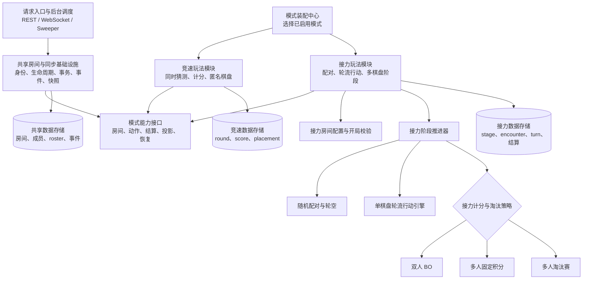
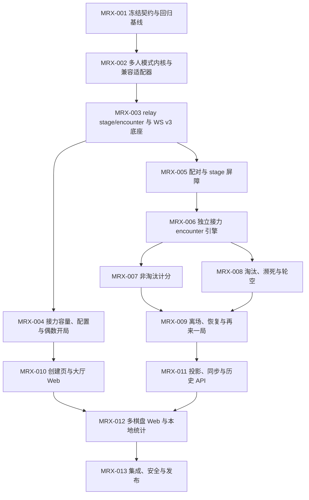

# 多人接力扩展开发计划

本文档组把“接力模式扩展到 2/4/6/8 人”拆成可独立认领、可单独回滚的 Issue。它建立在已经完成的 [多人房间扩展](../multiplayer-expansion/README.md)之上，但允许重构多人房间底层；重构必须先用特征测试冻结现有行为，再通过兼容适配器迁移，不能以新玩法为由改变现有竞速、双人接力、观战、聊天或断线恢复语义。

本计划中的产品语义集中记录在[决策记录](./decisions.md)，底层依赖方向与模块所有权记录在[多人模式模块边界](./architecture.md)。开发开始后如果需要改变规则或跨模块边界，应先修改 MRX-001 所有的对应文档与测试矩阵，再修改实现，不能在某个 Web、handler 或 migration PR 中私自形成另一套口径。

## 当前基线

当前集成基线已经包含多人竞速淘汰开关：race 实际 2 人冻结 `wins`，N>2 且关闭开关冻结 `points`，开启则冻结 `placement`；公开字段为 `raceEliminationEnabled`，本地统计版本为 v5，数据库迁移已经使用 `0013` 和 `0014`。MRX 必须从这份基线继续演进，不能按旧 main 的竞速语义重新设计。

现有多人底座还提供 2..8 个 player seat、冻结 match roster、按 `memberId` 计分、WS v2 连续游戏 sequence、snapshot 补齐、观战与历史入口。这些能力可以直接复用，但接力核心仍是一张双人共享棋盘：

- `relay` 的 `playerLimit` 被固定为 2，room settings 只接受 race 上限；
- `ReadyRoster` 只检查人数区间和全员准备，不表达“接力必须为偶数阵容”的模式策略；
- `multi_round` 自己保存一个 `answer_id`、`turn_slot` 和 `turn_deadline`；
- `multi_turn` 只关联 `round_id`，同一 round 无法容纳多个独立棋盘；
- 接力规则仍依赖 `[2]int`、`OtherSlot`、`winner_slot` 和单一共享 turn 流；
- `RoundView.shared`、`round.shared.guess` 与 `RelayMatchBoard` 都默认当前局只有一张棋盘；
- `round.ended` 会推动整局和整场结算，没有“某张棋盘先结束、全场轮次继续等待”的屏障。

因此，本次扩展不是简单放宽容量，而是引入“全场轮次 + 并行对局”的领域模型。

## 目标与非目标

### 目标

- 接力房间容量上限只能设置为 2、4、6、8，实际以 2/4/6/8 名玩家开局，不要求坐满上限。
- 房主可配置是否启用淘汰；实际冻结 roster 为 2 人时，无论开关为何值都沿用现有双人 BO 接力。
- N>2 时，每轮随机两两配对，每对玩家使用独立答案和独立双人接力棋盘；所有对局结束后才统一结算本轮。
- 淘汰制实现 10 分上限、按轮次递增扣分、濒死、奇数轮空、禁止连续轮空与按存留轮数排名。
- 非淘汰制按胜 2、平 1、负 0 计分，完成 BO 对应的总轮数后按积分排名。
- 所有参与者每页只查看一张棋盘，可查看当前轮其他棋盘和历史棋盘；多人接力不使用竞速匿名矩阵。
- 把房间策略、relay stage/encounter 编排、计分规则、投影与能力判定拆成可组合模块，为后续多人玩法提供窄扩展点。

### 非目标

- 不增加队伍、固定搭档、队内聊天、Elo、账号排行或跨房间赛季。
- 不改变竞速积分淘汰算法、竞速匿名矩阵或聊天 channel 策略。
- 不允许房主自定义初始分、积分上限、胜负分、濒死次数、配对算法或轮空补偿。
- 不保证不同轮次永不重复答案；只保证同一轮正在进行的各棋盘答案互不相同，并优先在整场内不重复。
- 不在首版实现瑞士轮、循环赛、种子排位、固定匹配或人工调整配对。

## 统一术语

| 术语                       | 含义                                           | 与现有名称的关系                                                                |
| -------------------------- | ---------------------------------------------- | ------------------------------------------------------------------------------- |
| match / 场次               | 从开局到最终排名的一整场游戏                   | 继续使用 `multi_match`                                                          |
| stage / 全场轮次           | 当前未淘汰玩家完成一次配对和统一结算的同步边界 | 用户规则中的“第 n 局”；新 match 使用 relay-owned `multi_relay_stage`            |
| encounter / 对局           | 一对玩家在某个 stage 内进行的一局双人接力      | 新增稳定 `encounterId`；一张 encounter 对应一张棋盘                             |
| turn / 手                  | encounter 内的一次猜测、主动空过或超时空过     | 从只关联 round 改为关联 encounter                                               |
| bye / 轮空                 | stage 中未分配 encounter 的一名 active 玩家    | 只读、积分不变，不是 spectator 身份转换                                         |
| rule set / 规则集          | `(mode, ruleSetKey, ruleSetVersion)`           | match 开始时冻结；完整三元组才可选择规则                                        |
| scoring policy / 计分策略  | relay 规则集内部的积分与排名函数               | 不是跨模式枚举，不被 race/relay 共同实现                                        |
| survival rounds / 存留局数 | 某玩家在 stage 结算后仍存留的次数              | 淘汰于第 n 轮者为 `n-1`；离场于第 n 轮者为 `n`；终局后仍存留者为已完成 stage 数 |

## 目标架构

共享核心只拥有跨模式不变量：身份、room lifecycle、房间锁入口、冻结 roster、事务/幂等框架、事件 sequence、replay 和 snapshot 水位。stage 生命周期、随机配对、接力 turn、积分、淘汰、排名和棋盘投影全部属于 relay module；race adapter 继续组合现有 `RaceRules`。详细的依赖规则、配置适配、规则集标识与数据所有权见[模块边界](./architecture.md)。

## Issue 依赖图

MRX-004 与 MRX-005 在 MRX-003 合并后可并行；MRX-007 与 MRX-008 在 MRX-006 合并后可并行；MRX-010 可在后端规则链推进期间独立开发。修改同一契约或生成物时仍应按上述拓扑串行合并。

## Issue 列表

| Issue                                                    | 交付物                                                | 依赖             | 状态   |
| -------------------------------------------------------- | ----------------------------------------------------- | ---------------- | ------ |
| [MRX-001](./MRX-001-contract-and-regression-baseline.md) | 决策冻结、现有功能特征测试、权限/状态/计分矩阵        | 无               | 已完成 |
| [MRX-002](./MRX-002-multiplayer-mode-kernel.md)          | 窄核心、capability registry、race/relay 兼容适配器    | MRX-001          | 已完成 |
| [MRX-003](./MRX-003-stage-encounter-data-and-ws-v3.md)   | relay-owned 数据模型、规则集引用、WS v3 契约骨架      | MRX-002          | 已完成 |
| [MRX-004](./MRX-004-relay-room-policy.md)                | 2/4/6/8 容量、淘汰设置、偶数且全员准备的开局事务      | MRX-003          | 已完成 |
| [MRX-005](./MRX-005-pairing-and-stage-coordinator.md)    | 可测试配对器、轮空约束、stage 完成屏障与推进器        | MRX-003          | 已完成 |
| [MRX-006](./MRX-006-relay-encounter-engine.md)           | 每对独立题目/棋盘/turn/计时、动作路由、双人语义兼容   | MRX-005          | 已完成 |
| [MRX-007](./MRX-007-fixed-round-points.md)               | N>2 非淘汰计分、BO 总轮数、并列排名                   | MRX-006          | 已完成 |
| [MRX-008](./MRX-008-elimination-near-death-and-bye.md)   | N>2 淘汰计分、濒死、轮空、存留排名                    | MRX-006          | 已完成 |
| [MRX-009](./MRX-009-lifecycle-recovery-and-rematch.md)   | 放弃/离场/断线/重启/再来一局的跨棋盘一致性            | MRX-007、MRX-008 | 已完成 |
| [MRX-010](./MRX-010-room-settings-web.md)                | 创建页与大厅滑杆、淘汰开关、偶数开局反馈              | MRX-004          | 已完成 |
| [MRX-011](./MRX-011-projection-sync-and-history.md)      | capability 投影、snapshot/WS 重连、按需历史棋盘 API   | MRX-009          | 已完成 |
| [MRX-012](./MRX-012-multi-board-web-experience.md)       | 单棋盘分页、全员积分、轮空/等待提示、非阻塞结算与统计 | MRX-010、MRX-011 | 已完成 |
| [MRX-013](./MRX-013-integration-security-rollout.md)     | 完整 e2e、并发/安全/性能、迁移与灰度发布              | MRX-012          | 已完成 |

完整覆盖矩阵见[测试矩阵](./test-matrix.md)，上线与回滚的人工检查见[发布闸门](./release-gate.md)。

## 实施顺序与分支纪律

1. MRX-001 先记录当前分支的基线命令与结果；未通过的既有测试必须登记原因，不能被新分支默认为已知失败。
2. MRX-002 只重构边界，不增加 N 人接力行为。它必须复用现有 `RaceRules`，并证明只注册 race 或 fake mode 也能运行；后续所有功能分支从该点开始。
3. MRX-003 从迁移 `0015` 开始；迁移、SQL 源、OpenAPI/WS 源和生成物放在同一 PR，生成目录不得手改。
4. 每个 Issue 一个短期分支和一个可回滚 PR。后续 Issue 从最新集成分支创建，不维护跨多个 Issue 的长期功能分支。
5. 数据库使用 expand-only 迁移：保留旧列供应用回滚读取，新表/新列在发布稳定后另开清理 Issue，首版不做破坏性收缩。
6. WS v3 建立在已包含 race `points/placement` 的当前 v2 上且不长期双写。发布时停止新建 v2 房间、等待短期房间排空或按维护窗口关闭，并让旧页面明确刷新。
7. 新功能置于服务端和 Web 双重灰度 flag 后；flag 关闭时仍能创建和完成现有双人 race/relay。
8. 共享 core、race module、relay module 的依赖方向必须由静态检查或包级测试保护；跨模式 import 视为架构回归。

## 跨 Issue 完成定义

- 规则逻辑优先写成确定性纯函数，随机源和时钟可注入；数据库事务只负责锁定、持久化和事件顺序。
- 权威对象使用 `memberId`、`stageId`、`encounterId` 关联；seat/no 仅用于显示和稳定排序。
- 同一业务事实只在一个模块结算。encounter 只产出胜/负/平，relay scoring policy 才修改接力积分和淘汰状态；race 继续由 `RaceRules` 结算。
- 普通 turn 不持有全场 stage 锁；只有 encounter 终态尝试 stage 屏障，避免不同棋盘无意义串行。
- 每个持久化状态变化与房间事件在同一事务提交；重试不得重复 turn、对局结算、积分或淘汰。
- relay 的所有参与者可查看所有棋盘完整标签，但任何进行中 encounter 的 `answerId` 都不得出现在 REST、WS、日志或前端状态中。
- 两人 race、N 人 race、双人 relay、观战、聊天、断线恢复与本地统计导入必须全部回归。
- kernel 不读取 `scoringMode`、near-death、finish rank 或 encounter 字段来决定玩法；完整 `RuleSetRef` 仅由所属 mode module 解析。
- 新 relay 数据不复用或放宽 race 的 round/score 数据约束；旧双人 relay 由兼容 adapter 读取，新 match 写 relay-owned 表。
- 桌面与移动端均保持单棋盘挂载，无横向页面溢出、无遮挡、无局末模态阻塞浏览。

## 文档更新责任

MRX-013 发布前同步更新稳定文档 [multiplayer.md](../multiplayer.md)、[gameplay.md](../gameplay.md)、[architecture.md](../architecture.md)、OpenAPI/WS 契约说明和用户公告。过程文档保留设计与验收记录，不用最终实现反向覆盖早期基线。
