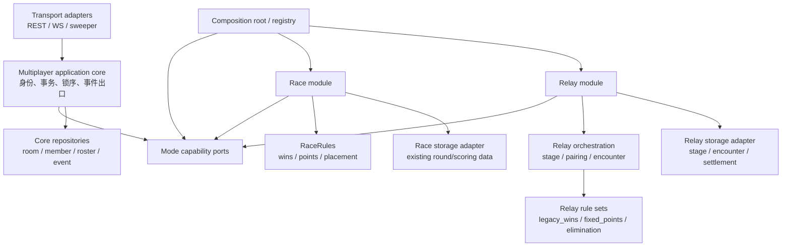

# 多人模式模块边界

本文定义 MRX 实施期间必须保持的依赖方向和扩展方式。目标不是把 race 与 relay 统一成同一种玩法，而是让它们复用可靠的房间基础设施，并能分别演进、测试、灰度和移除。

具体产品规则由[决策记录](./decisions.md)冻结；本文只规定模块所有权和交互契约。接口与包名可以在 MRX-002 中按代码现状调整，但不得削弱这里的隔离要求。

## 设计原则

1. **共享机制，不共享玩法语义**：身份、roster、事务、事件 sequence 和恢复机制可复用；配对、turn、计分、淘汰、排名和棋盘可见性由各模式拥有。
2. **依赖只指向稳定抽象**：共享核心不 import 任何具体模式；race 与 relay 互不 import；组合根负责注册和选择模式模块。
3. **第二个消费者出现后再抽象**：只有 relay 使用的 stage/encounter 先留在 relay；不能为了“以后可能复用”提前建立所有模式都必须理解的通用表或状态机。
4. **兼容只停留在边界**：旧 REST/WS/数据库字段由 transport/storage adapter 翻译，领域规则不能同时维护两套表示。
5. **冻结规则引用，不冻结实现对象**：match 保存可解释的规则集引用和版本；运行时从所属模式解析，不能只凭全局枚举选择算法。
6. **关闭模块不损坏数据**：flag 或注册配置可以阻止新房间使用某能力；已经创建的 match 必须由能解释其规则版本的 binary 完成或明确终止。

## 分层与依赖方向



允许的依赖方向：

```text
transport -> application core -> capability ports
composition root -> application core + registered mode modules
race module -> capability ports + race-owned domain/storage
relay module -> capability ports + relay-owned domain/storage
```

禁止的依赖方向：

```text
application core -X-> race/relay concrete package
race -X-> relay
relay -X-> race
mode domain -X-> generated OpenAPI types / WebSocket hub / HTTP response
shared repository -X-> relay stage/encounter or race finish-rank semantics
```

允许出现 `mode` 分支的位置只包括组合根、transport DTO 归一化和旧数据 storage adapter。handler、共享事务代码和 Web 房间壳不能随玩法增加而持续扩张 `if mode == ...`。

## 窄能力接口

不要建立要求所有模式实现十余个方法的 `ModeDefinition` 大接口。registry 组合按需能力，缺少某能力时返回稳定的 unsupported 错误：

| 能力端口            | 共享输入/输出                                       | 所有者可以决定的内容                          |
| ------------------- | --------------------------------------------------- | --------------------------------------------- |
| `RoomPolicy`        | 房间配置、成员摘要 -> 校验结果/开局资格             | 允许容量、模式配置、ready 阻塞原因            |
| `MatchFactory`      | 冻结 roster、房间配置、题库绑定 -> match 初始化结果 | 规则集、初始玩法状态、首个玩法单元            |
| `CommandHandler`    | 已鉴权 actor、命令、幂等键、时钟 -> 领域变化        | guess/pass/forfeit 等模式动作                 |
| `CompletionDriver`  | timeout/离场/玩法单元终态 -> 后续领域变化           | 结算、推进、终止、排名                        |
| `SnapshotProjector` | 权威数据、viewer capability -> 模式视图             | 匿名矩阵、完整标签、答案揭示和动作 capability |
| `HistoryReader`     | viewer、分页游标 -> 授权后的历史视图                | 历史粒度、终态详情和水合方式                  |
| `RecoveryDriver`    | 持久化活动状态、当前时间 -> 可重试恢复动作          | turn/stage 恢复和无法恢复时的模式终态         |

共享 application core 负责：

- guest token、member 身份、player/spectator 角色和冻结 roster；
- room 生命周期、房间级锁入口、事务提交和幂等执行框架；
- room event sequence、持久化 event append、WS 发布、replay/cursor 和 snapshot 水位；
- 注入时钟、随机源、题库读取端口和可观测性出口；
- 把领域错误映射为稳定 transport 错误，但不自行计算玩法结果。

模式模块负责：

- 模式专属房间配置及开局约束；
- match 内部状态机、动作授权、计分、淘汰、终止和排名；
- 题目如何分配到玩法单元；
- 实时、快照和历史中的玩法 payload 及可见性；
- 模式专属 timeout、离场和恢复语义。

领域变化通过 typed result 返回。共享出口只能识别“要持久化的领域变化、要追加的事件和事务后动作”，不能检查 `nearDeath`、`finishRank` 或 `turnMemberId` 来推断结果。

## 配置模型与兼容边界

`playerLimit`、format、题库范围等确有跨模式语义的字段继续属于 room core。玩法开关使用模式专属配置：

| 模式  | 领域配置                                           | 当前/新增兼容 wire 字段   |
| ----- | -------------------------------------------------- | ------------------------- |
| race  | `RaceRoomConfig{EliminationEnabled}`               | `raceEliminationEnabled`  |
| relay | `RelayRoomConfig{EliminationEnabled, TurnSeconds}` | `relayEliminationEnabled` |

不得引入裸 `eliminationEnabled` 作为跨模式字段。两个开关恰好都是布尔值，不代表淘汰算法、适用人数、计分和终止语义相同。

首版允许 OpenAPI/WS 为兼容保留顶层字段，但 handler 必须立即归一化为按 `mode` 判别的领域配置。新 Web 表单也按模式维护草稿，不能让切换 mode 时沿用另一模式的开关值。若以后引入 `modeSettings` discriminated union，应由独立契约 Issue 迁移，旧字段只在 transport adapter 中兼容。

持久化同样按所有权隔离：现有 `multi_room.race_elimination_enabled` 保持不动；MRX-004 新增 `multi_relay_room_config(room_id, elimination_enabled)`，由 relay storage adapter 独占。共享 room repository 只返回 opaque/typed mode config，不解释开关含义。现有 `turn_seconds` 为兼容保留，不借本次改造搬迁旧字段。

## 规则集标识

当前 race 已使用全局 `scoringMode = wins | points | placement`。MRX 不把 relay 的规则塞入该枚举，也不允许 kernel 只根据 `scoringMode` 调度。

领域层使用三元组：

```text
RuleSetRef {
  mode: race | relay
  key: mode-owned stable key
  version: positive integer
}
```

首版映射：

| mode    | ruleSetKey     | version | 说明                        |
| ------- | -------------- | ------: | --------------------------- |
| `race`  | `wins`         |       1 | 双人 BO                     |
| `race`  | `points`       |       1 | 多人固定轮数、不淘汰        |
| `race`  | `placement`    |       1 | 多人积分淘汰                |
| `relay` | `legacy_wins`  |       1 | 双人传统接力 BO             |
| `relay` | `fixed_points` |       1 | 多人接力固定轮数 2/1/0 积分 |
| `relay` | `elimination`  |       1 | 多人接力 10 分、濒死与淘汰  |

`scoringMode` 继续作为 race v2、旧数据库和 stats v5 的兼容投影；race adapter 可在内部继续调用现有 `RaceRules`。新 match 的权威调度依据必须是完整 `RuleSetRef`，并在开局时连同影响规则的配置快照一起冻结。规则常量发生语义变化时增加 version，不能原地改变历史 match 的解释。

迁移回填必须确定且可验证：race match 按现有 `scoring_mode` 回填 `(race, wins|points|placement, 1)`；MRX 前的 relay match 回填 `(relay, legacy_wins, 1)`。mode 与旧值矛盾、值未知或字段缺失时迁移应失败并报告数据，不得猜测为默认规则。

## 持久化所有权

MRX-003 的第一条新迁移从 `0015` 开始，并遵守 expand-only：

| 所有者       | 数据                                                     |
| ------------ | -------------------------------------------------------- |
| core         | room、member、match identity、冻结 roster、event stream  |
| race adapter | 现有 `multi_round`、finish order、race score/placement   |
| legacy relay | MRX 切换前已有的 `multi_round`/`multi_turn`，只读兼容    |
| relay module | `multi_relay_stage`、encounter、relay turn、结算和生命态 |

不把 `multi_round` 改造成所有模式都必须使用的通用 stage，也不在只有 relay 一个消费者时增加 `multi_stage_unit` 抽象表。新 relay match 使用 relay 专属表；旧双人 relay 数据由 legacy adapter 读取。未来第二个模式确实需要 stage/unit 时，再从两个已验证模型提取公共接口或只读投影，不能让其直接依赖 relay 表。

`multi_match` 可新增 opaque 的 `rule_set_key`、`rule_set_version` 和规则配置快照列，并由 `(mode, key, version)` 共同校验。relay 的负积分与 `near_death` 保存在 relay 专属 player state；不要为了 relay 放宽 race 当前 score 约束或向公共参与状态加入接力生命语义。

公开 schema 也遵守相同边界：现有 race `MemberScoreView.score >= 0` 保持不变；relay mode fragment 使用自己的 `RelayStandingView`，允许被淘汰后的负分并显式携带 life/status。不能为了复用一个 DTO 放宽所有模式的约束。

## 事件、投影与协议

共享的是事件信封和投递保证，不是 payload：

- core 拥有 `eventId/roomId/sequence/occurredAt`、持久化追加、发布、replay 和 cursor；
- mode module 拥有 namespaced event type、payload codec、snapshot fragment 和 viewer projector；
- race 保持匿名矩阵 projector；relay 提供完整标签 projector；二者不能共享“对手棋盘”实现；
- 新 relay 事件使用 `relay.stage.*`、`relay.encounter.*` 等命名空间，避免未来事件名碰撞；
- snapshot 由 core shell 加 mode fragment 组合，未知规则版本必须明确拒绝，不能猜测降级。

WS v3 建立在已经包含 race 淘汰开关与 `points` 的当前 v2 基线上。协议升级不得让 race 被迫改成 encounter，也不得复制 chat cursor 或 sequence 机制。

## Web 与本地统计

Web 可共享房间壳、成员列表、连接状态、聊天、通用 slider/switch primitive 和 event envelope reducer。以下内容必须留在模式目录或模式 selector：

- race 匿名矩阵、finish rank、race points/placement 展示；
- relay stage/encounter、turn、bye、near-death 和完整标签棋盘；
- 各模式的创建设置说明、规则集名称和终局文案。

本地统计 v6 使用按 `multiplayerMode + ruleSetKey + ruleSetVersion` 判别的记录，不扩大全局 `scoringMode` union。race stats v5 读取/导出行为保持兼容；relay stage 明细使用 relay 专属字段。共享统计聚合只读取标准化 outcome/rank/duration，不解析模式内部 stage 或 finish order。

## 可拆卸性验收

MRX-002 和 MRX-013 至少证明：

1. registry 只注册 race 时，race 创建、完成、snapshot、history、stats 和恢复全部可运行，relay 请求得到稳定 unsupported/flag 响应。
2. registry 只注册 relay 测试模块时，不需要构造 `RaceRules`、匿名矩阵或 race repository。
3. 关闭 N 人 relay flag 不改变 race 和双人 relay 已有行为，已开始的多人 relay 仍由相同规则版本完成。
4. 静态依赖检查阻止 core import mode、race import relay、relay import race。
5. 删除 relay Web route/module 后，共享 room shell、race 页面和 stats v1-v5 测试仍可编译运行。
6. 新增 fake mode 只需实现选择的 capability ports 并在组合根注册，不修改现有 race/relay 规则包。

这些验收比“接口看起来通用”更重要；无法独立装配和测试的抽象不视为可复用设计。

这里的“可拆卸”指包依赖、registry 装配、功能入口和测试可以独立关闭，不要求实现 Go 动态插件或在进程运行中热卸载模式。只要数据库仍存在未结束或保留期内的某规则版本，生产 binary 就必须保留对应 reader/recovery adapter；必须先停止新建并排空，才能从后续 binary 真正移除模块。
