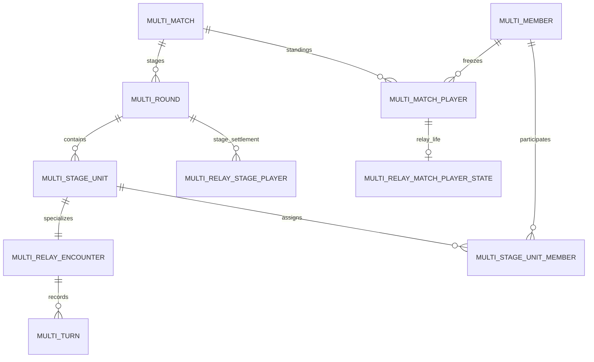

# 多人接力扩展决策记录

本文冻结 MRX-001 至 MRX-013 共用的规则和架构语义。标记为“首版固定”的值不开放房主设置；如需修改，先更新本文件、测试矩阵和拥有该决策的 Issue。

## 1. 兼容优先的底层改造

允许重构多人房间底层，但采用以下顺序：

1. 用特征测试锁定现有 race 2/3/4/8 人、relay 2 人、spectator、chat、WS 重放和本地统计行为。
2. 引入 `ModeDefinition` 注册表与小型策略接口，将现有实现接入兼容适配器；此步骤不改变 wire 或数据库语义。
3. 增加 stage/encounter 能力和 WS v3；新能力由 relay adapter 消费，race adapter 不被迫理解接力配对或濒死。
4. 通过灰度 flag 开放 N 人 relay；双人 relay 与 race 始终保留在回归矩阵中。

共享不等于把所有规则塞入同一状态机。内核拥有生命周期、身份、事务、事件和恢复；模式模块拥有玩法配置、动作、计分和投影。

## 2. 模式内核边界

首版形成以下可组合职责，具体 Go 接口名称可在 MRX-002 调整，但依赖方向不得反转：

| 职责                   | 输入/输出                                                       | 不应负责               |
| ---------------------- | --------------------------------------------------------------- | ---------------------- |
| `RoomPolicy`           | 校验模式配置、容量、开局 roster                                 | 猜测、积分、棋盘投影   |
| `MatchFactory`         | 根据冻结 roster 选择 scoring policy 并创建首个 stage plan       | HTTP、WebSocket 扇出   |
| `StageCoordinator`     | 持久化 stage units、检测完成屏障、调用结算并推进                | 解释胜负分值           |
| `PairingPolicy`        | active roster + 上轮轮空 + 随机源 -> 配对/轮空计划              | 写数据库、加减积分     |
| `RelayEncounterEngine` | guess/pass/timeout/forfeit -> turn 与 encounter outcome         | 修改全场积分或排名     |
| `ScoringPolicy`        | stage outcomes + match player state -> 新比分、状态、终止与排名 | 处理反馈字段或回合权限 |
| `ProjectionPolicy`     | 权威状态 + viewer capability -> REST/WS 视图                    | 决定游戏结果           |

handler 只做鉴权、输入解析、事务编排和错误映射，不按人数复制规则。模式模块不得直接广播；它返回领域结果，由共享事件出口持久化后发布。

## 3. 房间配置与开局

- relay `playerLimit` 首版只允许 `2/4/6/8`，默认 2；slider 使用 `min=2,max=8,step=2`。
- 新增 relay 专属布尔设置 `eliminationEnabled`，默认 `false`。公开契约使用明确字段，不复用 race 的自动 placement 语义。
- 两项设置只能由房主在 lobby 且无人 ready、尚未创建 match 时修改；修改与 join、claim-seat、ready/start 共用 room 行锁。
- 降低上限不能低于当前 player 数；沿用现有 seat 压紧规则，房主保持 seat 1，`memberId` 和 token 不变。
- 达到上限后的加入者仍进入 spectator；提高上限不自动提升 spectator，继续使用显式 claim-seat。
- 实际开局 roster 必须满足：人数属于 `{2,4,6,8}`、不超过上限、包含 seat 1 房主、所有当前 player 均 connected + ready。
- “2/4/6 人准备可开局”解释为当前入座人数可以少于房间上限，但当前入座玩家必须全员准备。4 人房间中 2 人 ready、2 人未 ready 不会只冻结其中 2 人。
- 奇数个当前 player 即使全员 ready 也不开始；ready 请求成功但房间留在 lobby，并向所有人投影 `startBlockedReason=odd_player_count`。

`eliminationEnabled` 是房间偏好；真正的 `scoringMode` 在开局事务中按实际 roster 冻结：

| 实际人数 | eliminationEnabled | scoringMode         |
| -------: | -----------------: | ------------------- |
|        2 |               任意 | `legacy_wins`       |
|    4/6/8 |              false | `relay_points`      |
|    4/6/8 |               true | `relay_elimination` |

因此上限 8 的房间以 2 人开局仍完全沿用当前双人接力，不能因开关状态进入积分赛。

## 4. Stage、encounter 与 turn

- match 是整场；stage 是所有存留玩家完成一次配对并统一结算的同步边界；encounter 是两名玩家的一张接力棋盘；turn 是该棋盘的一手。
- 一个 relay stage 有 1..4 个 encounter，淘汰制人数为奇数时另有一名 bye player。
- 同一 stage 的 encounter 使用相同 `startsAt`；每张棋盘有自己的整局 deadline、当前行动者和 turn deadline。
- encounter 先完成时只结束该棋盘。其他 encounter 继续，已完成玩家可浏览当前轮其他棋盘或历史，输入保持禁用。
- 最后一个 encounter 进入终态后，在 stage 行锁内恰好执行一次统一计分；积分在此之前不做预结算。
- stage 结算完成后才发布下一轮计划。不能让先完成的 encounter 单独触发下一轮。

## 5. 配对与轮空

- 配对只使用本 stage 开始时的 `active` match players；计划一经持久化，刷新、重连或服务重启不得重抽。
- 随机源由服务端注入，生产使用安全随机种子，测试使用固定种子。随机值本身不通过 wire 暴露。
- 偶数人数全部两两配对；奇数人数先从“上轮没有轮空”的候选中随机选择一名 bye，再随机配对其余玩家。
- 同一玩家不能连续两个 stage 轮空。active 人数大于 1 时总能满足此约束；若只剩 1 人，应先结束 match，不创建新 stage。
- 首版不禁止连续遇到同一对手，也不按积分、seat 或历史胜负配对。
- bye player 仍是 player，当前 stage capability 为只读，顶部和棋盘区显示“本轮轮空”；其积分、濒死状态和存留状态不变。

## 6. 题目隔离

- 答案属于 encounter，不属于 stage。每张棋盘独立保存 `answerId`、turn 和 deadline。
- 同一 stage 的 encounter 必须从候选池无放回抽取，保证当前各棋盘答案互不相同。候选答案数少于同时 encounter 数时不创建 stage，并返回稳定的 `QUESTION_POOL_TOO_SMALL_FOR_PAIRINGS`。
- 整场优先不重复已使用答案；若未使用池不足以创建新 stage，可在 stage 边界重置“历史已使用”集合，但本 stage 内仍必须互异。
- 进行中 encounter 的答案不得投影。encounter 结束后可在该棋盘和历史中揭示答案。
- 所有 relay player 和 spectator 均可查看其他 encounter 的完整猜测标签与角色信息；这是有意区别于 race 匿名矩阵的模式策略。

同轮答案互异使已完成棋盘不会直接揭示仍在进行棋盘的答案。观察其他棋盘仍可能提供一般性的排除信息，这是“完整标签可见”需求的自然结果，不通过匿名化消除。

## 7. Encounter 规则

每个 encounter 复用现有双人接力语义：

1. 初始行动方在双方之间按 stage/seat 稳定交替，具体公式由 MRX-006 用特征测试冻结。
2. 只有 `turnMemberId` 可以猜测或主动空过；每次成功动作推进本 encounter，不影响其他棋盘。
3. 正确猜测者立即赢得 encounter；猜错后换手或按现有次数耗尽规则推进。
4. 主动空过和 turn timeout 共享每人每 encounter 2 次额度；额度耗尽后再次空过，该玩家输掉 encounter。
5. 双方用尽轮次或 encounter 整局超时为平局。
6. 当前 encounter 主动放弃判对手胜；放弃仅影响本 stage，下一 stage 仍可配对。

动作端点显式携带 `encounterId`。服务端同时校验 stage、encounter、成员归属、当前 turn 和 match 状态，不能根据客户端正在浏览的棋盘推断动作目标。

## 8. 非淘汰计分

- 仅适用于冻结 roster 为 4/6/8 且 `eliminationEnabled=false` 的 match。
- 每名玩家初始 0 分，无积分上限。
- encounter 胜者 +2、败者 +0；平局双方各 +1；bye 或因奇数存留产生的系统轮空 +0。
- BO 设置表示固定 stage 总数：BO1=1、BO3=3、BO5=5、BO7=7，不使用“先胜”目标。
- 完成计划 stage 数后结束 match；按积分降序生成 `1、1、3` 式共享名次，允许并列第一，不用胜场、对手分或 seat 打破平分。

## 9. 淘汰计分与濒死

- 仅适用于冻结 roster 为 4/6/8 且 `eliminationEnabled=true` 的 match。
- 每名玩家初始 10 分，积分上限 10。stage index `n` 从 1 开始。
- encounter 胜者 `+1`，结算后不超过 10；败者 `-n`；平局双方各 `-floor(n/2)`；bye 为 0。
- 普通 active 玩家计算后若积分恰好为 0，不触发濒死；只有原始结算结果 `< 0` 才首次触发濒死。
- 第一次原始结果 `< 0` 时，将积分钳制为 0，状态改为 `near_death`，本次不淘汰。
- `near_death` 玩家后续正积分不生效，积分保持 0；0 分变更不淘汰；下一次负积分正常应用为负数并淘汰。
- 只有结算前已经是 `near_death` 且本次结算后积分 `< 0` 的玩家淘汰。一次 stage 可淘汰多人，甚至淘汰全部存留玩家。
- stage 结算后 active 数量 `<=1` 时 match 结束；从 2 名存留者开始的 stage 仍使用淘汰计分，不切回双人 BO。
- 淘汰赛不使用 BO 总轮数，也不设置改变结果的任意 `maxStages` 截断；每张 encounter 的 deadline 保证 stage 最终可推进，match 只在结算后存留人数 `<=1` 时正常结束。异常重启/离场使用明确终态。
- 积分与状态在一个 stage 结算事务中批量写入，幂等重试不得重复触发濒死或淘汰。

## 10. 淘汰排名

“存留局数”定义为 stage 结算后仍处于存留状态的次数：

- 在第 n 个 stage 末被淘汰或永久离场，`survivedStages=n-1`；
- match 结束后仍存留的玩家，`survivedStages=completedStages`；
- 排名只按 `survivedStages` 降序，使用共享名次；积分不作为破同分条件；
- 唯一存留者为唯一第一名；若最后一轮所有人同时淘汰，可以出现并列第一且无单一 winner。

持久化保留 `eliminatedStage`，`survivedStages` 由统一函数推导，避免两个字段漂移。

## 11. 离场、断线与异常终态

- turn timer 和 encounter deadline 在短暂断线时继续；宽限期内重连恢复原 encounter 和 capability。
- 主动离开或断线宽限逾期会把 match player 标记为 `left`，当前未结束 encounter 按该玩家负、对手胜结算；已经结束的 encounter 不重写结果。
- `left` 玩家后续不再配对。非淘汰赛若因此出现奇数 active 人数，复用 bye 计划且 bye 不加分；只剩不足 2 名 active 时以 `insufficient_active_players` 提前结束并按当前积分排名。
- 淘汰赛的 `left` 等价于在当前 stage 末退出存留集合，排名使用该 stage 的 `survivedStages`；它不消耗濒死保护。
- 同一 encounter 双方在结算前都永久离场时结果为 draw，不凭数据库遍历顺序制造胜者。
- 服务重启/优雅排空不能重抽已持久化配对或答案。无法安全恢复的活动 encounter 以明确 `server_restart` 终态结束，不能停留为永久 playing。

上述是异常路径，不改变正常 stage 的计分常量。

## 12. 再来一局

- finished 后仍要求原冻结 roster 全员 connected 并确认；任何 `left` 成员都会使 rematch 不可用，沿用当前房间语义。
- 淘汰玩家仍是原 roster player，可以确认再来一局。
- 新 match 继承 room 的 `playerLimit`、`eliminationEnabled`、format、turnSeconds 和题库设置，重新冻结 scoring mode、积分、濒死状态、配对和答案。
- 历史 match 保持只读；新 match 的事件和统计使用新的 match index。

## 13. 持久化模型

MRX-003 采用 expand-only 方案，目标关系如下：



- `multi_round` 继续作为跨模式 stage 容器，保留 race 和旧数据所需字段。
- `multi_stage_unit` 只保存 stage 内可独立完成的工作单元、顺序和终态；`kind` 是受约束枚举，不保存任意规则 JSON。
- `multi_relay_encounter` 保存 relay 专属答案、turn、winner、deadline；未来其他玩法使用自己的扩展表，不向此表塞字段。
- `multi_stage_unit_member` 以 `memberId` 关联 unit，保存 side/seat snapshot；seat 不是鉴权键。
- bye 记录在 stage participant 结算数据中，不创建伪 encounter 或虚拟玩家。
- `multi_turn` 增加 `encounter_id`；唯一猜测约束改为 encounter 范围，允许不同棋盘猜同一角色。
- `multi_relay_stage_player` 保存本轮 paired/bye、outcome、score before/delta/after 和生命转换；不扩张 race 专用的 `multi_round_player.status`。
- `multi_relay_match_player_state` 保存 `healthy/near_death` 生命维度；公共 `multi_match_player.status` 仍只表达 `active/eliminated/left`，near-death 玩家仍为 active。
- `multi_match_player.score` 允许 relay 淘汰后为负；race 仍由自身规则保证非负。
- `multi_round.answer_id` 对 stage 容器改为可空，但 race/旧单棋盘 adapter 在领域层继续要求非空；N 人 relay 的答案只存在 encounter。
- 旧 `answer_id`、`turn_slot`、`winner_slot` 等列在首版保留供回滚读取，不在同一发布删除。

## 14. 事务与锁序

建议锁序固定为：

```text
relay action: encounter -> stage (仅尝试完成时) -> match -> room/event sequence
lobby command: room -> members
sweeper: encounter -> stage -> match -> room/event sequence
```

普通 guess/pass 只锁自己的 encounter，避免 4 张棋盘互相阻塞；写 room event sequence 时只短暂串行。完成 encounter 的事务在 stage 锁下查询其他 unit 的已提交状态：若仍有 active unit 就提交 encounter 结果；最后一个完成者负责一次性 stage settlement。不得为了聚合而反向锁住其他 encounter 行，否则并发完成会形成死锁。

所有动作有 encounter 范围幂等键；stage 结算有唯一 completion marker；事件与状态同事务写入。

## 15. 契约与 WS v3

并行 encounter 无法由 v2 的单一 `RoundView.shared` 安全表达，因此 MRX-003 升级子协议为 `touhouflandre-multi.v3`。不长期维护 v2/v3 双协议：房间短期保留，发布按排空策略切换。

v3 的权威结构使用带 ID 的数组并稳定排序，不使用动态 JSON key：

- match 投影包含冻结的 `scoringMode`、`rosterSize`、`plannedStages`/终止策略和 standings；
- current stage 包含 participant states 与 `encounters[]` 摘要；
- encounter 详情包含参与者、状态、turn、deadline 和可见 rows；
- `encounter.*` 事件只推进一张棋盘；`stage.ended` 承载原子积分变更、淘汰/濒死/轮空与下一阶段信息；
- action API 显式使用 `stageIndex + encounterId`，并返回稳定错误 `ENCOUNTER_NOT_FOUND`、`NOT_ENCOUNTER_PLAYER`、`NOT_YOUR_TURN`、`ENCOUNTER_ENDED`；
- game sequence、cursor frame、`sync.complete` 和 snapshot 缺口修复沿用 v2 已验证语义。

## 16. 投影、能力与页面状态

权限由服务端 capability 推导，不能只依赖 `role`：

| 查看者状态                 | 查看当前所有棋盘 |                                 在自己的 encounter 作答 | 浏览历史 |                     聊天 |
| -------------------------- | ---------------: | ------------------------------------------------------: | -------: | -----------------------: |
| paired + encounter playing |             完整 | 仅轮到本人且正在查看自己的棋盘时启用 UI；服务端始终校验 |       是 |           player channel |
| own encounter ended        |             完整 |                                                      否 |       是 |           player channel |
| bye                        |             完整 |                                                      否 |       是 |           player channel |
| near_death + paired        |             完整 |                                      与普通 paired 相同 |       是 |           player channel |
| eliminated                 |             完整 |                                                      否 |       是 | player channel，游戏只读 |
| spectator                  |             完整 |                                                      否 |       是 |        spectator channel |

Web 始终每页挂载一张棋盘。棋盘左上角固定显示 `{displayName}({seat}) vs {displayName}({seat})`。顶部实时展示全员积分和状态；长昵称截断但可访问完整名称。

玩家自己的 encounter 结束后不出现阻塞模态，只显示 `你已猜中本局`、`对手已猜中本局`、`本局平局` 或对应放弃/超时状态，并禁用输入。浏览他人棋盘时输入也禁用，避免动作目标与所见棋盘不一致。

## 17. 历史与负载边界

- snapshot 只包含当前 stage、比分、紧凑 stage summaries 和恢复所需水位，不无界嵌入所有历史 turn。
- 新增按 match/stage 查询的分页历史 API；stage detail 返回该轮 encounter 列表，encounter detail/同一响应返回完整终态棋盘。
- Web 按需加载历史并以 `matchId + stageIndex + encounterId` 缓存；切页卸载旧棋盘 DOM。
- 进行中 encounter 的 answer 永不出现在历史接口；只有 terminal encounter 可返回答案。
- room event 仍按房间 sequence 串行，但投影器按 encounter 增量更新，避免每一手广播整个 stage 的所有棋盘。

## 18. 灰度与可观测性

建议新增：

- `MULTI_N_PLAYER_RELAY_ENABLED`：服务端是否接受 relay 上限大于 2；
- `NEXT_PUBLIC_MULTI_N_PLAYER_RELAY_ENABLED`：Web 是否显示 relay 上限与多人状态；
- `MULTI_RELAY_ELIMINATION_ENABLED`：独立关闭新淘汰赛创建，不影响多人非淘汰或既有两人房间；
- `NEXT_PUBLIC_MULTI_RELAY_ELIMINATION_ENABLED`：Web 是否允许打开淘汰开关。

指标至少区分 mode/scoring mode，记录 active encounters、stage duration、encounter duration、stage barrier wait、turn timeout、pairing failure、pool-too-small、settlement retry、WS payload size 和 history latency。日志允许记录 room/match/stage/encounter 的内部 ID，但不得记录 guest token、未揭示 answer 或聊天正文。
