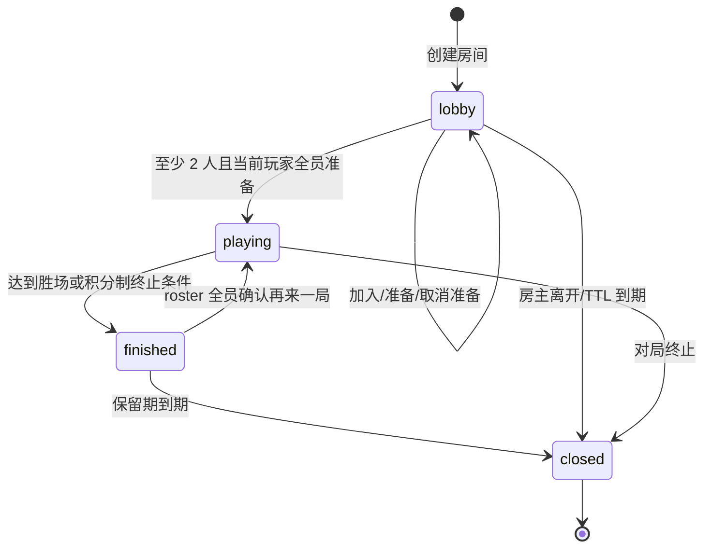
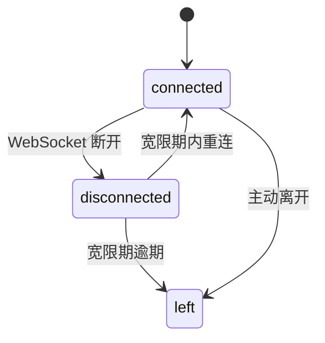

# 多人房间开发文档

本文说明 TouhouFlandre 多人房间的稳定规则、状态机、传输协议和维护约束。

多人房间扩展的设计、任务边界和验收记录维护在[多人房间扩展开发计划](./multiplayer-expansion/README.md)和[多人接力扩展开发计划](./multiplayer-relay-expansion/README.md)中。本文只描述已经实现的稳定规则。N 人竞速、N 人接力（固定积分和淘汰赛）以及房间聊天默认开启，发布与回滚按 [MRX-013 发布闸门](./multiplayer-relay-expansion/release-gate.md)执行。

## 模式范围

房主创建房间时选择 `race` 或 `relay`。race 房间允许 2..8 个玩家席位；relay 上限只允许 2/4/6/8，且实际开局人数必须为偶数。两种模式各有独立淘汰设置，开局时按实际 roster 冻结完整 `RuleSetRef`。开局后新加入者始终是观战者，淘汰或离场产生的空缺不会重新开放。原 roster 完整、在线且全员确认后可再来一局。

| 玩法         | 冻结模式               | 规则                                                                                                 |
| ------------ | ---------------------- | ---------------------------------------------------------------------------------------------------- |
| 双人竞速     | `race` / `wins`        | 两名玩家同时竞猜；按 BO1/3/5/7 总局数先到目标胜场者赢得整场。                                        |
| 多人积分赛   | `race` / `points`      | 三至八名玩家同时竞猜；按完成顺序计分，不淘汰，打满所选总局数结束，或只剩一名 active 玩家时提前结束。 |
| 多人积分淘汰 | `race` / `placement`   | 三至八名玩家同时竞猜；按完成顺序计分并按累计积分淘汰，沿用 3N 安全上限。                             |
| 双人接力     | `relay/legacy_wins@1`  | 双方共用一张棋盘并轮流行动，按 BO1/3/5/7 胜场制结算。                                                |
| 多人接力积分 | `relay/fixed_points@1` | 4/6/8 人每个 stage 随机配对；胜 +2、平各 +1、负 +0，完成 BO 对应的固定 stage 数后按积分排名。        |
| 多人接力淘汰 | `relay/elimination@1`  | 4/6/8 人从 10 分开始，按 stage 递增扣分，包含濒死、淘汰和奇数存留者轮空，直到存留人数不超过一人。    |

游客身份只在房间范围内有效。多人模式不提供账号级排行、云存档或跨设备身份合并。

## 业务不变量

- Postgres 是房间、成员、场次、回合、猜测、接力轮次和事件的权威来源。
- Go 内存只保存活动 WebSocket 连接与热点投影。
- 多人场次绑定创建时的题库版本，题库更新不影响已开始对局。
- 每局每名玩家的猜测或接力轮次上限来自房主创建房间时冻结的题库设置；缺失旧配置回退为 8 次，关闭次数限制时使用 999 表示无次数限制。
- WebSocket 事件先入库后广播。
- 客户端按 sequence 去重、排序，发现缺口时拉取 snapshot 补齐。
- match 只按冻结的 `(mode, ruleSetKey, ruleSetVersion)` 选择模式实现；未知或缺失规则集会明确失败，不回退到默认玩法。
- 多人竞速的并发正确猜测由 round 行锁串行化，每名猜中者只获得一个唯一 `finishRank`，幂等重试不会重复计分。
- 竞速模式中，对手棋盘只展示匿名矩阵，不暴露猜测角色名称和标签值。
- 多人接力中，一个 stage 包含 1..4 个独立 encounter；普通动作只锁目标 encounter，最后一个终态 encounter 才在 stage 屏障内统一且幂等地结算。
- 接力模式中，只有目标 encounter 的 `turnMemberId` 可以行动；主动空过和超时空过共享每人每 encounter 2 次空过额度。
- 进行中的 encounter 不投影答案。relay 的完整猜测标签对房间内所有参与者可见，但 terminal answer 只在对应 encounter 结束后揭示。
- 观战者只读：可获取 snapshot/WS 并主动离开，不能准备、猜测、放弃、空过、再来一局或关闭房间。

## 房间流程



## 成员状态



大厅中的加入者离开会释放座位；对局中的离开会保留成员行用于结算和终态恢复。
`points` 场只累计积分，不产生 `eliminated` 态；`placement` 场的 match player 另有 `active`、`eliminated`、`left` 状态，淘汰者仍保留 player 身份和聊天权限，但游戏操作与棋盘投影切换为只读观战模式。

## 单局判定

双人竞速仍按 BO 胜场制判定：某成员猜中后本局立即结束；主动放弃、双方次数耗尽、超时、离场和断线沿用既有两人终态规则。

主动放弃只影响当前小局；下一局是否继续参与取决于是否被 `placement` 规则淘汰。离场或断线宽限逾期会永久标记 `left` 且本局得 0 分。

三人及以上竞速按冻结的 `scoringMode` 判定：

1. `points`：每局按完成顺序计分，不淘汰；整场在打满所选总局数或只剩一名 active 玩家时结束。
2. `placement`：每局按完成顺序计分。从第 `floor(N/2)` 局结算后开始淘汰：先取累计积分最低者，再取其中历史最高单局积分最低者；仍并列则同时淘汰。若候选包含全部 active 玩家，本局不淘汰。剩余不超过一人、剩余两人且积分差大于 1，或达到 `3N` 局安全上限时结束整场。完整排行榜按总积分降序并使用 `1、1、3` 式共享名次。唯一第一名是冠军；并列第一时所有第一名为 draw，其余为 loss，不设置单一 `winnerMemberId`。

服务重启或优雅排空会明确结束当前局和整场；积分型 race 场仍发布当前参与状态、0 分记录和完整排行榜。

接力模式判定：

1. 每个 encounter 独立保存答案、棋盘、当前行动者和 deadline；同 stage 的答案互不相同。
2. 当前玩家提交正确角色，该玩家赢得 encounter；猜错、主动空过或超时空过只推进该棋盘。
3. 主动空过和超时空过共享每人每 encounter 2 次额度；额度耗尽后再次空过，该玩家输掉 encounter。
4. 双方用尽轮次或 encounter 整局超时为平局；主动放弃只判当前 encounter 的对手胜。
5. 一张棋盘先结束时其他棋盘继续。最后一张结束后才原子结算 stage，并按冻结规则创建下一 stage 或结束 match。
6. fixed-points 只按 BO 对应的固定 stage 数结束；elimination 的濒死玩家下一次受到负分时才淘汰，奇数 active roster 每轮恰有一人轮空且不会连续轮空。

双人接力继续使用同一套 encounter 语义和原有 BO 胜场结果。对局中永久离场会结束所属 encounter；多人场其他棋盘继续，双人场则按原语义结束整场。

## 可见性

| 模式 | 进行中可见内容                                                                                            | 局末可见内容                                                                         |
| ---- | --------------------------------------------------------------------------------------------------------- | ------------------------------------------------------------------------------------ |
| 竞速 | active 玩家看到自己的完整猜测；其他玩家只显示匿名矩阵。placement 模式下淘汰者改为只读完整棋盘。           | 揭示答案、全员比分、每局积分，以及积分累计/淘汰状态、所有完整棋盘和结算结果。        |
| 接力 | 所有 player 可分页查看当前 stage 的完整 encounter 棋盘；只有自己正在进行的 encounter 且轮到本人时可操作。 | 仅对应 terminal encounter 揭示答案；stage 结算后原子更新积分、濒死、淘汰和轮空状态。 |
| 观战 | 竞速模式可分页查看所有玩家完整棋盘；接力模式每页查看一张完整 encounter 棋盘。                             | 页面内标注结果，并可分页按需读取本房间保留期内的已结束 stage。                       |

竞速模式的匿名矩阵字段列顺序按观察者稳定置换，防止通过列位置推断对手字段值。`points` 模式只显示积分累计，不会出现淘汰态；`placement` 模式才会把被淘汰者切换为只读完整棋盘。

## 房间聊天

聊天使用独立于游戏事件的消息流，不占用 `room_event.sequence`。客户端重连时分别提交 `lastGameSequence` 和 `lastChatCursor`；只有收到 `sync.complete` 后才持久化完成水位。

| 发送者    | 服务端 channel | 可见范围            |
| --------- | -------------- | ------------------- |
| player    | `room`         | player 与 spectator |
| spectator | `spectator`    | spectator           |
| system    | `room`         | player 与 spectator |

客户端不能提交 sender、role、seat 或 channel；这些字段由服务端根据成员令牌和当前角色派生并保存快照。聊天内容只支持 `text` 和白名单 Unicode `emoji`，按纯文本渲染，不解析 HTML。spectator claim-seat 成为 player 后，旧连接会失效；重连后的 player 不再接收 spectator channel。

对局实际冻结阵容不少于 2 人时，服务端可以 `system` 身份写入完成状态播报。竞速在玩家猜中、猜测次数耗尽、主动放弃当局或断线宽限届满时播报；接力在每个 encounter 产生胜者或平局时播报。系统消息不占用玩家聊天限流，不能由客户端伪造。

闭麦是浏览器本地 `receiveChat` 偏好，只影响当前客户端是否显示他人消息和是否允许自己发送；它不改变服务端授权、历史扫描、chat cursor 或其他查看者的显示。关闭聊天发送的灰度 flag 时，新发送返回 `CHAT_SEND_FORBIDDEN`，历史读取仍按授权可用。

## REST API

| 方法     | 路径                                                                       | 用途                                                                                          |
| -------- | -------------------------------------------------------------------------- | --------------------------------------------------------------------------------------------- |
| `POST`   | `/api/rooms`                                                               | 创建房间；race 上限为 2..8，relay 上限为 2/4/6/8；两种模式使用各自的淘汰设置。                |
| `GET`    | `/api/rooms/{roomCode}`                                                    | 加入前公开预检。                                                                              |
| `POST`   | `/api/rooms/{roomCode}/join`                                               | 加入房间。                                                                                    |
| `POST`   | `/api/rooms/{roomId}/ready`                                                | 幂等设置准备状态。                                                                            |
| `PATCH`  | `/api/rooms/{roomId}/settings`                                             | 房主在无人 ready 的 lobby 修改当前模式的玩家上限或淘汰开关。                                  |
| `POST`   | `/api/rooms/{roomId}/claim-seat`                                           | lobby 观战者在有空席时沿用原成员身份认领玩家席位。                                            |
| `POST`   | `/api/rooms/{roomId}/leave`                                                | 离开房间。                                                                                    |
| `DELETE` | `/api/rooms/{roomId}`                                                      | 房主关闭房间。                                                                                |
| `GET`    | `/api/rooms/{roomId}/snapshot`                                             | 获取房间快照和事件补齐。                                                                      |
| `POST`   | `/api/rooms/{roomId}/rounds/{roundIndex}/guess`                            | 提交当前小局猜测；接力模式仅当前轮到的玩家可用。                                              |
| `POST`   | `/api/rooms/{roomId}/rounds/{roundIndex}/forfeit`                          | 放弃当前小局。                                                                                |
| `POST`   | `/api/rooms/{roomId}/rounds/{roundIndex}/pass`                             | 接力模式主动空过当前轮次。                                                                    |
| `POST`   | `/api/rooms/{roomId}/stages/{stageIndex}/encounters/{encounterId}/actions` | relay v3 的 guess/pass/forfeit 动作；服务端校验 room、stage、encounter、成员、turn 和幂等键。 |
| `GET`    | `/api/rooms/{roomId}/matches/{matchIndex}/stages`                          | 按 cursor 分页读取已结束 relay stage 历史，最多 20 条。                                       |
| `POST`   | `/api/rooms/{roomId}/rematch`                                              | 请求再来一局。                                                                                |
| `GET`    | `/api/rooms/{roomId}/messages`                                             | 查询授权可见的房间聊天历史，使用独立 chat cursor。                                            |
| `POST`   | `/api/rooms/{roomId}/messages`                                             | 发送房间聊天；灰度关闭时返回 `CHAT_SEND_FORBIDDEN`。                                          |
| `GET`    | `/api/rooms/{roomId}/ws`                                                   | WebSocket 事件通道。                                                                          |

REST 写命令使用成员令牌鉴权。WS 鉴权在首帧 `hello` 中携带令牌，不放入 URL。
`playerLimit` 是容量上限而非开局目标；`minPlayers` 固定为 2，当前 2..`playerLimit`
名玩家全部 connected + ready 后即按当时阵容开局。`room.info`、`room.updated` 与 snapshot
统一返回 `playerCount`、`playerLimit`、两种模式的淘汰设置、`startBlockedReason`、`minPlayers`、`availableSeats` 和 `spectatorCount`。

`match.started` 中冻结 `ruleSetRef`。race 继续投影兼容字段 `scoringMode`；relay 以 `legacy_wins | fixed_points | elimination` 及版本号选择权威规则。

## WebSocket 协议

升级要求：

- Origin 必须匹配 `WEB_ORIGINS`。
- 子协议为 `touhouflandre-multi.v3`；v2 页面会收到刷新要求，不能静默按 v3 连接。
- 首帧必须是 `hello`，包含成员令牌和上一次完整确认的 `lastGameSequence`。

事件信封包含：

```json
{
  "type": "room.updated",
  "eventId": "...",
  "roomId": "...",
  "sequence": 42,
  "occurredAt": "2026-08-08T12:00:00Z",
  "payload": {}
}
```

主要事件类型：

| 事件                        | 用途                                                                                                                 |
| --------------------------- | -------------------------------------------------------------------------------------------------------------------- |
| `room.updated`              | 房间成员、准备状态、容量计数、赛制、模式或积分赛淘汰开关变化。                                                       |
| `match.started`             | 新对局开始，携带赛制、模式、`scoringMode`（`wins` / `points` / `placement`）、`rosterSize`、`maxRounds` 和题库版本。 |
| `match.rematch`             | 成员确认再来一局。                                                                                                   |
| `round.started`             | 小局创建并携带冻结的 `activePlayerCount`；接力模式另含行动成员、行动截止时间和轮次/空过上限。                        |
| `round.playing`             | 倒计时结束，可以开始行动。                                                                                           |
| `round.opponent.guess`      | 竞速模式的对手匿名猜测行。                                                                                           |
| `round.shared.guess`        | 接力模式的共享猜测行。                                                                                               |
| `round.turn.timeout`        | 接力模式的超时空过行。                                                                                               |
| `round.turn.pass`           | 接力模式的主动空过行。                                                                                               |
| `round.ended`               | 小局结束，揭示答案、比分、棋盘；积分型 race 场另含每人状态、名次、得分，placement 场还带本局淘汰集合。               |
| `match.ended`               | 整场对局结束；积分型 race 场另含完整共享名次排行榜。                                                                 |
| `room.closed`               | 房间进入关闭终态。                                                                                                   |
| `relay.stage.started`       | relay stage 计划、参与者、配对与轮空已冻结。                                                                         |
| `relay.encounter.*`         | 单个 encounter 的开始、guess/pass/timeout、turn 推进和终态增量。                                                     |
| `relay.stage.ended`         | stage 屏障完成后的原子计分、生命状态、淘汰、排名和下一阶段信息。                                                     |
| `protocol.refresh_required` | 旧协议页面必须刷新后使用 v3。                                                                                        |

每个持久化游戏 sequence 对任一观察者都必须有一帧：有权消费时发送上述业务事件，
无权或无需消费时发送不含 `payload` 的 `room.cursor`。`hello-ok` 只声明同步目标水位，
只有 FIFO 队尾的 `sync.complete` 才表示此前重放/缓冲帧已交付。

事件类型和 payload 以 `contracts/ws/protocol.yaml` 为准。

## 重连与补齐

客户端断线后指数退避重连，并携带上一次完成同步的 `lastGameSequence`。业务事件与
`room.cursor` 共同推进当前连接的 applied game sequence；只有大于期望值的 sequence 才是真缺口。
同一缺口只发起一个 `GET /api/rooms/{roomId}/snapshot?after=<seq>`，并以响应中的
`gameSequence` 对齐权威水位后按序排空缓冲帧。

## 配置项

| 变量                                          | 默认语义                                                                                |
| --------------------------------------------- | --------------------------------------------------------------------------------------- |
| `MULTI_LOBBY_TTL`                             | 大厅未开局保留时长。                                                                    |
| `MULTI_EVENT_RETENTION`                       | closed 后事件和房间树保留时长。                                                         |
| `MULTI_JOIN_RATE_LIMIT`                       | 加入/预检限流。                                                                         |
| `MULTI_ROUND_COUNTDOWN`                       | 首局开始前倒计时。                                                                      |
| `MULTI_INTERMISSION`                          | 局间间歇。                                                                              |
| `MULTI_ROUND_SECONDS`                         | 接力模式单局最长时间，默认 900 秒。                                                     |
| `MULTI_RACE_ROUND_SECONDS`                    | 竞速模式单局最长时间，默认 300 秒。                                                     |
| `MULTI_TURN_SECONDS`                          | 接力模式默认单次行动时限。                                                              |
| `MULTI_DISCONNECT_GRACE`                      | 断线宽限期。                                                                            |
| `MULTI_MAX_ROUNDS_FACTOR`                     | 最大局数保护因子。                                                                      |
| `MULTI_FINISHED_RETENTION`                    | 结束态保留时长，默认 10 分钟。                                                          |
| `MULTI_WS_READ_LIMIT`                         | 客户端 WS 消息读限。                                                                    |
| `MULTI_WS_SEND_QUEUE`                         | 单连接发送队列长度。                                                                    |
| `MULTI_PROJECTION_SECRET`                     | 对手匿名棋盘列置换的 HMAC 密钥；生产环境必填，未配置时生成进程级随机值。                |
| `MULTI_MODE_REGISTRY`                         | 模式装配 profile：`full`（默认）、`race-only` 或 `relay-only`；未知值启动失败。         |
| `MULTI_N_PLAYER_RACE_ENABLED`                 | 是否允许新建/调高 2 人以上竞速房间，默认开启，可关闭。                                  |
| `NEXT_PUBLIC_MULTI_N_PLAYER_RACE_ENABLED`     | Web 创建页是否显示 2..8 人 race 上限控件，默认开启，可关闭。                            |
| `MULTI_CHAT_SEND_ENABLED`                     | 是否允许写入新的房间聊天消息，默认开启，可关闭。                                        |
| `MULTI_SYSTEM_ANNOUNCEMENTS_ENABLED`          | 是否生成新的对局系统播报，默认开启；关闭不影响已保存历史。                              |
| `NEXT_PUBLIC_MULTI_CHAT_UI_ENABLED`           | Web 房间页是否挂载聊天入口，默认开启，可关闭。                                          |
| `NEXT_PUBLIC_MULTI_CHAT_SEND_ENABLED`         | Web 聊天输入和表情发送控件是否启用，默认开启，可关闭。                                  |
| `MULTI_N_PLAYER_RELAY_ENABLED`                | 是否允许新建或调高为多人 relay，默认开启；设为 false 可关闭新入口，不影响已冻结 match。 |
| `NEXT_PUBLIC_MULTI_N_PLAYER_RELAY_ENABLED`    | Web 是否显示多人 relay 上限和对应状态，构建期默认开启；设为 false 可隐藏入口。          |
| `MULTI_RELAY_ELIMINATION_ENABLED`             | 是否允许新建/修改多人 relay 淘汰设置，默认开启；设为 false 可关闭新入口。               |
| `NEXT_PUBLIC_MULTI_RELAY_ELIMINATION_ENABLED` | Web 是否显示多人 relay 淘汰开关，构建期默认开启；设为 false 可隐藏入口。                |
| `MULTI_RELAY_HISTORY_RATE_LIMIT`              | 每名已鉴权成员每分钟 relay 历史请求上限，默认 60。                                      |
| `MULTI_CHAT_RETENTION`                        | 聊天消息逻辑/物理保留时长，默认 24 小时。                                               |
| `MULTI_CHAT_CURSOR_SECRET`                    | 聊天 cursor HMAC 密钥；未配置时从 `MULTI_PROJECTION_SECRET` 域隔离派生。                |

## 测试重点

- 创建、加入、准备、对局、结算和再来一局全流程。
- 2/3/4/8 人竞速大厅、容量调整、`raceEliminationEnabled` 切换、取消准备、认领席位和 seat 压紧。
- 双人 `wins` 的并发正确猜测恰有一个局胜者；3+ 人 `points` / `placement` 并发正确猜测获得唯一完成名次且只计分一次。
- 3+ 人 `points` 不产生淘汰态；`placement` 的排名积分、成组淘汰、全员同分不淘汰、离场、两人差距终止、`3N` 上限和共享冠军。
- 竞速模式重复猜测、猜测上限、局末后提交和超时。
- 双人接力兼容语义，以及 4/6/8 人 stage 配对、独立棋盘、屏障、fixed-points、elimination、濒死和轮空。
- 当前小局主动放弃、断线宽限、重连、事件重放和 snapshot 补齐。
- 竞速匿名矩阵不泄露角色名或标签值。
- N 人棋盘分页只挂载当前页；进行中的 active 玩家始终只挂载一张对手棋盘，局末/历史回放每页一张，实时观战桌面每页两张、移动端每页一张。
- 本地统计 v1-v6 导入和匿名导出；v6 以 mode + RuleSetRef 区分 race/relay，落盘和导出不包含成员、房间或令牌身份字段。
- 玩家/spectator 聊天可见性、纯文本/XSS、chat cursor 补齐、闭麦不接收且不开启后回放提示。
- 服务重启或优雅排空后返回明确终态。
- WebSocket Origin、子协议、hello 鉴权和慢消费者处理。
