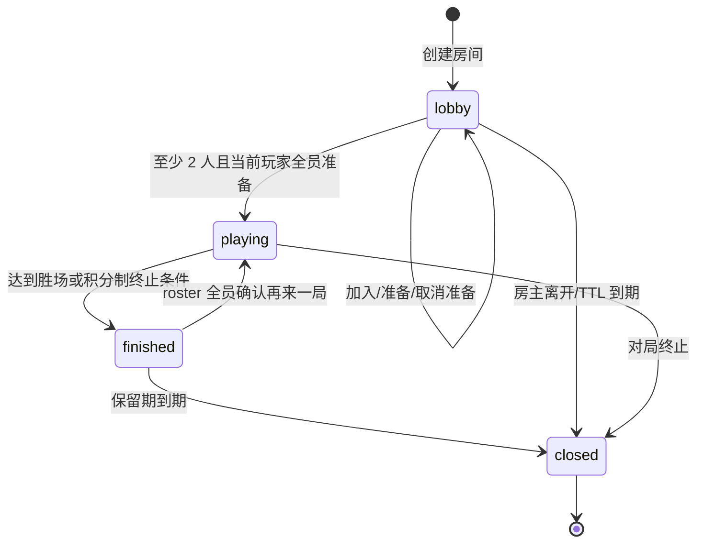
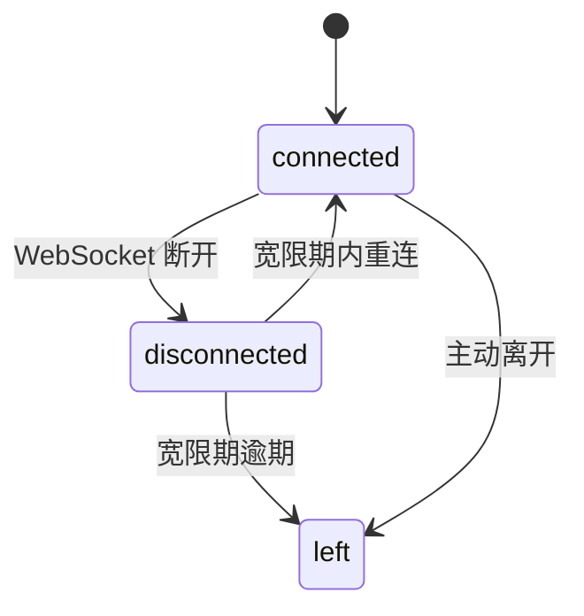

# 多人房间开发文档

本文说明 TouhouFlandre 多人房间的稳定规则、状态机、传输协议和维护约束。

多人房间扩展的设计、任务边界和验收记录维护在[多人房间扩展开发计划](./multiplayer-expansion/README.md)及其 Issue 文档中；本文只描述当前实现的稳定规则。N 人竞速和房间聊天的默认暴露由 [MPX-010 发布闸门](./multiplayer-expansion/release-gate.md)控制：默认开启，回滚或灰度暂停时可通过环境变量分别关闭。

## 模式范围

房主创建房间时选择 `race` 或 `relay`；`race` 房间允许 2..8 个玩家席位，接力房间固定两人。房主创建 race 房间时可设置竞速人数上限和 `raceEliminationEnabled`；实际开局人数冻结本场竞速规则：2 人时固定为 `wins`，3 人及以上时开关关闭为 `points`、开启为 `placement`。开局后新加入者始终是观战者，淘汰或离场产生的空缺不会重新开放。原 roster 完整、在线且全员确认后可再来一局。

| 玩法         | 冻结模式             | 规则                                                                                                 |
| ------------ | -------------------- | ---------------------------------------------------------------------------------------------------- |
| 双人竞速     | `race` / `wins`      | 两名玩家同时竞猜；按 BO1/3/5/7 总局数先到目标胜场者赢得整场。                                       |
| 多人积分赛   | `race` / `points`    | 三至八名玩家同时竞猜；按完成顺序计分，不淘汰，打满所选总局数结束，或只剩一名 active 玩家时提前结束。 |
| 多人积分淘汰 | `race` / `placement` | 三至八名玩家同时竞猜；按完成顺序计分并按累计积分淘汰，沿用 3N 安全上限。                             |
| 双人接力     | `relay`              | 双方共用一张棋盘并轮流行动，当前轮到的玩家可以猜测或主动空过，猜中者赢得本局。                       |

游客身份只在房间范围内有效。多人模式不提供账号级排行、云存档或跨设备身份合并。

## 业务不变量

- Postgres 是房间、成员、场次、回合、猜测、接力轮次和事件的权威来源。
- Go 内存只保存活动 WebSocket 连接与热点投影。
- 多人场次绑定创建时的题库版本，题库更新不影响已开始对局。
- 每局每名玩家的猜测或接力轮次上限来自房主创建房间时冻结的题库设置；缺失旧配置回退为 8 次，关闭次数限制时使用 999 表示无次数限制。
- WebSocket 事件先入库后广播。
- 客户端按 sequence 去重、排序，发现缺口时拉取 snapshot 补齐。
- 多人竞速的并发正确猜测由 round 行锁串行化，每名猜中者只获得一个唯一 `finishRank`，幂等重试不会重复计分。
- 竞速模式中，对手棋盘只展示匿名矩阵，不暴露猜测角色名称和标签值。
- 接力模式中，只有当前 `turnMemberId` 对应成员可以行动；主动空过和超时空过共享每人每局 2 次空过额度。
- 观战者只读：可获取 snapshot/WS 并主动离开，不能准备、猜测、放弃、空过、再来一局或关闭房间。

## 房间流程



## 成员状态



大厅中的加入者离开会释放座位；对局中的离开会保留成员行用于结算和终态恢复。
`points` 场只累计积分，不产生 `eliminated` 态；`placement` 场的 match player 另有 `active`、`eliminated`、`left` 状态，淘汰者仍保留 player 身份和聊天权限，但游戏操作与棋盘投影切换为只读观战模式。

## 单局判定

双人竞速仍按 BO 胜场制判定：某成员猜中后本局立即结束；主动放弃、双方次数耗尽、超时、离场和断线沿用既有两人终态规则。

主动放弃只影响当前小局；下一局是否继续参与取决于是否被 `placement` 规则淘汰。离场或断线宽限逾期会永久标记 `left` 且本局得 0 分。

三人及以上竞速按冻结的 `scoringMode` 判定：

1. `points`：每局按完成顺序计分，不淘汰；整场在打满所选总局数或只剩一名 active 玩家时结束。
2. `placement`：每局按完成顺序计分。从第 `floor(N/2)` 局结算后开始淘汰：先取累计积分最低者，再取其中历史最高单局积分最低者；仍并列则同时淘汰。若候选包含全部 active 玩家，本局不淘汰。剩余不超过一人、剩余两人且积分差大于 1，或达到 `3N` 局安全上限时结束整场。完整排行榜按总积分降序并使用 `1、1、3` 式共享名次。唯一第一名是冠军；并列第一时所有第一名为 draw，其余为 loss，不设置单一 `winnerMemberId`。

服务重启或优雅排空会明确结束当前局和整场；积分型 race 场仍发布当前参与状态、0 分记录和完整排行榜。

接力模式仍固定两人：小局放弃判对方胜；对局中离开或断线宽限逾期判对方整场胜。

接力模式判定：

1. 当前玩家提交正确角色，该玩家胜，本局立即结束。
2. 当前玩家主动空过或超时空过，会写入共享棋盘并推进到下一手。
3. 主动空过和超时空过共享每人每局 2 次空过额度；额度耗尽后再次空过，该玩家本局判负。
4. 双方都用尽接力轮次且无人猜中，平局。
5. 整局时间耗尽，平局。

局结束后发布 `round.ended`；若满足当前 scoring mode 的终止条件，随后发布 `match.ended`。

## 可见性

| 模式 | 进行中可见内容                                                                  | 局末可见内容                                                     |
| ---- | ------------------------------------------------------------------------------- | ---------------------------------------------------------------- |
| 竞速 | active 玩家看到自己的完整猜测；其他玩家只显示匿名矩阵。placement 模式下淘汰者改为只读完整棋盘。 | 揭示答案、全员比分、每局积分，以及积分累计/淘汰状态、所有完整棋盘和结算结果。 |
| 接力 | 双方看到同一张共享棋盘，包含已接受的猜测、主动空过和超时空过。                  | 揭示答案、比分、共享棋盘和结算结果。                             |
| 观战 | 竞速模式可分页查看所有玩家完整棋盘；接力模式可看到完整共享棋盘。                | 页面内标注胜者/平局，可查看本房间保留期内的已结束小局记录。      |

竞速模式的匿名矩阵字段列顺序按观察者稳定置换，防止通过列位置推断对手字段值。`points` 模式只显示积分累计，不会出现淘汰态；`placement` 模式才会把被淘汰者切换为只读完整棋盘。

## 房间聊天

聊天使用独立于游戏事件的消息流，不占用 `room_event.sequence`。客户端重连时分别提交 `lastGameSequence` 和 `lastChatCursor`；只有收到 `sync.complete` 后才持久化完成水位。

| 发送者    | 服务端 channel | 可见范围            |
| --------- | -------------- | ------------------- |
| player    | `room`         | player 与 spectator |
| spectator | `spectator`    | spectator           |

客户端不能提交 sender、role、seat 或 channel；这些字段由服务端根据成员令牌和当前角色派生并保存快照。聊天内容只支持 `text` 和白名单 Unicode `emoji`，按纯文本渲染，不解析 HTML。spectator claim-seat 成为 player 后，旧连接会失效；重连后的 player 不再接收 spectator channel。

闭麦是浏览器本地 `receiveChat` 偏好，只影响当前客户端是否显示他人消息和是否允许自己发送；它不改变服务端授权、历史扫描、chat cursor 或其他查看者的显示。关闭聊天发送的灰度 flag 时，新发送返回 `CHAT_SEND_FORBIDDEN`，历史读取仍按授权可用。

## REST API

| 方法     | 路径                                              | 用途                                                                  |
| -------- | ------------------------------------------------- | --------------------------------------------------------------------- |
| `POST`   | `/api/rooms`                                      | 创建房间；race 可设置 `playerLimit=2..8`（默认 2）与 `raceEliminationEnabled`，relay 固定 2 人。 |
| `GET`    | `/api/rooms/{roomCode}`                           | 加入前公开预检。                                                      |
| `POST`   | `/api/rooms/{roomCode}/join`                      | 加入房间。                                                            |
| `POST`   | `/api/rooms/{roomId}/ready`                       | 幂等设置准备状态。                                                    |
| `PATCH`  | `/api/rooms/{roomId}/settings`                    | 房主在无人 ready 的 lobby 修改 race 玩家上限或积分赛淘汰开关。        |
| `POST`   | `/api/rooms/{roomId}/claim-seat`                  | lobby 观战者在有空席时沿用原成员身份认领玩家席位。                    |
| `POST`   | `/api/rooms/{roomId}/leave`                       | 离开房间。                                                            |
| `DELETE` | `/api/rooms/{roomId}`                             | 房主关闭房间。                                                        |
| `GET`    | `/api/rooms/{roomId}/snapshot`                    | 获取房间快照和事件补齐。                                              |
| `POST`   | `/api/rooms/{roomId}/rounds/{roundIndex}/guess`   | 提交当前小局猜测；接力模式仅当前轮到的玩家可用。                      |
| `POST`   | `/api/rooms/{roomId}/rounds/{roundIndex}/forfeit` | 放弃当前小局。                                                        |
| `POST`   | `/api/rooms/{roomId}/rounds/{roundIndex}/pass`    | 接力模式主动空过当前轮次。                                            |
| `POST`   | `/api/rooms/{roomId}/rematch`                     | 请求再来一局。                                                        |
| `GET`    | `/api/rooms/{roomId}/messages`                    | 查询授权可见的房间聊天历史，使用独立 chat cursor。                    |
| `POST`   | `/api/rooms/{roomId}/messages`                    | 发送房间聊天；灰度关闭时返回 `CHAT_SEND_FORBIDDEN`。                  |
| `GET`    | `/api/rooms/{roomId}/ws`                          | WebSocket 事件通道。                                                  |

REST 写命令使用成员令牌鉴权。WS 鉴权在首帧 `hello` 中携带令牌，不放入 URL。
`playerLimit` 是容量上限而非开局目标；`minPlayers` 固定为 2，当前 2..`playerLimit`
名玩家全部 connected + ready 后即按当时阵容开局。`room.info`、`room.updated` 与 snapshot
统一返回 `playerCount`、`playerLimit`、`raceEliminationEnabled`、`minPlayers`、`availableSeats` 和 `spectatorCount`。

`match.started` 中的 `scoringMode` 在开局时冻结为 `wins | points | placement`：2 人必为 `wins`；3 人及以上在 `raceEliminationEnabled` 关闭时为 `points`，开启时为 `placement`。

## WebSocket 协议

升级要求：

- Origin 必须匹配 `WEB_ORIGINS`。
- 子协议为 `touhouflandre-multi.v2`；v1 页面必须刷新后重新连接。
- 首帧必须是 `hello`，包含成员令牌和上一次完整确认的 `lastGameSequence`。

事件信封包含：

```json
{
  "type": "room.updated",
  "eventId": "...",
  "roomId": "...",
  "sequence": 42,
  "occurredAt": "2026-08-08T12:00:00Z",
  "payload": {}
}
```

主要事件类型：

| 事件                   | 用途                                                                                          |
| ---------------------- | --------------------------------------------------------------------------------------------- |
| `room.updated`         | 房间成员、准备状态、容量计数、赛制、模式或积分赛淘汰开关变化。                                  |
| `match.started`        | 新对局开始，携带赛制、模式、`scoringMode`（`wins` / `points` / `placement`）、`rosterSize`、`maxRounds` 和题库版本。 |
| `match.rematch`        | 成员确认再来一局。                                                                            |
| `round.started`        | 小局创建并携带冻结的 `activePlayerCount`；接力模式另含行动成员、行动截止时间和轮次/空过上限。 |
| `round.playing`        | 倒计时结束，可以开始行动。                                                                    |
| `round.opponent.guess` | 竞速模式的对手匿名猜测行。                                                                    |
| `round.shared.guess`   | 接力模式的共享猜测行。                                                                        |
| `round.turn.timeout`   | 接力模式的超时空过行。                                                                        |
| `round.turn.pass`      | 接力模式的主动空过行。                                                                        |
| `round.ended`          | 小局结束，揭示答案、比分、棋盘；积分型 race 场另含每人状态、名次、得分，placement 场还带本局淘汰集合。 |
| `match.ended`          | 整场对局结束；积分型 race 场另含完整共享名次排行榜。                                          |
| `room.closed`          | 房间进入关闭终态。                                                                            |

每个持久化游戏 sequence 对任一观察者都必须有一帧：有权消费时发送上述业务事件，
无权或无需消费时发送不含 `payload` 的 `room.cursor`。`hello-ok` 只声明同步目标水位，
只有 FIFO 队尾的 `sync.complete` 才表示此前重放/缓冲帧已交付。

事件类型和 payload 以 `contracts/ws/protocol.yaml` 为准。

## 重连与补齐

客户端断线后指数退避重连，并携带上一次完成同步的 `lastGameSequence`。业务事件与
`room.cursor` 共同推进当前连接的 applied game sequence；只有大于期望值的 sequence 才是真缺口。
同一缺口只发起一个 `GET /api/rooms/{roomId}/snapshot?after=<seq>`，并以响应中的
`gameSequence` 对齐权威水位后按序排空缓冲帧。

## 配置项

| 变量                                      | 默认语义                                                                 |
| ----------------------------------------- | ------------------------------------------------------------------------ |
| `MULTI_LOBBY_TTL`                         | 大厅未开局保留时长。                                                     |
| `MULTI_EVENT_RETENTION`                   | closed 后事件和房间树保留时长。                                          |
| `MULTI_JOIN_RATE_LIMIT`                   | 加入/预检限流。                                                          |
| `MULTI_ROUND_COUNTDOWN`                   | 首局开始前倒计时。                                                       |
| `MULTI_INTERMISSION`                      | 局间间歇。                                                               |
| `MULTI_ROUND_SECONDS`                     | 接力模式单局最长时间，默认 900 秒。                                      |
| `MULTI_RACE_ROUND_SECONDS`                | 竞速模式单局最长时间，默认 300 秒。                                      |
| `MULTI_TURN_SECONDS`                      | 接力模式默认单次行动时限。                                               |
| `MULTI_DISCONNECT_GRACE`                  | 断线宽限期。                                                             |
| `MULTI_MAX_ROUNDS_FACTOR`                 | 最大局数保护因子。                                                       |
| `MULTI_FINISHED_RETENTION`                | 结束态保留时长，默认 10 分钟。                                           |
| `MULTI_WS_READ_LIMIT`                     | 客户端 WS 消息读限。                                                     |
| `MULTI_WS_SEND_QUEUE`                     | 单连接发送队列长度。                                                     |
| `MULTI_PROJECTION_SECRET`                 | 对手匿名棋盘列置换的 HMAC 密钥；生产环境必填，未配置时生成进程级随机值。 |
| `MULTI_N_PLAYER_RACE_ENABLED`             | 是否允许新建/调高 2 人以上竞速房间，默认开启，可关闭。                   |
| `NEXT_PUBLIC_MULTI_N_PLAYER_RACE_ENABLED` | Web 创建页是否显示 2..8 人 race 上限控件，默认开启，可关闭。             |
| `MULTI_CHAT_SEND_ENABLED`                 | 是否允许写入新的房间聊天消息，默认开启，可关闭。                         |
| `NEXT_PUBLIC_MULTI_CHAT_UI_ENABLED`       | Web 房间页是否挂载聊天入口，默认开启，可关闭。                           |
| `NEXT_PUBLIC_MULTI_CHAT_SEND_ENABLED`     | Web 聊天输入和表情发送控件是否启用，默认开启，可关闭。                   |
| `MULTI_CHAT_RETENTION`                    | 聊天消息逻辑/物理保留时长，默认 24 小时。                                |
| `MULTI_CHAT_CURSOR_SECRET`                | 聊天 cursor HMAC 密钥；未配置时从 `MULTI_PROJECTION_SECRET` 域隔离派生。 |

## 测试重点

- 创建、加入、准备、对局、结算和再来一局全流程。
- 2/3/4/8 人竞速大厅、容量调整、`raceEliminationEnabled` 切换、取消准备、认领席位和 seat 压紧。
- 双人 `wins` 的并发正确猜测恰有一个局胜者；3+ 人 `points` / `placement` 并发正确猜测获得唯一完成名次且只计分一次。
- 3+ 人 `points` 不产生淘汰态；`placement` 的排名积分、成组淘汰、全员同分不淘汰、离场、两人差距终止、`3N` 上限和共享冠军。
- 竞速模式重复猜测、猜测上限、局末后提交和超时。
- 接力模式共享棋盘、轮到玩家校验、猜测推进、主动空过、超时空过和空过额度。
- 当前小局主动放弃、断线宽限、重连、事件重放和 snapshot 补齐。
- 竞速匿名矩阵不泄露角色名或标签值。
- N 人棋盘分页只挂载当前页；进行中的 active 玩家始终只挂载一张对手棋盘，局末/历史回放每页一张，实时观战桌面每页两张、移动端每页一张。
- 本地统计 v1-v5 导入后统一为 v5，记录积分制名次、淘汰局与每局得分；落盘和导出不包含成员、房间或令牌身份字段。
- 玩家/spectator 聊天可见性、纯文本/XSS、chat cursor 补齐、闭麦不接收且不开启后回放提示。
- 服务重启或优雅排空后返回明确终态。
- WebSocket Origin、子协议、hello 鉴权和慢消费者处理。
