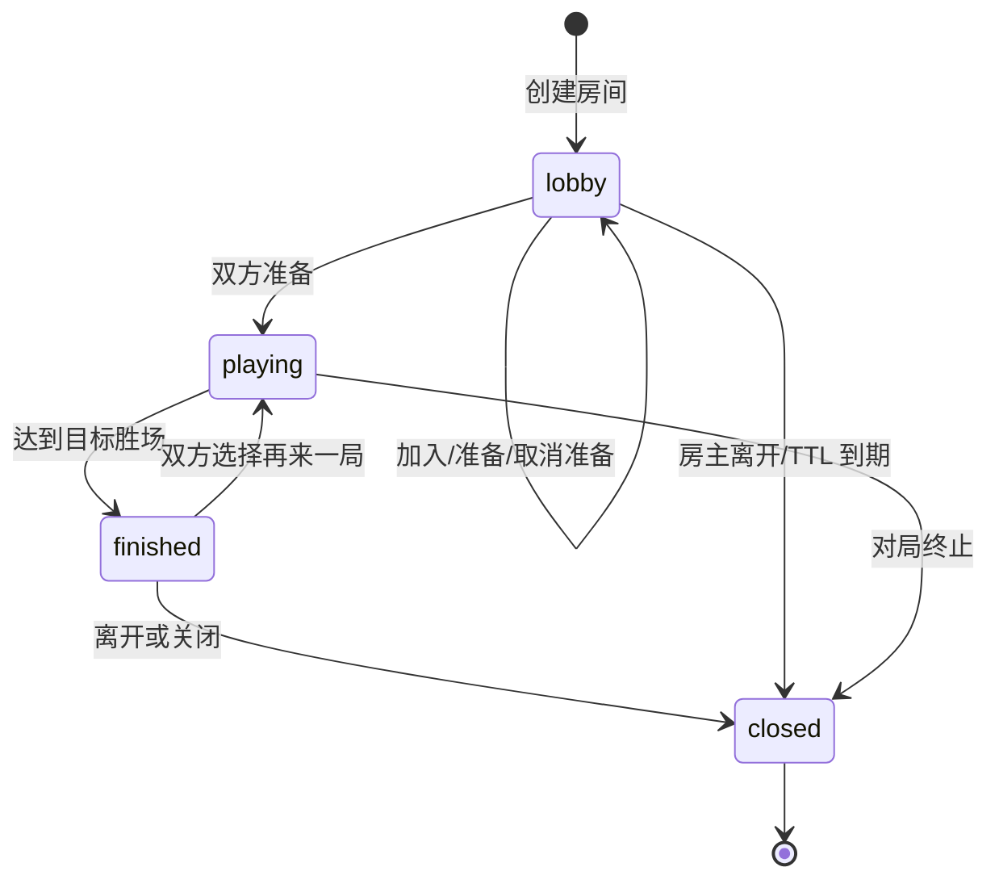
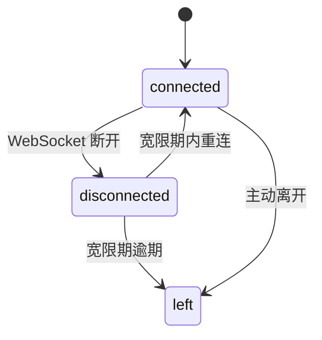

# 多人房间开发文档

本文说明 TouhouFlandre 多人房间的稳定规则、状态机、传输协议和维护约束。

## 模式范围

多人房间面向两名游客，支持 BO1、BO3、BO5 和 BO7 赛制。房主创建房间并选择玩法模式，加入者通过 6 位房间号进入；双方准备后进入倒计时并开始首局。达到目标胜场后对局结束，双方可选择再来一局。

| 模式 | 标识 | 单局规则 |
|---|---|---|
| 竞速 | `race` | 双方同时竞猜同一个隐藏角色，先提交正确答案者赢得本局。 |
| 接力 | `relay` | 双方共用一张棋盘并轮流行动，当前轮到的玩家可以猜测或主动空过，猜中者赢得本局。 |

游客身份只在房间范围内有效。多人模式不提供账号级排行、云存档或跨设备身份合并。

## 业务不变量

- Postgres 是房间、成员、场次、回合、猜测、接力轮次和事件的权威来源。
- Go 内存只保存活动 WebSocket 连接与热点投影。
- 多人场次绑定创建时的题库版本，题库更新不影响已开始对局。
- 每局每名玩家的猜测或接力轮次上限来自房主创建房间时冻结的题库设置；缺失旧配置回退为 8 次，关闭次数限制时使用 999 表示无次数限制。
- WebSocket 事件先入库后广播。
- 客户端按 sequence 去重、排序，发现缺口时拉取 snapshot 补齐。
- 竞速模式的并发正确猜测由数据库事务串行化，恰有一个胜者。
- 竞速模式中，对手棋盘只展示匿名矩阵，不暴露猜测角色名称和标签值。
- 接力模式中，只有当前 `turnSlot` 对应成员可以行动；主动空过和超时空过共享每人每局 2 次空过额度。

## 房间流程



## 成员状态



大厅中的加入者离开会释放座位；对局中的离开会保留成员行用于结算和终态恢复。

## 单局判定

通用判定：

1. 某成员主动放弃当前小局，对手胜。
2. 某成员断线或离开并超过宽限期，对手胜。
3. 服务重启或优雅排空触发明确终止，按服务端终态返回结果。

竞速模式判定：

1. 某成员提交正确角色，该成员胜，本局立即结束。
2. 双方用尽猜测次数且无人猜中，平局。
3. 整局时间耗尽，平局。

接力模式判定：

1. 当前玩家提交正确角色，该玩家胜，本局立即结束。
2. 当前玩家主动空过或超时空过，会写入共享棋盘并推进到下一手。
3. 主动空过和超时空过共享每人每局 2 次空过额度；额度耗尽后再次空过，该玩家本局判负。
4. 双方都用尽接力轮次且无人猜中，平局。
5. 整局时间耗尽，平局。

局结束后发布 `round.ended`；若比分达到目标胜场，随后发布 `match.ended`。

## 可见性

| 模式 | 进行中可见内容 | 局末可见内容 |
|---|---|---|
| 竞速 | 自己看到完整猜测、头像、字段值和反馈；对手只显示匿名矩阵。 | 揭示答案、比分、双方完整棋盘和结算结果。 |
| 接力 | 双方看到同一张共享棋盘，包含已接受的猜测、主动空过和超时空过。 | 揭示答案、比分、共享棋盘和结算结果。 |

竞速模式的匿名矩阵字段列顺序按观察者稳定置换，防止通过列位置推断对手字段值。

## REST API

| 方法 | 路径 | 用途 |
|---|---|---|
| `POST` | `/api/rooms` | 创建房间；请求体包含赛制、玩法模式、接力回合秒数和显示名。 |
| `GET` | `/api/rooms/{roomCode}` | 加入前公开预检。 |
| `POST` | `/api/rooms/{roomCode}/join` | 加入房间。 |
| `POST` | `/api/rooms/{roomId}/ready` | 幂等设置准备状态。 |
| `POST` | `/api/rooms/{roomId}/leave` | 离开房间。 |
| `DELETE` | `/api/rooms/{roomId}` | 房主关闭房间。 |
| `GET` | `/api/rooms/{roomId}/snapshot` | 获取房间快照和事件补齐。 |
| `POST` | `/api/rooms/{roomId}/rounds/{roundIndex}/guess` | 提交当前小局猜测；接力模式仅当前轮到的玩家可用。 |
| `POST` | `/api/rooms/{roomId}/rounds/{roundIndex}/forfeit` | 放弃当前小局。 |
| `POST` | `/api/rooms/{roomId}/rounds/{roundIndex}/pass` | 接力模式主动空过当前轮次。 |
| `POST` | `/api/rooms/{roomId}/rematch` | 请求再来一局。 |
| `GET` | `/api/rooms/{roomId}/ws` | WebSocket 事件通道。 |

REST 写命令使用成员令牌鉴权。WS 鉴权在首帧 `hello` 中携带令牌，不放入 URL。

## WebSocket 协议

升级要求：

- Origin 必须匹配 `WEB_ORIGINS`。
- 子协议为 `touhouflandre-multi.v1`。
- 首帧必须是 `hello`，包含成员令牌和客户端已应用的最后 sequence。

事件信封包含：

```json
{
  "type": "room.updated",
  "eventId": "...",
  "roomId": "...",
  "sequence": 42,
  "occurredAt": "2026-08-08T12:00:00Z",
  "payload": {}
}
```

主要事件类型：

| 事件 | 用途 |
|---|---|
| `room.updated` | 房间成员、准备状态、赛制或模式投影变化。 |
| `match.started` | 新对局开始，携带赛制、模式、目标胜场和题库版本。 |
| `match.rematch` | 成员确认再来一局。 |
| `round.started` | 小局创建；接力模式额外携带 `turnSlot`、`turnDeadline`、`maxTurnsPerPlayer`、`maxSkipsPerPlayer`。 |
| `round.playing` | 倒计时结束，可以开始行动。 |
| `round.opponent.guess` | 竞速模式的对手匿名猜测行。 |
| `round.shared.guess` | 接力模式的共享猜测行。 |
| `round.turn.timeout` | 接力模式的超时空过行。 |
| `round.turn.pass` | 接力模式的主动空过行。 |
| `round.ended` | 小局结束，揭示答案、比分和棋盘。 |
| `match.ended` | 整场对局结束。 |
| `room.closed` | 房间进入关闭终态。 |

事件类型和 payload 以 `contracts/ws/protocol.yaml` 为准。

## 重连与补齐

客户端断线后指数退避重连，并携带本地 `lastAppliedSeq`。服务端从事件表重放后续事件；如客户端发现 sequence 缺口，应通过 `GET /api/rooms/{roomId}/snapshot?after=<seq>` 获取权威快照和事件补齐。

## 配置项

| 变量 | 默认语义 |
|---|---|
| `MULTI_LOBBY_TTL` | 大厅未开局保留时长。 |
| `MULTI_EVENT_RETENTION` | closed 后事件和房间树保留时长。 |
| `MULTI_JOIN_RATE_LIMIT` | 加入/预检限流。 |
| `MULTI_ROUND_COUNTDOWN` | 首局开始前倒计时。 |
| `MULTI_INTERMISSION` | 局间间歇。 |
| `MULTI_ROUND_SECONDS` | 单局最长时间。 |
| `MULTI_TURN_SECONDS` | 接力模式默认单次行动时限。 |
| `MULTI_DISCONNECT_GRACE` | 断线宽限期。 |
| `MULTI_MAX_ROUNDS_FACTOR` | 最大局数保护因子。 |
| `MULTI_FINISHED_RETENTION` | 结束态保留时长。 |
| `MULTI_WS_READ_LIMIT` | 客户端 WS 消息读限。 |
| `MULTI_WS_SEND_QUEUE` | 单连接发送队列长度。 |

## 测试重点

- 创建、加入、准备、对局、结算和再来一局全流程。
- 竞速模式并发正确猜测恰有一个胜者。
- 竞速模式重复猜测、猜测上限、局末后提交和超时。
- 接力模式共享棋盘、轮到玩家校验、猜测推进、主动空过、超时空过和空过额度。
- 当前小局主动放弃、断线宽限、重连、事件重放和 snapshot 补齐。
- 竞速匿名矩阵不泄露角色名或标签值。
- 服务重启或优雅排空后返回明确终态。
- WebSocket Origin、子协议、hello 鉴权和慢消费者处理。
