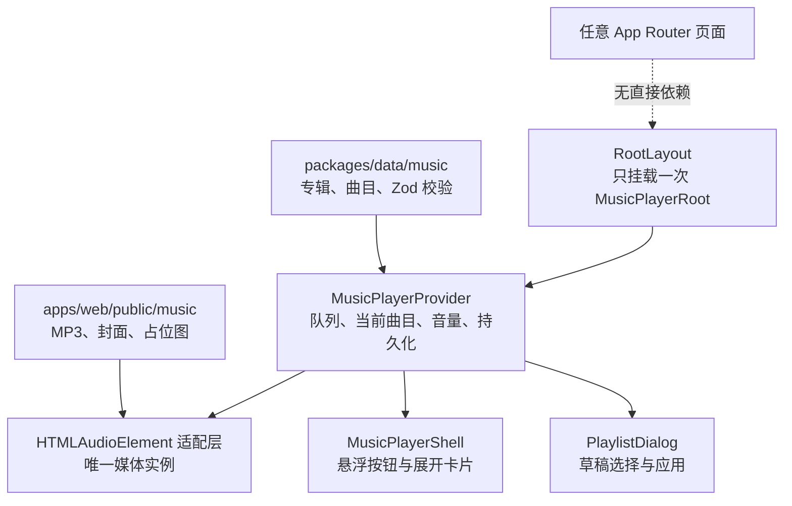
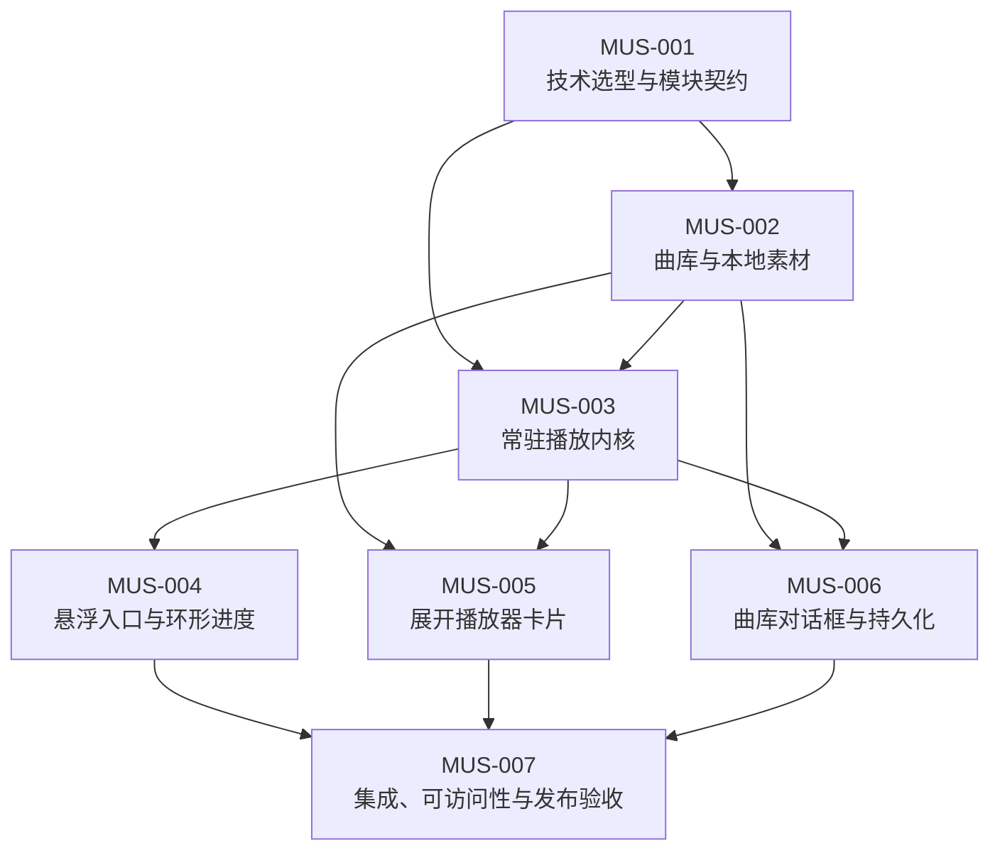

# 全站音乐播放器开发计划

本文档组是全站音乐播放器的实施工作台。它把曲库、播放内核、悬浮入口、展开卡片、曲库设置和质量验收拆成可以独立认领、独立回滚的 Issue；每个 Issue 都说明目标、范围、代码落点、依赖和验收标准。

本计划只描述实现过程，不包含播放器代码、音乐文件或封面素材。附件示意图只用于确认信息层级，不作为固定尺寸稿。

## 需求目标

- 页面右上角提供圆形悬浮入口；按钮底色跟随深/浅色模式，内圈从 12 点方向显示当前曲目进度，进度色跟随当前主题色。
- 展开卡片提供封面、标题、元信息、播放进度、上一首、播放/暂停、下一首、曲库设置、音量和静音控制。
- 曲库由仓库内结构化数据维护，MP3 和封面作为 Git 版本化资产发布；封面加载失败时显示本地占位图。
- 曲库设置支持按专辑和按曲目筛选，设置在下次打开网站时仍然有效。
- Next.js 客户端路由切换不销毁音频实例；整页刷新、关闭页面或用户主动操作可以中断播放。
- 播放器是独立功能模块。页面只负责在根布局挂载一次，不读取或修改播放器内部状态。

## 当前项目基线

| 现有能力                  | 代码位置                                                                     | 对播放器的约束                                                                                       |
| ------------------------- | ---------------------------------------------------------------------------- | ---------------------------------------------------------------------------------------------------- |
| Next.js App Router 根布局 | `apps/web/src/app/layout.tsx`                                                | 播放器根组件必须挂在 `RootLayout`，不能挂在具体页面；软导航时才会保持音频实例。                      |
| 深浅色与六种主题色        | `apps/web/src/lib/appearance.ts`、`apps/web/src/app/globals.css`             | 组件直接消费 `--accent`、`--surface`、`--ink`、`--line` 等变量；不复制主题枚举或维护第二套主题状态。 |
| 现有浮动控件              | `apps/web/src/components/AppearanceSwitcher.tsx`、`ChatDock.tsx`、移动端导航 | 需要定义播放器的固定定位、移动端安全区和层级，避免与导航、聊天、结果弹层重叠。                       |
| 题库设置对话框            | `apps/web/src/components/QuestionScopeDialog.tsx`                            | 曲库对话框沿用其信息密度、复选卡片、Ant Design 主题桥接和响应式方向，但不复用题库领域状态。          |
| 角色/作品数据维护         | `packages/data/src`、`docs/data-guidelines.md`                               | 音乐目录采用 JSON + Zod + 跨记录/资产校验；不为纯静态曲库新增 Postgres 表或 API。                    |
| 静态素材与授权清单        | `apps/web/public`、`THIRD_PARTY_ASSETS.md`                                   | 音频、封面和占位图都使用本地 URL；禁止热链，逐项来源链接维护在音乐 JSON，目录 README 只说明用途。       |
| 前端测试                  | `apps/web/src/**/*.test.ts(x)`、`apps/web/e2e`                               | 状态机用 Vitest 验证，路由连续播放、主题、响应式和真实媒体行为用 Playwright 验证。                   |

## 目标架构



建议的模块边界如下；最终文件名可以在 MUS-001 中小幅调整，但所有权不能重新散回页面组件：

```text
packages/data/src/music/
  albums.demo.json
  tracks.demo.json
  schema.ts
  index.ts

apps/web/public/music/
  covers/
  tracks/
  placeholder-cover.png
  README.md

apps/web/src/features/music-player/
  MusicPlayerRoot.tsx
  MusicPlayerProvider.tsx
  playerReducer.ts
  audioAdapter.ts
  storage.ts
  catalog.ts
  FloatingPlayerButton.tsx
  components/
    PlayerCard.tsx
    PlaylistDialog.tsx
    TrackCover.tsx
```

`apps/web/src/app/layout.tsx` 只新增一次 `<MusicPlayerRoot />`。具体页面、游戏会话、多人 WebSocket、题库和统计模块不得成为播放器依赖。

## 跨 Issue 不变量

1. **单一音频实例**：展开/收起卡片、打开/关闭曲库对话框和客户端路由切换都不能重新创建或替换 `<audio>`；只有切换曲目时才修改 `src`。
2. **用户手势启动**：首次进入网站保持暂停，不尝试绕过浏览器自动播放策略；`play()` 被拒绝时回到暂停态并给出可理解状态。
3. **曲库顺序唯一**：播放列表始终按曲库定义的专辑顺序和 `trackNumber` 排序；首版只筛选，不支持拖拽重排。
4. **列表循环**：上一首、下一首和自然播放结束都在已启用曲目中循环；空列表不得进入可播放状态。
5. **主题单一来源**：按钮、卡片、进度条和音量条只使用站点 CSS 变量；主题切换不触发播放器状态迁移。
6. **持久化有版本**：只保存曲目筛选、当前曲目、音量和静音偏好；不保存“正在播放”或播放秒数，不在重新打开页面时自动播放。
7. **资产本地化**：运行时不请求第三方音频或封面地址。数据中的公开 URL 必须位于 `/music/`，并能被校验脚本映射到仓库文件。
8. **失败可恢复**：封面失败回退占位图；单曲音频失败不会造成无限自动跳曲或整个播放器崩溃，用户仍可切换其他曲目或调整曲库。
9. **对话框使用草稿**：取消或按 Escape 不修改生效列表；“应用”是唯一提交点，且至少保留一首可播放曲目。
10. **弹层优先级明确**：播放器浮层低于全屏游戏/结果弹层，曲库设置对话框高于播放器卡片；不以不断增大零散 `z-index` 的方式修复冲突。

详细行为约定见[架构与行为决策](./decisions.md)。

## Issue 依赖



| 阶段          | Issue                                                         | 可独立交付物                                                 | 依赖              |
| ------------- | ------------------------------------------------------------- | ------------------------------------------------------------ | ----------------- |
| M0 设计冻结   | [MUS-001](./MUS-001-technical-selection-and-contract.md)      | 技术选型记录、状态/事件接口、模块边界、浏览器兼容基线        | 无                |
| M1 数据与素材 | [MUS-002](./MUS-002-catalog-and-assets.md)                    | 已完成：音乐数据子入口、校验器、占位图、3 首测试曲目及封面、目录授权声明与 JSON 来源元数据 | MUS-001           |
| M2 播放基础   | [MUS-003](./MUS-003-persistent-playback-core.md)              | 已完成：唯一音频实例、播放状态机、循环切歌、音量/静音、根布局常驻 | MUS-001、002      |
| M3A 悬浮入口  | [MUS-004](./MUS-004-floating-launcher.md)                     | 已完成：56px 右上圆形入口、中央 `Music2` 音符、12 点起始环形进度、定位、主题和可访问性 | MUS-003           |
| M3B 播放卡片  | [MUS-005](./MUS-005-player-card.md)                           | 封面/标题/元信息、时间轴、传输控制、音量和展开过渡           | MUS-002、003      |
| M3C 曲库设置  | [MUS-006](./MUS-006-playlist-dialog-and-persistence.md)       | 专辑/曲目复选对话框、草稿提交、版本化本地设置                | MUS-002、003      |
| M4 共同验收   | [MUS-007](./MUS-007-integration-accessibility-and-release.md) | 路由连续播放、故障态、键盘/移动端、视觉与发布回归            | MUS-004、005、006 |

MUS-004、MUS-005、MUS-006 可以从同一个 MUS-003 基线并行，但三者不得各自创建音频实例或各自维护当前曲目。MUS-007 只做集成修复和质量收口，不在最后阶段重写曲库或状态模型。

## 推荐提交与 PR 边界

- 一个 Issue 对应一个可回滚 PR；MUS-002 的元数据、资产、校验和授权记录必须在同一个 PR 中提交。
- `packages/data` 的源 JSON、Zod schema、导出入口和测试一起变更，不能只提交生成结果或静态文件。
- MUS-003 先提供稳定上下文接口，MUS-004 至 006 只消费接口，不穿透访问 `<audio>`。
- 所有新依赖都必须在 MUS-001 记录用途、许可证、包体积和放弃方案；已有的 `antd` 与 `lucide-react` 也应优先复用。
- 不在本计划中修改 API、数据库、OpenAPI、WebSocket、游戏规则或统计数据结构。

## 完成定义

功能只有通过[发布验收闸门](./release-gate.md)才算完成。至少包括：

- `pnpm --filter @touhouflandre/data validate`
- `pnpm --filter @touhouflandre/data test`
- `pnpm --filter @touhouflandre/web typecheck`
- `pnpm --filter @touhouflandre/web test`
- `pnpm --filter @touhouflandre/web build`
- 桌面 Chromium 与 Pixel 7 的 Playwright 用例和截图检查
- 真实客户端路由切换时 `currentSrc`、当前曲目与播放时间连续
- 六种主题色及深/浅模式的计算样式验证
- 音频 Range 请求、`audio/mpeg` MIME 和部署缓存头验证
- `THIRD_PARTY_ASSETS.md` 的音乐目录级声明与音乐 JSON 的逐项来源记录完成；`apps/web/public/music/README.md` 只保留目录用途说明
